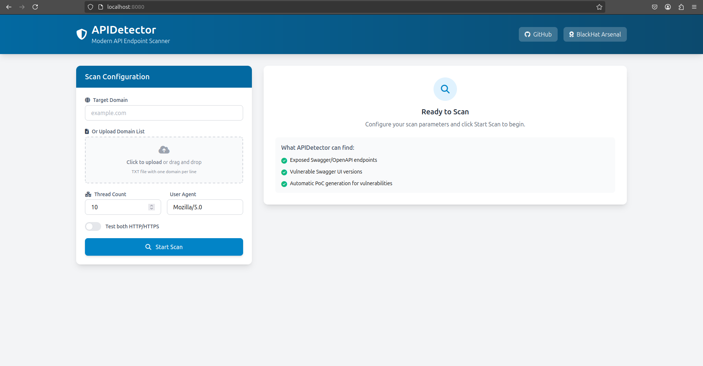

<p align="center">
  
</p>

##

APIDetector is a powerful and efficient tool designed for testing exposed Swagger endpoints in various subdomains with unique smart capabilities to detect false-positives. It's particularly useful for security professionals and developers who are engaged in API testing and vulnerability scanning.

### Web Interface

1. Build docker image: use podman/docker cmds interchangebly depening on what you are using
```bash
podman build -t apidetector .
```

2. apidetector container runtime:
```bash
podman run -it --name apidetector -p 8080:8080 apidetector
```

3. Open your browser and navigate to the URL shown in the terminal.

<p align="center">
  
</p>

4. Using the web interface:
   - Enter a single domain or upload a file with multiple domains (one per line)
   - Configure scan options (thread count, mixed mode, user agent)
   - Click 'Start Scan' to begin
   - View real-time results as they appear
   - Screenshots of vulnerable endpoints will be displayed automatically

5. The screenshots are saved in the `screenshots` directory for future reference.

### Command Line Interface

Run APIDetector using the command line. Here are some usage examples:

- Common usage, scan with 30 threads a list of subdomains using a Chrome user-agent and save the results in a file:
  ```bash
  python apidetector.py -i list_of_company_subdomains.txt -o results_file.txt -t 30 -ua "Mozilla/5.0 (Windows NT 10.0; Win64; x64) AppleWebKit/537.36 (KHTML, like Gecko) Chrome/90.0.4430.212 Safari/537.36"
  ```

- To scan a single domain:

  ```bash
  python apidetector.py -d example.com
  ```

- To scan multiple domains from a file:

  ```bash
  python apidetector.py -i input_file.txt
  ```

- To specify an output file:

  ```bash
  python apidetector.py -i input_file.txt -o output_file.txt
  ```

- To use a specific number of threads:

  ```bash
  python apidetector.py -i input_file.txt -t 20
  ```

- To scan with both HTTP and HTTPS protocols:

  ```bash
  python apidetector.py -m -d example.com
  ```

- To run the script in quiet mode (suppress verbose output):

  ```bash
  python apidetector.py -q -d example.com
  ```

- To run the script with a custom user-agent:

  ```bash
  python apidetector.py -d example.com -ua "Mozilla/5.0 (Windows NT 10.0; Win64; x64) AppleWebKit/537.36 (KHTML, like Gecko) Chrome/90.0.4430.212 Safari/537.36"
  ```
If you are using APIDetector v2, replace the commands by apidetectorv2.py.

### Options

- `-d`, `--domain`: Single domain to test.
- `-i`, `--input`: Input file containing subdomains to test.
- `-o`, `--output`: Output file to write valid URLs to.
- `-t`, `--threads`: Number of threads to use for scanning (default is 10).
- `-m`, `--mixed-mode`: Test both HTTP and HTTPS protocols.
- `-q`, `--quiet`: Disable verbose output (default mode is verbose).
- `-ua`, `--user-agent`: Custom User-Agent string for requests.

### Risk Details of Each Endpoint APIDetector Finds

Exposing Swagger or OpenAPI documentation endpoints can present various risks, primarily related to information disclosure. Here's an ordered list based on potential risk levels, with similar endpoints grouped together APIDetector scans:

#### 1. High-Risk Endpoints (Direct API Documentation):
- **Endpoints**:
  - `'/swagger-ui.html'`, `'/swagger-ui/'`, `'/swagger-ui/index.html'`, `'/api/swagger-ui.html'`, `'/documentation/swagger-ui.html'`, `'/swagger/index.html'`, `'/api/docs'`, `'/docs'`, `'/api/swagger-ui'`, `'/documentation/swagger-ui'`
- **Risk**:
  - These endpoints typically serve the Swagger UI interface, which provides a complete overview of all API endpoints, including request formats, query parameters, and sometimes even example requests and responses.
  - **Risk Level**: High. Exposing these gives potential attackers detailed insights into your API structure and potential attack vectors.

#### 2. Medium-High Risk Endpoints (API Schema/Specification):
- **Endpoints**:
  - `'/openapi.json'`, `'/swagger.json'`, `'/api/swagger.json'`, `'/swagger.yaml'`, `'/swagger.yml'`, `'/api/swagger.yaml'`, `'/api/swagger.yml'`, `'/api.json'`, `'/api.yaml'`, `'/api.yml'`, `'/documentation/swagger.json'`, `'/documentation/swagger.yaml'`, `'/documentation/swagger.yml'`
- **Risk**:
  - These endpoints provide raw Swagger/OpenAPI specification files. They contain detailed information about the API endpoints, including paths, parameters, and sometimes authentication methods.
  - **Risk Level**: Medium-High. While they require more interpretation than the UI interfaces, they still reveal extensive information about the API.

#### 3. Medium Risk Endpoints (API Documentation Versions):
- **Endpoints**:
  - `'/v2/api-docs'`, `'/v3/api-docs'`, `'/api/v2/swagger.json'`, `'/api/v3/swagger.json'`, `'/api/v1/documentation'`, `'/api/v2/documentation'`, `'/api/v3/documentation'`, `'/api/v1/api-docs'`, `'/api/v2/api-docs'`, `'/api/v3/api-docs'`, `'/swagger/v2/api-docs'`, `'/swagger/v3/api-docs'`, `'/swagger-ui.html/v2/api-docs'`, `'/swagger-ui.html/v3/api-docs'`, `'/api/swagger/v2/api-docs'`, `'/api/swagger/v3/api-docs'`
- **Risk**:
  - These endpoints often refer to version-specific documentation or API descriptions. They reveal information about the API's structure and capabilities, which could aid an attacker in understanding the API's functionality and potential weaknesses.
  - **Risk Level**: Medium. These might not be as detailed as the complete documentation or schema files, but they still provide useful information for attackers.

#### 4. Lower Risk Endpoints (Configuration and Resources):
- **Endpoints**:
  - `'/swagger-resources'`, `'/swagger-resources/configuration/ui'`, `'/swagger-resources/configuration/security'`, `'/api/swagger-resources'`, `'/api.html'`
- **Risk**:
  - These endpoints often provide auxiliary information, configuration details, or resources related to the API documentation setup.
  - **Risk Level**: Lower. They may not directly reveal API endpoint details but can give insights into the configuration and setup of the API documentation.

### Summary:
- **Highest Risk**: Directly exposing interactive API documentation interfaces.
- **Medium-High Risk**: Exposing raw API schema/specification files.
- **Medium Risk**: Version-specific API documentation.
- **Lower Risk**: Configuration and resource files for API documentation.

### Recommendations:
- **Access Control**: Ensure that these endpoints are not publicly accessible or are at least protected by authentication mechanisms.
- **Environment-Specific Exposure**: Consider exposing detailed API documentation only in development or staging environments, not in production.
- **Monitoring and Logging**: Monitor access to these endpoints and set up alerts for unusual access patterns.


## Legal Disclaimer

The APIDetector tool is strictly intended for testing and educational purposes only. The developers of APIDetector assume no liability and disclaim all responsibility for any misuse, unintended consequences, or damage caused by the use of this tool. Any unauthorized, illegal, or otherwise harmful use of APIDetector is expressly prohibited. The end user bears full responsibility for ensuring compliance with all relevant local, state, federal, and international laws. By using this tool, the user acknowledges that they hold the necessary authorizations to test the networks or systems they intend to scan and agrees to indemnify the developers against any and all claims arising from its use.
The end user is solely responsible for ensuring that their use of this tool does not violate any legal restrictions or terms of service governing the networks or systems under test.

