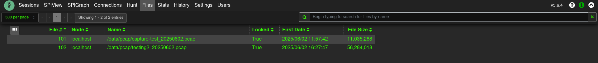
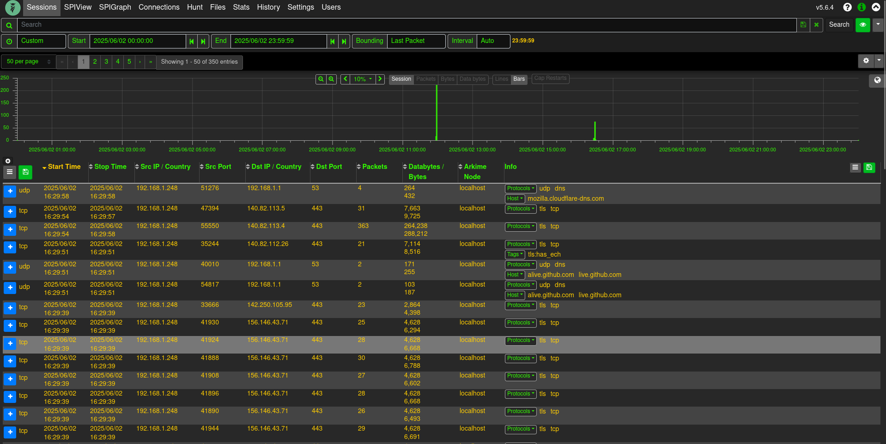

<p align="center">
  
</p>

## quickstart

> [!NOTE]
>
> https://opensearch.org/blog/GPU-Accelerated-Vector-Search-OpenSearch-New-Frontier
>
> For AMD or Apple M series GPU's, you'll have to modify the compose file and get docker/podman to recognize the device.

```sh
# sysctl required setting for opensearch
sudo sysctl -w vm.max_map_count=262144

# get required packages
dnf update -y

dnf install -y \
    linux-headers-$(uname -r) \
    podman \
    podman-compose \
    curl \
    nvidia-driver \
    nvidia-cuda-toolkit \
    nvidia-container-toolkit

# Set/Check NVIDIA configuration
nvidia-ctk cdi generate --output=/var/run/cdi/nvidia.yaml
nvidia-ctk cdi generate --output=/etc/cdi/nvidia.yaml
chmod a+r /var/run/cdi/nvidia.yaml /var/run/cdi/nvidia.yaml
nvidia-smi -L
nvidia-ctk cdi list

# On Linux systems, after a suspend/resume cycle, there may be instances where
# Opensearch fails to recognize your NVIDIA GPU, defaulting to CPU usage.
rmmod nvidia_uvm && modprobe nvidia_uvm

[  436.768767] nvidia-uvm: Unloaded the UVM driver.
[  445.301511] nvidia_uvm: module uses symbols nvUvmInterfaceDisableAccessCntr from proprietary module nvidia, inheriting taint.
[  445.317756] nvidia-uvm: Loaded the UVM driver, major device number 511.

# update variables in Dockerfile
ENV OS_USER="admin"
ENV OS_PASSWORD="password1234!!**"
ENV ARKIME_INTERFACE="wlo1"
ENV ARKIME_ADMIN_PASSWORD="admin"

mkdir -p ./pcaps
# place pcap in ./pcaps directory to analyze with arkime

# get int names
ip -o link show | awk -F': ' '{print $2}'

# or capture current traffic, see also pcap-container (tshark pcap capture)
sudo tcpdump -i <interface name> -s 65535 -w ./pcaps/<filename>_$(date +"%Y%m%d").pcap

# or run a script to capture pcaps and extract outbound IP's, given your firewall is set to deny-by-default (which it should be...)
sudo chmod +x ./outbound_monitor.sh ; ./outbound_monitor.sh

# change to user namespace from tcpdump
sudo chown -R $(whoami):$(whoami) pcaps/

# as user namespace
podman-compose up -d

# parse pcap (note: adjust time filter if using older pcaps)
podman exec -it arkime /data/arkime-parse-pcap-folder.sh
```

You should now see your pcap's under Files:

##

<p align="center">
  
</p>

Start analyzing network traffic:

##

<p align="center">
  
</p>