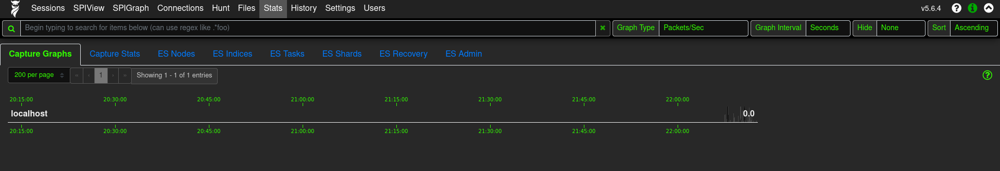
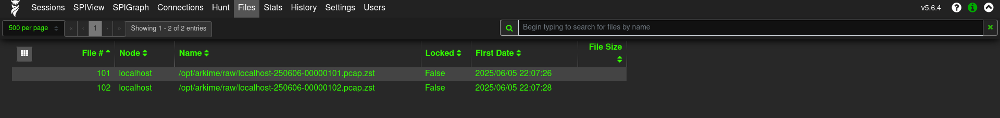

## arkime pcap capture

> [!NOTE]
>
> Arkime packet capture accesses the Linux kernel primarily through the use of network packet capture mechanisms like "AF_PACKET" and "NFQUEUE" (Netfilter Queue), allowing it to intercept network traffic at a low level within the kernel, enabling efficient analysis by leveraging the kernel's capabilities to capture packets directly from the network interface.

## arkime pcap capture stream

```sh
# for local dns
echo -ne "\n127.0.0.1   os01 arkime" | sudo tee -a /etc/hosts

# get interfaces on host system
ip -o link show | awk -F': ' '{print $2}'

# Update Dockerfile variables:
ENV ARKIME_INTERFACE="wlo1"
ENV CAPTURE="on"

```

##

```yaml
# to enable traffic capture, uncomment the following lines and comment out networks/ports above.

# docker-compose.yml
    cap_add:
      - net_admin
      - net_raw
      - sys_nice
    network_mode: host
```

##

```sh
# run containers as root since packet capture must utilize the kernel
sudo podman-compose up -d
```

##

verify packet capture:

```sh
sudo podman exec arkime cat /data/logs/capture.log
```

<p align="center">
  
</p>

<p align="center">
  
</p>

## suricata plugin, enrich network data with suricata events

To get suricata up, check ../suricata

```yaml
# monitor suricata IDS eve.json

# Dockerfile
ENV SURICATA="on"

# docker-compose.yml
volumes:
      - arkime_config:/data/config:Z
      - arkime_logs:/data/logs:Z
      - ${PCAP_DIR}:/data/pcap:Z
      - ${EVE_DIR}/eve.json:/data/suricata/eve.json:Z
```

