# Elastic Security Stack Demo

Architecture:

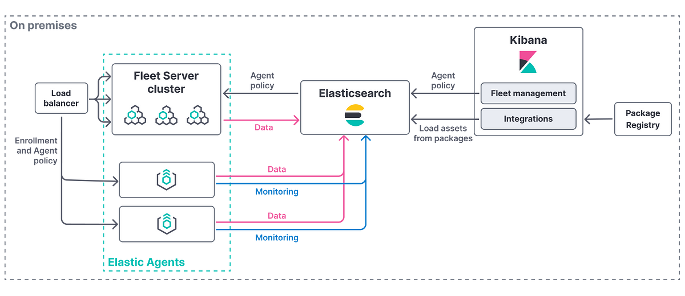

Core Components:

[Kibana](https://www.elastic.co/kibana)

[ElasticSearch](https://www.elastic.co/elasticsearch)

[Elastic Agent](https://www.elastic.co/elastic-agent)

[Fleet Server](https://www.elastic.co/guide/en/fleet/current/fleet-overview.html)

## Initial Steps

```zsh
# generate random passwords
sudo chmod +x key-gen.sh
./key-gen.sh

# verify authenticity of container images used for this build (dnf install -y cosign)
cosign verify --key https://artifacts.elastic.co/cosign.pub docker.elastic.co/elasticsearch/elasticsearch:9.2.0
cosign verify --key https://artifacts.elastic.co/cosign.pub docker.elastic.co/elasticsearch/elasticsearch-wolfi:9.2.0
cosign verify --key https://artifacts.elastic.co/cosign.pub docker.elastic.co/kibana/kibana-wolfi:9.2.0
cosign verify --key https://artifacts.elastic.co/cosign.pub docker.elastic.co/elastic-agent/elastic-agent-wolfi:9.2.0
```

Compose up elasticsearch, kibana, and fleet-server:

```zsh
# ssl cert creation and username config
# start elasticsearch, kibana, and fleet-server
podman-compose up -d
```

## Kibana

Launch the Kibana web UI by opening <https://localhost:5601> in a web browser, and use the following credentials to log
in:

* user: *elastic*
* password: *(located in .env)*

> [!WARNING]
> Accept The Risk and Continue.
> The self-signed certificate is untrusted, bypass ssl errors depending on your browser.
> This is basic tls encryption for demo purposes.


## Fleet Server

In the event, fleet-server exits due to kibana taking too long to load.

```zsh
# wait to see fleet setup completed in kibana logs
podman logs kibana

[INFO ][plugins.fleet] Beginning fleet setup
[INFO ][plugins.fleet] Cleaning old indices
[INFO ][plugins.fleet] Fleet setup completed
[INFO ][http.server.Preboot] http server running at https://0.0.0.0:5601

#reinitialize fleet-server
podman-compose up -d fleet-server
```

Navigate to Management > Fleet.

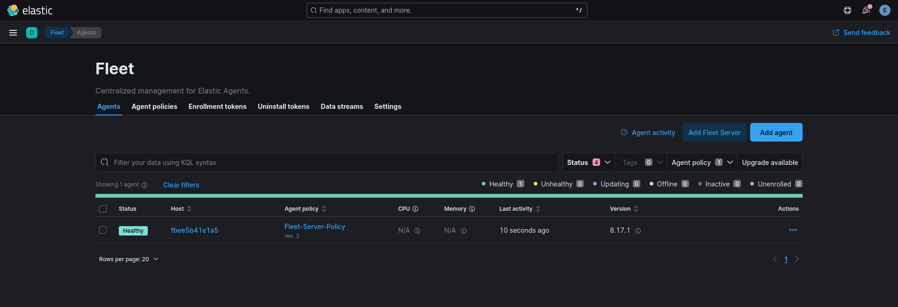

Get the enrollment token from the "elastic_agent-1" policy to pass to the agent installation command.

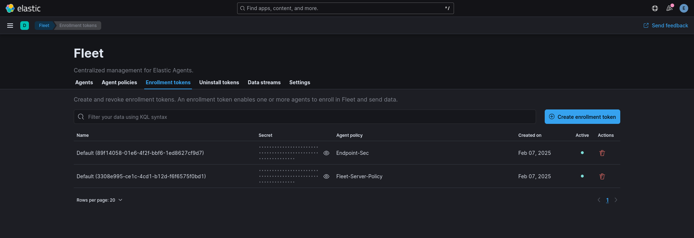

> [!NOTE]
> Remeber the Service Token.
> "elastic_agent-1" policy.

## Enroll Agents into Fleet

Get the ca_sha256 base64 fingerprint from ca.crt and update kibana.yml

```zsh
# get the ca to connect via https to fleet-server
# https://www.elastic.co/guide/en/fleet/current/secure-connections.html
# we'll need the ca to enroll agent later on
podman cp fleet-server:/certs/ca/ca.crt /tmp/ca.crt

openssl x509 -fingerprint -sha256 -noout -in /tmp/ca.crt
```

Update kibana.yml with fingerprint (remove the colons):

```yaml
# kibana.yml
xpack.fleet.outputs:
  - id: fleet-default-output
    name: default
    type: elasticsearch
    hosts: [ https://elasticsearch:9200 ]
    ca_trusted_fingerprint: 846637D1BB82209640D31B79869A370C8E47C2DC15C7EAFD4F3D615E51E3D503
    is_default: true
    is_default_monitoring: true
```

```zsh
# update fleet-server settings in kibana
podman-compose down -v kibana && podman-compose up kibana -d
```

```zsh
# install elastic agent on linux
curl -L -O https://artifacts.elastic.co/downloads/beats/elastic-agent/elastic-agent-9.2.0-linux-x86_64.tar.gz
tar xzvf elastic-agent-9.2.0-linux-x86_64.tar.gz
cd elastic-agent-9.2.0-linux-x86_64
sudo ./elastic-agent install --url=https://fleet-server:8220 --insecure \
  --enrollment-token="Insert the Enrollment Token Here to the corresponding Agent Policy!"
```

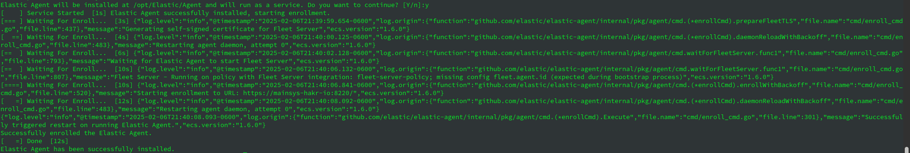

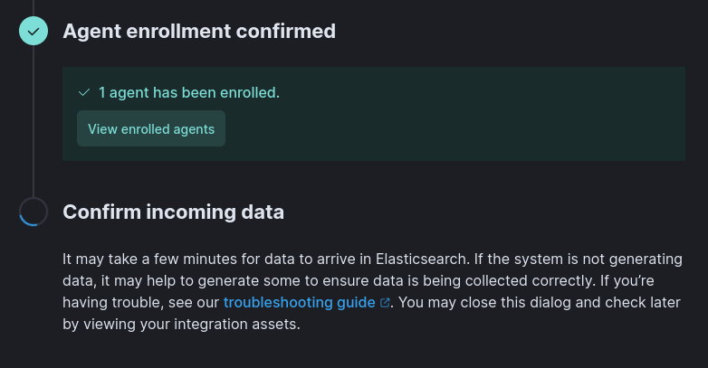

> [!NOTE]
>
> Begin selecting integrations for the elastic-agent-1 policy.
>
> https://www.elastic.co/guide/en/fleet/current/add-integration-to-policy.html
>
> Elastic Defend and Suricata are primarily used for this demo.

## Suricata Integration

Add the suricata integration in the elastic agent policy, place the correct path to eve.json

https://docs.elastic.co/en/integrations/suricata

> [!NOTE]
> After starting suricata, keeps in mind where the local bind directory for suricata logs are located.
> This was declared when using the podman run command.
> ex.
> -v <directory for logs to go>:/var/log/suricata:Z

Enter the path to eve.json in the integration configuration.

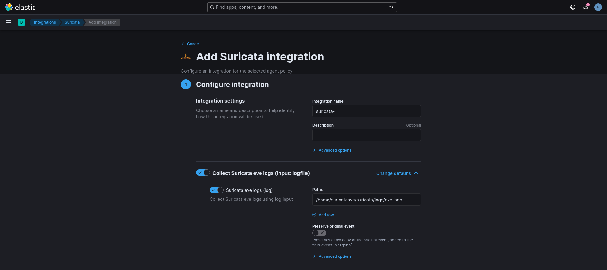

## Zeek

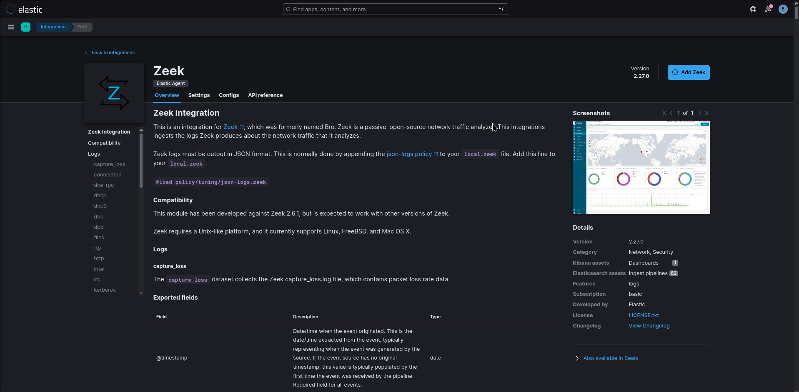

> [!NOTE]
> Refer to zeek/zeek for location of logs
>
> Default is /opt/zeek/current

```zsh

# zeek/zeek

#The user can set the top level directory that holds all zeek content by setting it in "zeek_top_dir" (default "/opt/zeek")
HOST_ZEEK=${zeek_top_dir:-/opt/zeek}

```

Change the base path:

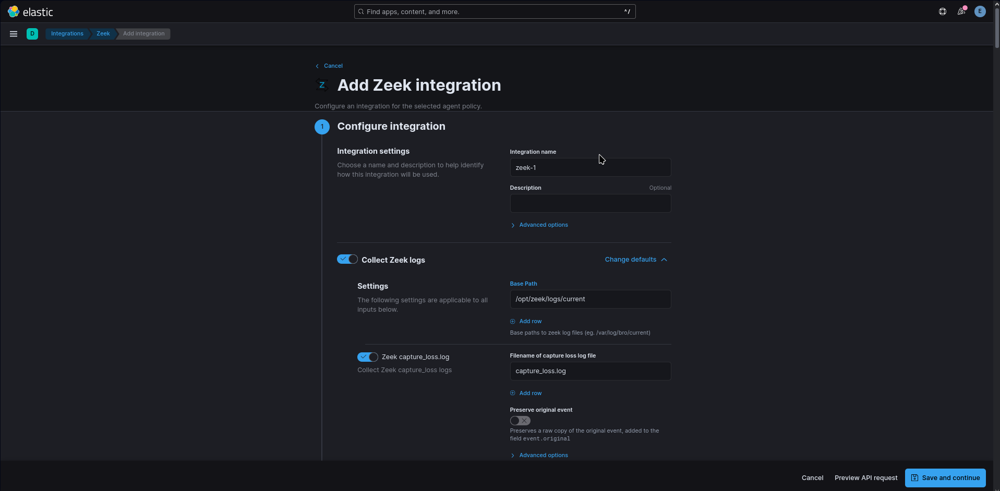

## Elastic Defend

https://www.elastic.co/security/endpoint-security

Add Elastic Defend Integration to the Agent Policy:

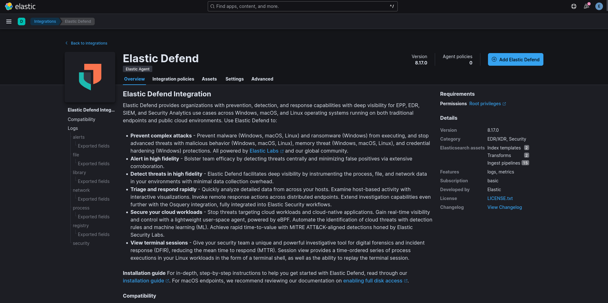

See https://www.elastic.co/guide/en/security/current/configure-endpoint-integration-policy.html for more details.

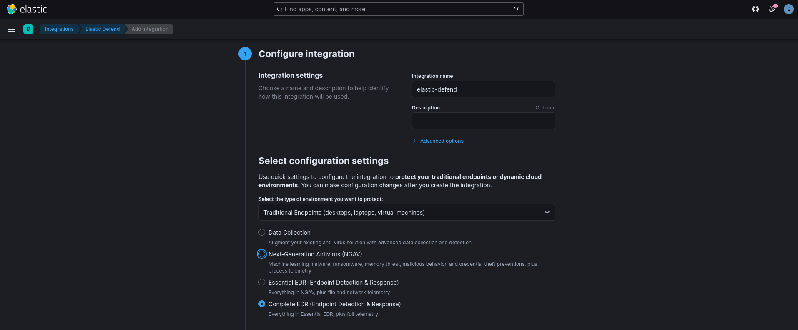

## Elastic SIEM Workflow

https://www.elastic.co/guide/en/security/current/getting-started.html

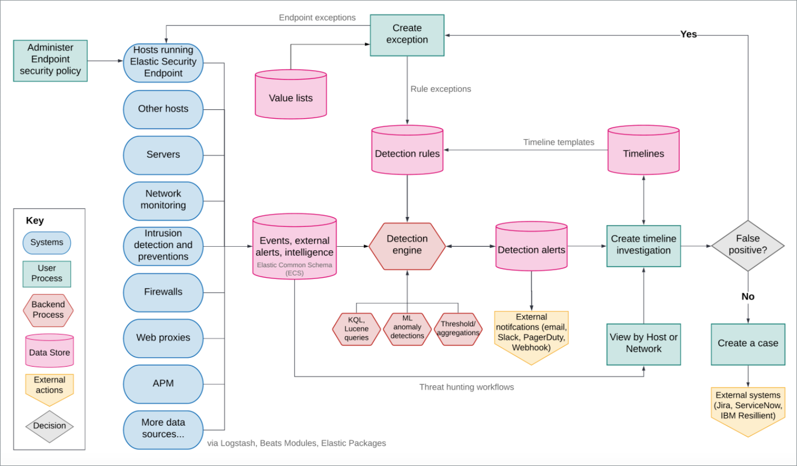

## Teardown

```zsh

# Remove Elastic Agent
sudo /usr/bin/elastic-agent uninstall

# Delete container environment (if elastic is all thats running)
podman system reset -f

# Delete elastic pod (if other containers are running)
podman pod stop pod_elastic
podman pod rm -f pod_elastic
podman system prune -a
```
