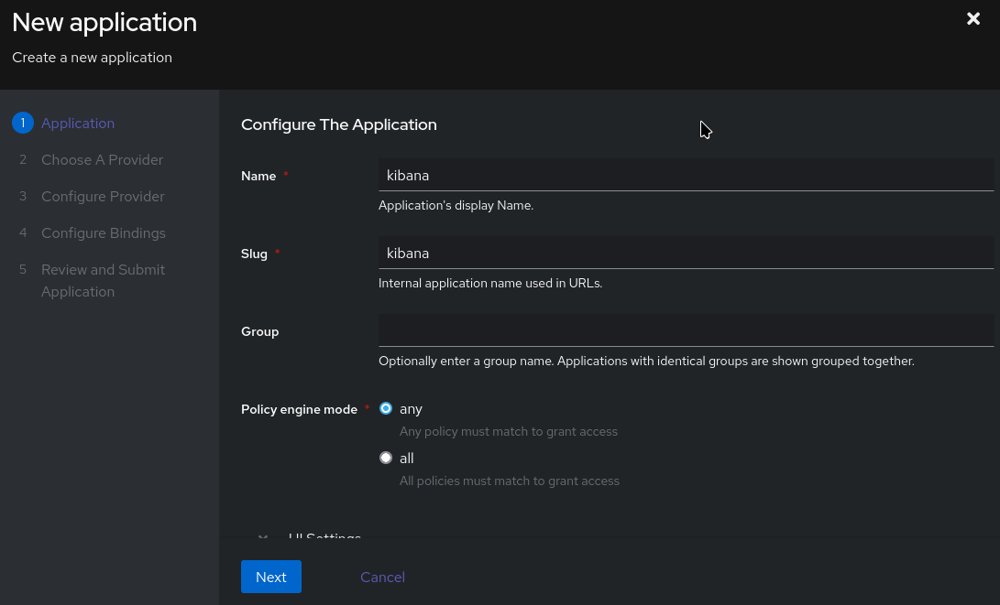
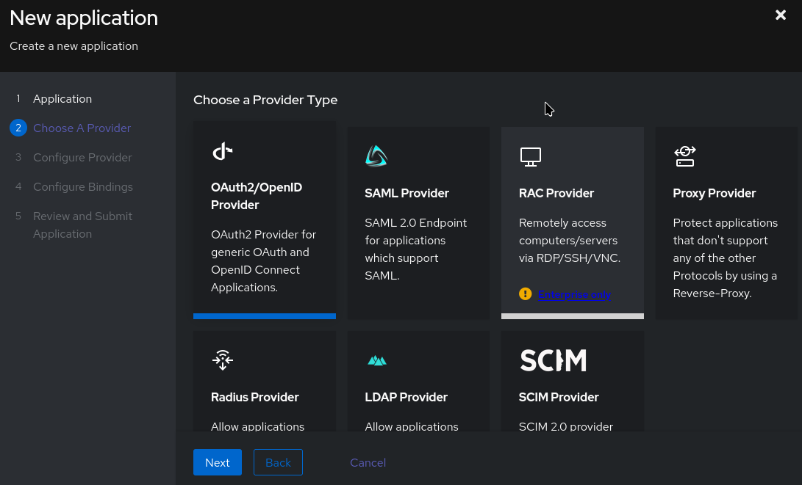
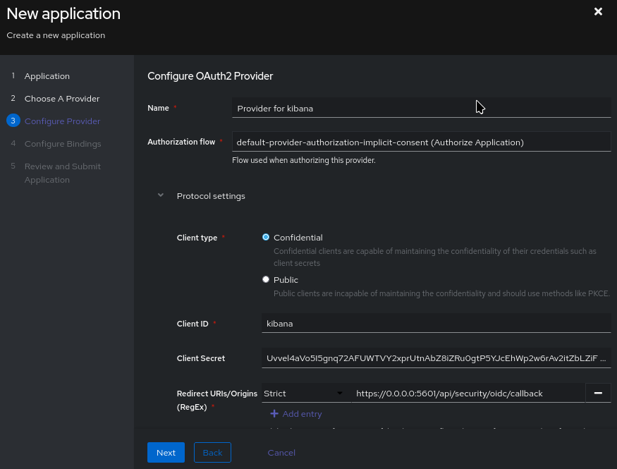
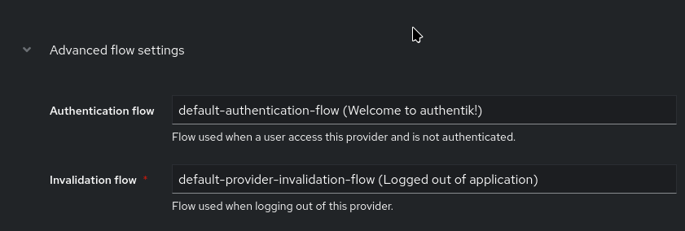
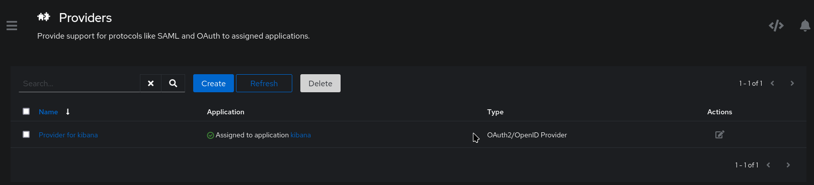
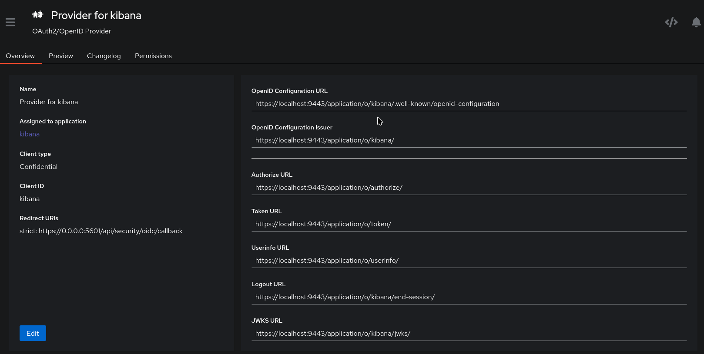

# Single Sign-On to Kibana (editing)

## Authentik

https://goauthentik.io/

```zsh

# set vars and compose up authentik stack

cd authentik; chmod +x env-gen.sh; ./env-gen.sh
podman-compose up -d

```

## Initial Account

Navigate to http://localhost:9000/if/flow/initial-setup/

    - Create the initial admin user

Navigate to https://localhost:9443/ and login with that user.

## Set up Kibana Provider

Use "Create with Wizard" in Applications:














:

......to do