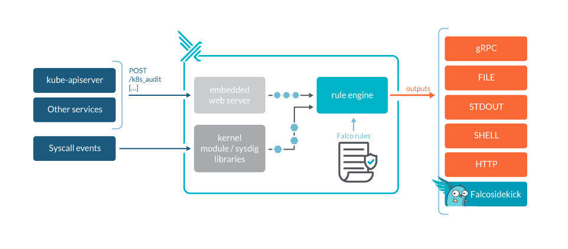
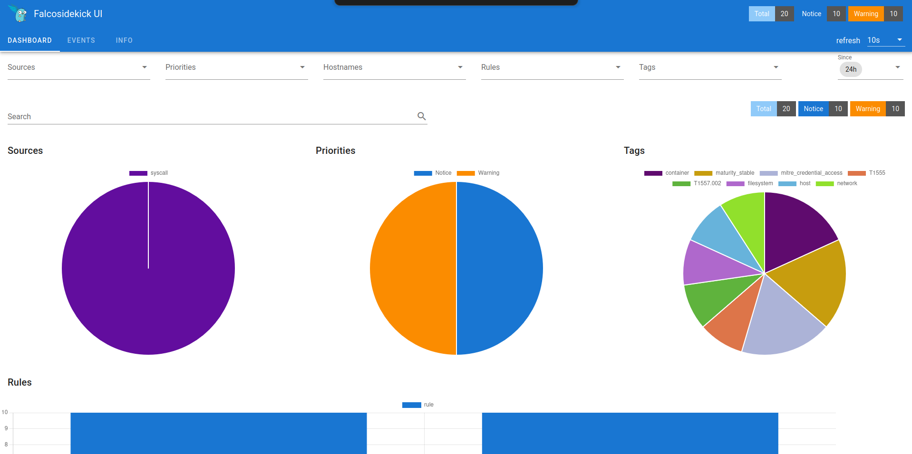
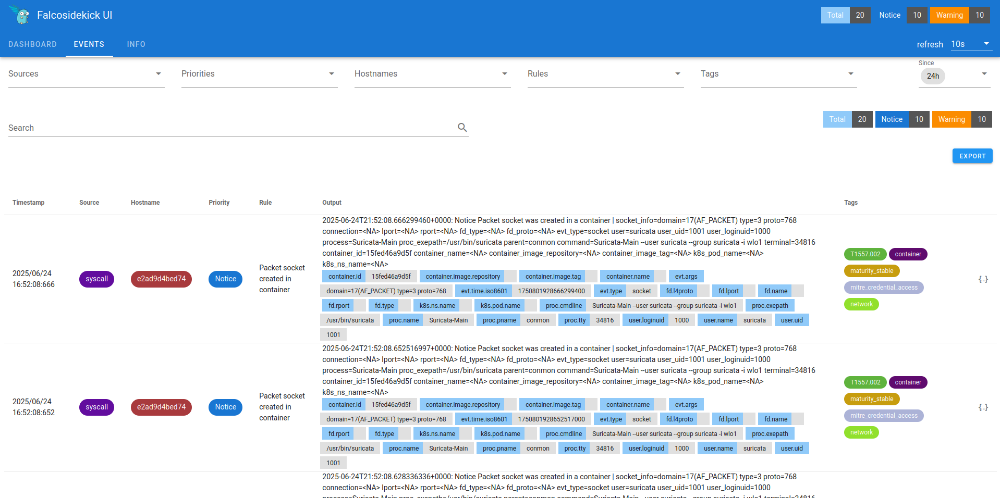

## falco

<p align="center">
  
</p>

Falco is a cloud native security tool that provides runtime security across hosts, containers, Kubernetes, and cloud environments. It leverages custom rules on Linux kernel events and other data sources through plugins, enriching event data with contextual metadata to deliver real-time alerts. Falco enables the detection of abnormal behavior, potential security threats, and compliance violations.

### podman/docker

```sh
# modify .env in certs

# traefik and tinyauth setup
sudo chmod +x gen-traefik-cert.sh && ./gen-traefik-cert.sh

# generate pass hash, remove < >, twice for trafik dashboard login and tinyauth
htpasswd -nb traefik "InsertAPassword" | sed -e 's/\$/\$\$/g'
htpasswd -nb tinyauth "InsertAPassword" | sed -e 's/\$/\$\$/g'

# secret string for tinyauth
openssl rand -base64 32 | tr -dc 'a-zA-Z0-9' | head -c 32 && echo
```

Modify "docker-compose.yaml"
```yaml
# traefik

  labels:
      - "traefik.http.middlewares.dashboard-auth.basicauth.users=traefik:yourhashedpasshere"

# tinyauth

  environment:
      - SECRET=      #some-random-32-chars-string
      - APP_URL=http://localhost:2802
      # htpasswd -B -c .htpasswd tinyauth - htpasswd -nb tinyauth "InsertAPassword" | sed -e 's/\$/\$\$/g'
      - USERS=tinyauth:youhashedpasshere       # user:password
```

```sh
# podman
sudo podman-compose up -d

# docker
sudo docker compose up -d
```
Traefik Proxy Dashboard
### https://dashboard.podman.localhost

Falco Web UI Dashboard
### http://localhost:2802

<p align="center">
  
</p>

<p align="center">
  
</p>

## Falco Stack Deployment

## Prerequisites
- Docker or Podman
- kubectl and Helm for K8s
- Ansible for Ansible deployment
- openssl and htpasswd

## Setup
1. Edit config.yaml with passwords and other settings.
2. Run python deploy.py to generate certs and update files with secrets.

## Deployment
- Docker: docker compose up -d
- Podman: podman play kube podman.yaml
- Kubernetes: ./deploy-falco-k8s.sh
- Ansible: ansible-playbook ansible-playbook.yaml --extra-vars "mode=k8s"  # or docker

## Access
Add to /etc/hosts:
127.0.0.1 dashboard.podman.localhost tinyauth.local falco-webui.local

Trust CA from secrets/certs/ca.crt in browser.

Login with tinyauth credentials from config or generated.

