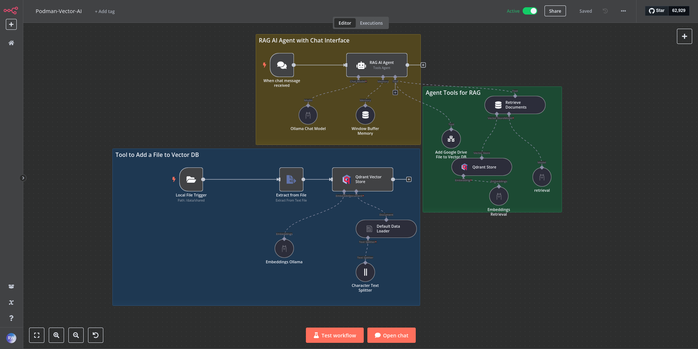
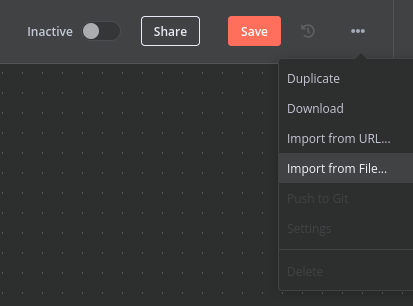
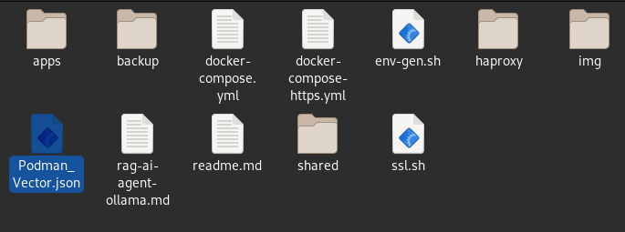
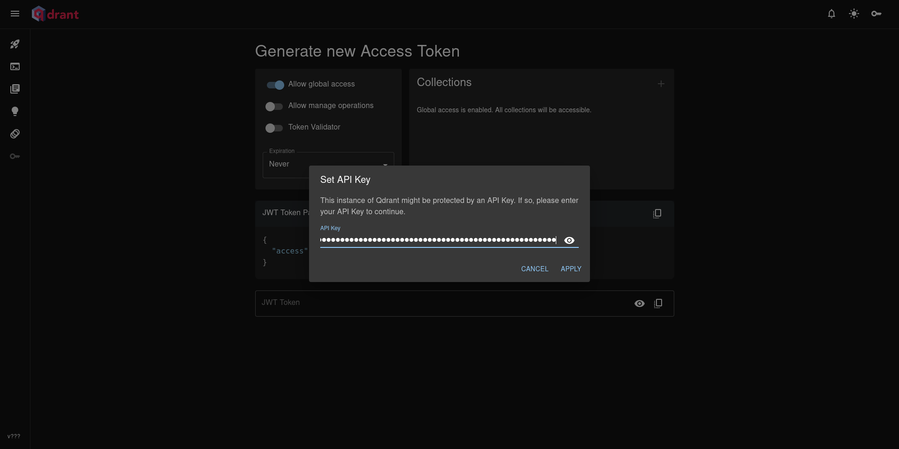
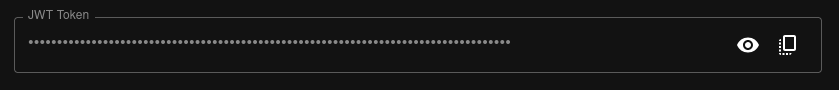
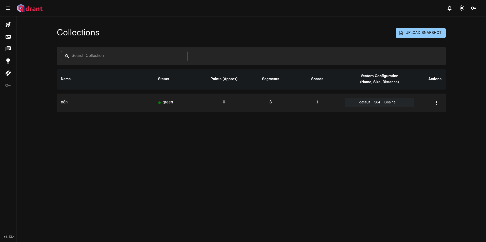
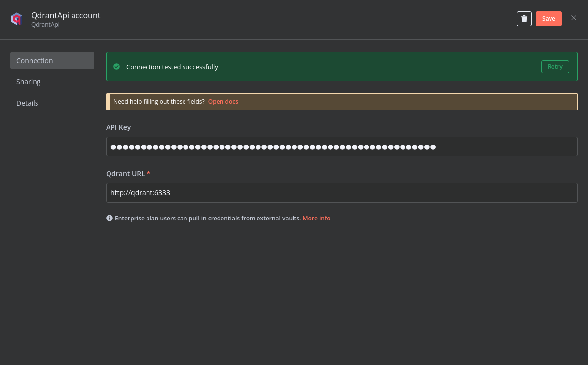
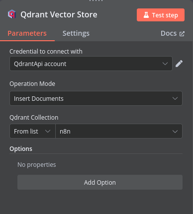
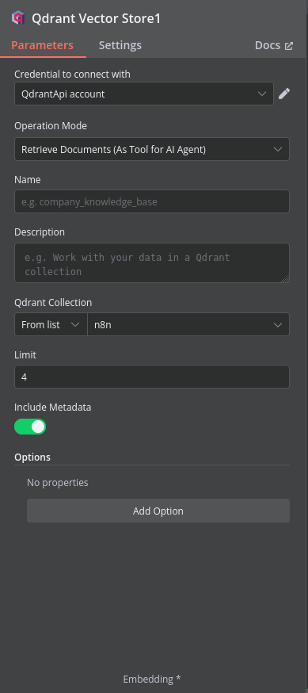

## Retrieval-Augmented Generation (RAG) in n8n demo

<p align="center">
  
</p>

Compose up stack:

```zsh
# generate keys
chmod +x env-gen.sh; ./env-gen.sh

podman-compose up
```

## n8n

http://localhost:5678

Import "Podman_Vector_AI.json"

<p align="center">
  
</p>

<p align="center">
  
</p>

## qdrant

```zsh
[qdrant]                |            _                 _
[qdrant]                |   __ _  __| |_ __ __ _ _ __ | |_
[qdrant]                |  / _` |/ _` | '__/ _` | '_ \| __|
[qdrant]                | | (_| | (_| | | | (_| | | | | |_
[qdrant]                |  \__, |\__,_|_|  \__,_|_| |_|\__|
[qdrant]                |     |_|
[qdrant]                |
[qdrant]                | Version: 1.13.4, build: 7abc6843
[qdrant]                | Access web UI at http://localhost:6333/dashboard
[qdrant]                |
```

## Optional: JWT Token

http://localhost:6333/dashboard#/jwt

Insert key from .env:

<p align="center">
  
</p>

<p align="center">
  
</p>

## create collection for n8n workflow

```zsh
# create collection vector

source .env

curl -X PUT \
  'http://localhost:6333/collections/n8n' \
  --header 'api-key: '"${QDRANT__SERVICE__API_KEY}" \
  --header 'Content-Type: application/json' \
  --data-raw '{
  "vectors": {
    "dense-vector-n8n": {
      "size": 1536,
      "distance": "Cosine"
    },
    "sparse_vectors": {
      "sparse-vector-n8n": {
        "index": {
          "on_disk": true
        }
      }
    }
  }
}'
```

```yaml
{"result":true,"status":"ok","ticurl  -X PUT \1}
```

#

Collection is now created and can be seen in dashboards:

<p align="center">
  
</p>

## configure n8n vector store settings:

Configure qdrant api key:

In ".env", QDRANT__SERVICE__API_KEY=

#

<p align="center">
  
</p>

Configure the vector stores in "Podman Vector AI" workflow:

#

<p align="center">
  
</p>

#

<p align="center">
  
</p>
