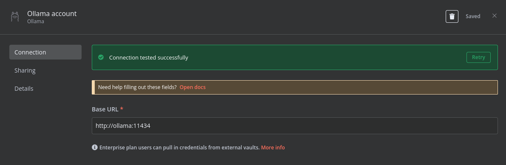
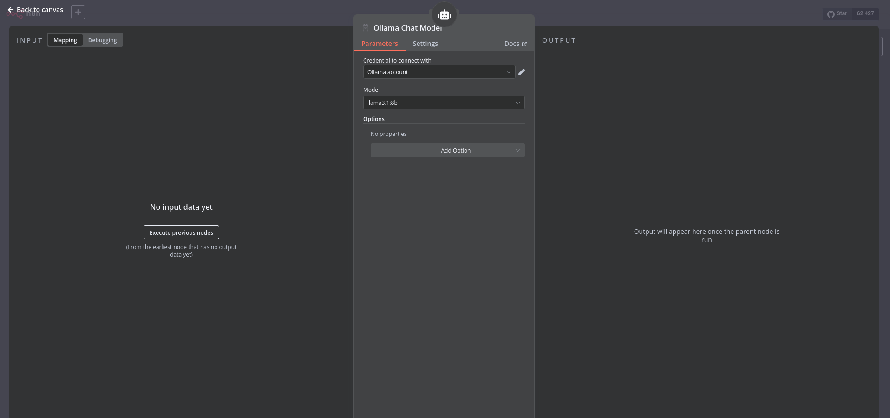
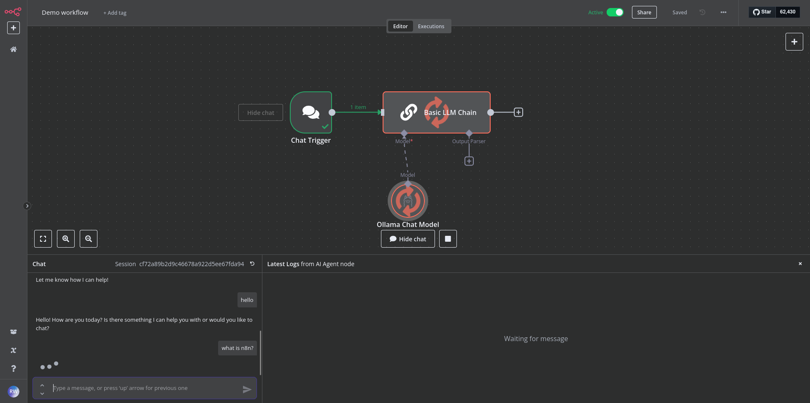
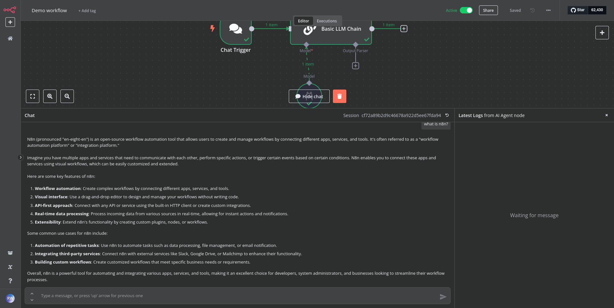

## n8n

n8n is a workflow automation platform that gives technical teams the flexibility of code with the speed of no-code. With 400+ integrations, native AI capabilities, and a fair-code license, n8n lets you build powerful automations while maintaining full control over your data and deployments.

https://docs.n8n.io/try-it-out/

## containers and nvidia

```zsh

└─$ dnf update -y

└─$ dnf install -y \
    linux-headers-$(uname -r) \
    podman \
    podman-compose \
    curl \
    nvidia-driver \
    nvidia-cuda-toolkit \
    nvidia-container-toolkit \
    nvidia-kernel-dkms

# Set/Check NVIDIA configuration
└─$ nvidia-ctk cdi generate --output=/var/run/cdi/nvidia.yaml
└─$ nvidia-ctk cdi generate --output=/etc/cdi/nvidia.yaml
└─$ chmod a+r /var/run/cdi/nvidia.yaml /var/run/cdi/nvidia.yaml
└─$ nvidia-smi -L
└─$ nvidia-ctk cdi list

# On Linux systems, after a suspend/resume cycle, there may be instances where
# Ollama fails to recognize your NVIDIA GPU, defaulting to CPU usage.
└─$ rmmod nvidia_uvm && modprobe nvidia_uvm

[  436.768767] nvidia-uvm: Unloaded the UVM driver.
[  445.301511] nvidia_uvm: module uses symbols nvUvmInterfaceDisableAccessCntr from proprietary module nvidia, inheriting taint.
[  445.317756] nvidia-uvm: Loaded the UVM driver, major device number 511.
```

## selecting which LLM to pull

Edit "docker-compose.yml" and replace "llama3.1:8b" with whichever one you'd like.

```yaml
# pull model (replace here)
x-init-ollama: &init-ollama
  image: ollama/ollama:latest
  networks: ['n8n']
  container_name: ollama-pull-llama
  volumes:
    - ollama_storage:/root/.ollama:z
  entrypoint: /bin/sh
  environment:
    - OLLAMA_HOST=ollama:11434
  command:
    - "-c"
    - "sleep 15; ollama pull llama3.1:8b"
```

## spin-up

```zsh

chmod +x env-gen.sh; ./env-gen.sh

podman-compose up -d

```

http://localhost:5678

Setup an account and see example templates on automation workflows.

## verify ollama and n8n are connected:

<p align="center">
  
</p>

<p align="center">
  
</p>

Integrate LLM's into your automation workflows.

See "Demo Workflow" for a quick demo on LLM chat bot integration workflow:

<p align="center">
  
</p>

<p align="center">
  
</p>
