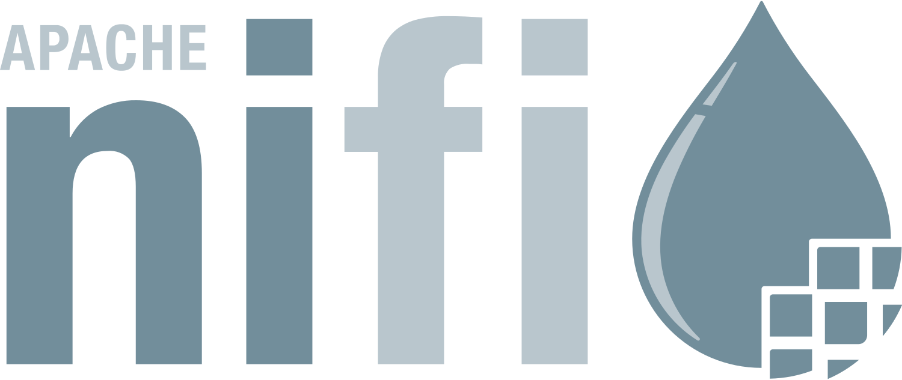
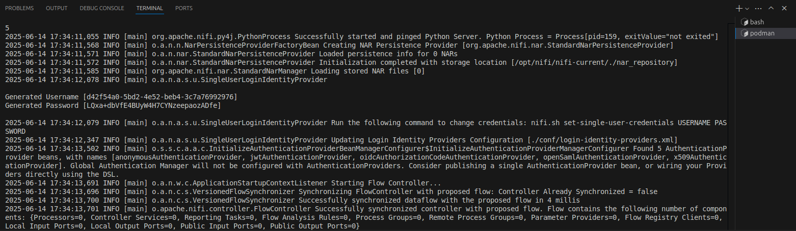
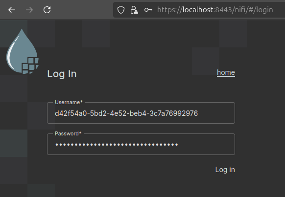
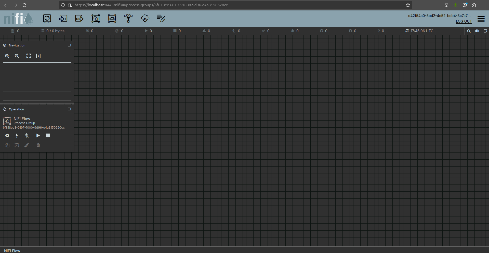

<p align="center">
  
</p>

## Apache NiFI

    An easy to use, powerful, and reliable system to process and distribute data.

NiFi automates cybersecurity, observability, event streams, and generative AI data pipelines and distribution for thousands of companies worldwide across every industry

##

```sh
podman build -t nifi .

podman run --name nifi \
      -p 8443:8443 \
      -d nifi
```

##

Retrieve Username/Password:

```sh
podman logs nifi | grep Generated
```

<p align="center">
  
</p>

https://localhost:8443

<p align="center">
  
</p>

Start building data flows in NiFi:

<p align="center">
  
</p>

### Setup Nifi registry for template imports (note json format is only accepted for version 2+)

```bash
podman build -t nifi-registry -f registry.Dockerfile

podman run -p 18080:18080 --name nifi-registry -d nifi-registry
```