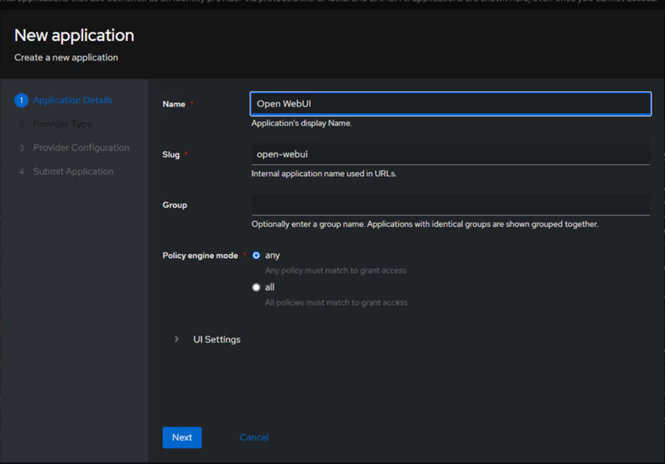
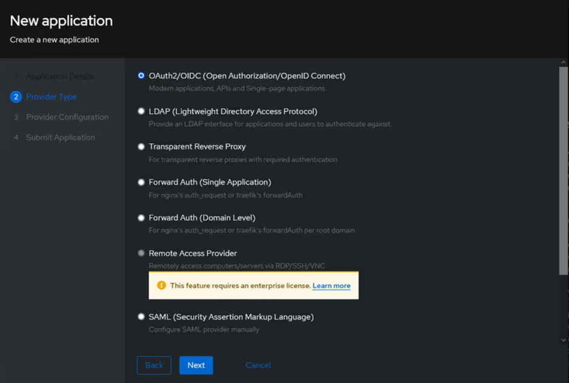
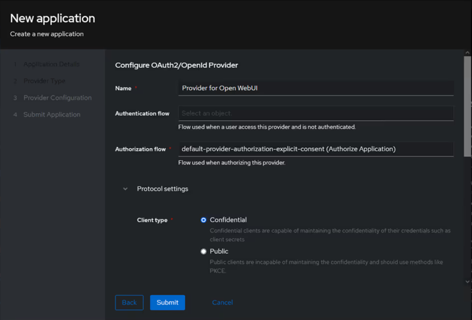
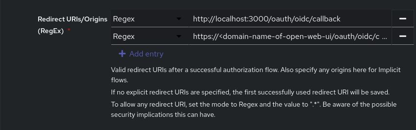
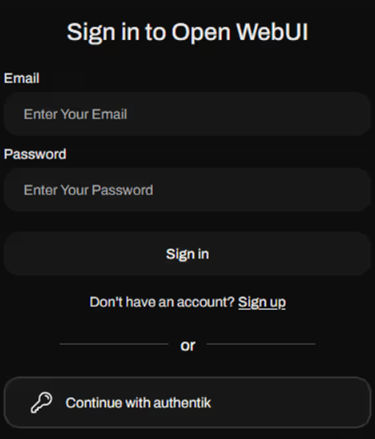

## Setup OAuth2 via Authentik for Open-WebUI

To configure Authentik for OAuth2/OIDC with Docker Compose, follow these steps:

Environment variables: Set the necessary environment variables in the docker-compose.yml file. At a minimum, you'll need to set AUTHENTIK_SECRET_KEY and AUTHENTIK_POSTGRESQL__PASSWORD. Generate a strong, random string for the secret key.

Start Authentik:

```sh
systemctl --user enable podman.socket

sudo chmod +x env-gen.sh
./env-gen.sh

podman-compose up -d

# watch system startup
podman logs authentik-server
podman logs authentik-worker
```

Initial setup: Access the Authentik web interface and complete the initial setup, including creating an administrative user.

http://localhost:9000/if/flow/initial-setup/

# After initial setup, you can use https via port 9443

https://localhost:9443

Create an OAuth2/OIDC provider:

Go to Applications > Applications, then “Create With Wizard.”



Select “OAuth2/OIDC” for the provider type:



Select an authorization flow (either implicit or explicit, depending on whether you want to prompt for consent to use the required scopes, as well as set the client type to “Confidential.”:





OPENID_PROVIDER_URL is in the form of
https://[authentik.domain]/application/o/[application]/.well-known/openid-configuration.

https:///application-domain-name/o/open-webui/.well-known/openid-configuration

Update .env for Open-WebUI

```sh
# Authentik OAUTH vars
OAUTH_CLIENT_ID=
OAUTH_CLIENT_SECRET=
# OPENID_PROVIDER_URL is in the form of
# https://[authentik.domain]/application/o/[application]/.well-known/openid-configuration.
# Setup proxy, DNS record to authentik web server
OPENID_PROVIDER_URL=
# The allowed redirect URI should include <open-webui>/oauth/oidc/callback
OPENID_REDIRECT_URI=http://<fqdn of open-webui>/oauth/oidc/callback
```

OAuth2/ODIC login is now enabled for Open-WebUI:

