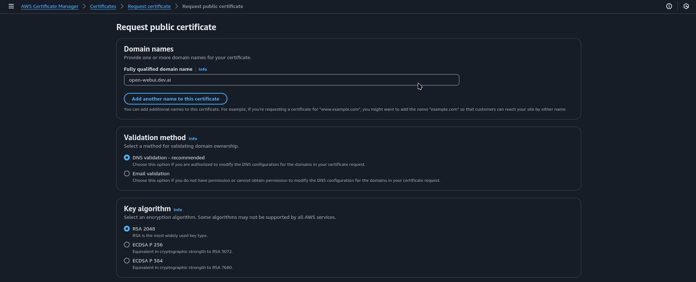
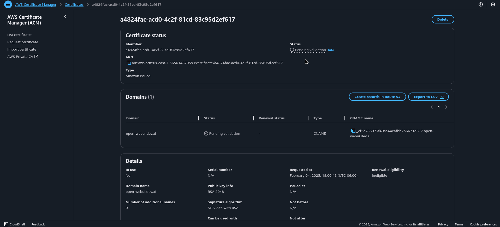
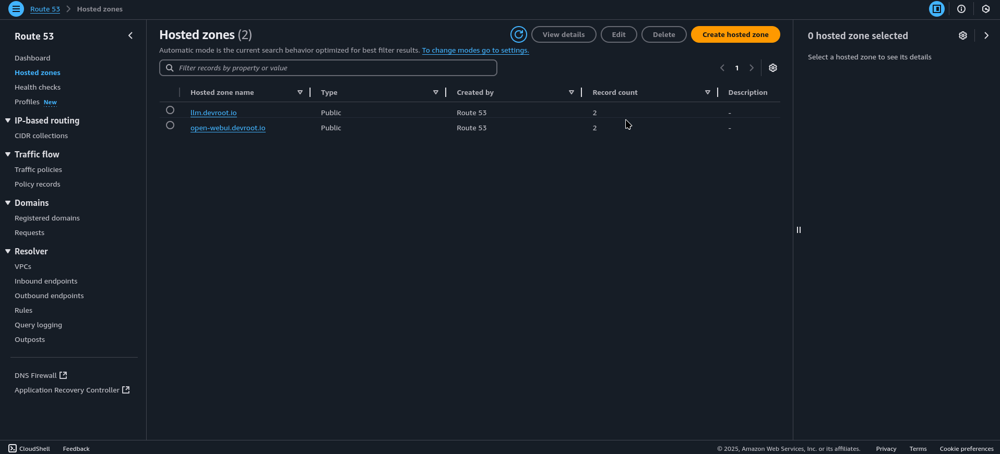
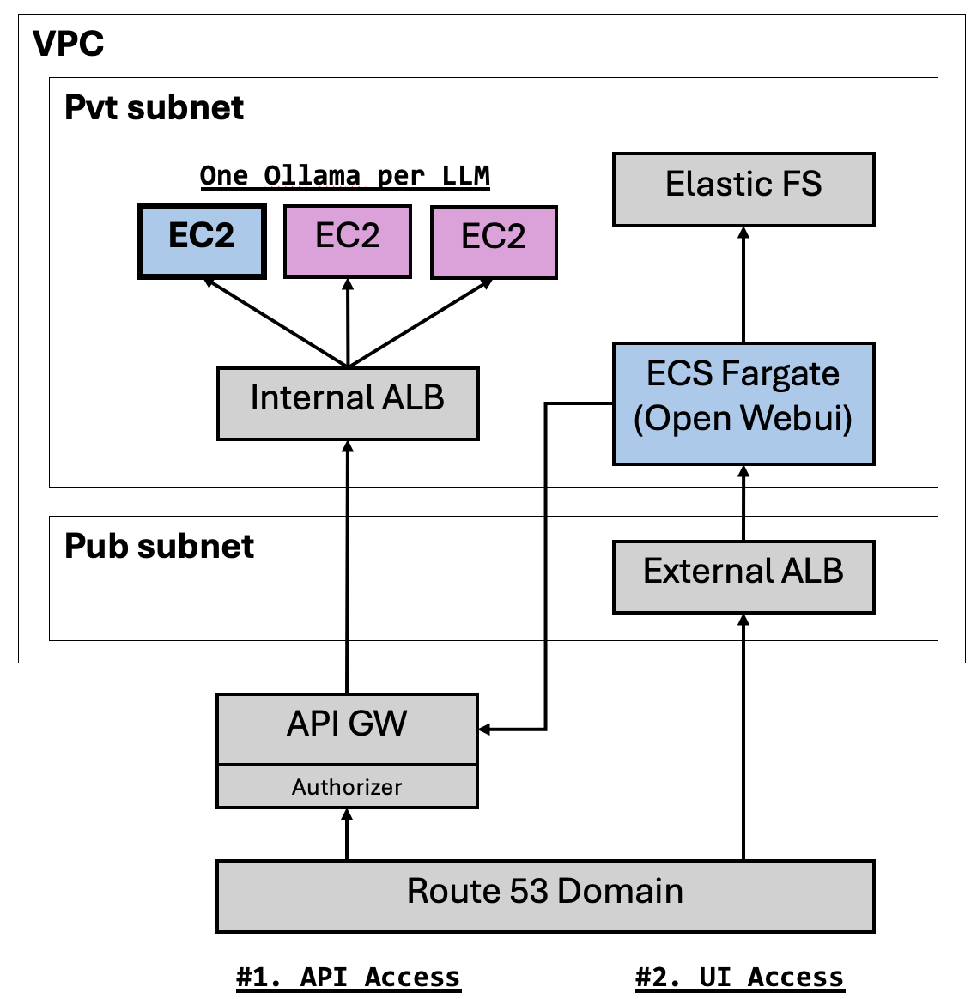

## Setting Up Ollama on AWS

Pre-reqs:

SSL certs for API Gateway and Open-WebUI Domain

Generate and get ARN to update in .tfvars





DNS Zones (Hosted Zone IDs) for api-gw and open-webui



## Update sample.auto.tfvars (example)

```sh
region                    = "us-west-1"
azs                       = ["us-west-1a", "us-west-1b"]
vpc_private_subnets_cidrs = ["172.77.48.0/20", "172.77.64.0/20"]
vpc_private_subnets_names = ["private-48-1a", "private-64-1b"]
vpc_public_subnets_cidrs  = ["172.77.0.0/20", "172.77.16.0/20"]
vpc_public_subnets_names  = ["public-0-1a", "public-16-1b"]

# Models and AMI (Deep Learning OSS Nvidia Driver AMI GPU PyTorch 2.5 (Ubuntu 22.04))
llm_ec2_configs = [
  {
    llm_model     = "gemma2:9b"
    instance_type = "g5g.xlarge"
    ami_id        = "ami-0bbe82e88da64960f"
    ebs_volume_gb = 200
    app_port      = 11434
  },
  {
    llm_model     = "qwen2:7b"
    instance_type = "g5g.xlarge"
    ami_id        = "ami-0bbe82e88da64960f"
    ebs_volume_gb = 200
    app_port      = 11434
  },
  {
    llm_model     = "deepseek-r1:7b"
    instance_type = "g5g.xlarge"
    ami_id        = "ami-0bbe82e88da64960f"
    ebs_volume_gb = 200
    app_port      = 11434
  },
]

create_api_gw                   = true
api_gw_disable_execute_endpoint = true
api_gw_domain                   = "llm.devroot.io"
api_gw_domain_route53_zone      = "Z07120222G4GAN3A8G4N"
api_gw_domain_ssl_cert_arn      = "arn:aws:acm:us-east-1:565614870591:certificate/934f2779-b4cf-4182-920f-c902b37f4807"

open_webui_task_cpu   = 4096
open_webui_task_mem   = 8192
open_webui_task_count = 2
open_webui_port       = 8080
open_webui_image_url  = "ghcr.io/open-webui/open-webui:main"
open_webui_domain              = "open-webui.devroot.io"
open_webui_domain_route53_zone = "Z07105161JFTIXZTQALLI"
open_webui_domain_ssl_cert_arn = "arn:aws:acm:us-east-1:565614870591:certificate/a4824fac-acd0-4c2f-81cd-83c95d2ef617"
```

# Exec Terraform

```sh
# install terraform
sudo dnf-config-manager --add-repo https://rpm.releases.hashicorp.com/RHEL/hashicorp.repo
sudo dnf -y install terraform

# Review/Edit aws_env.sh
sudo chmod +x aws_env.sh
./aws_env.sh

terraform init
terraform apply
```

## Architecture

