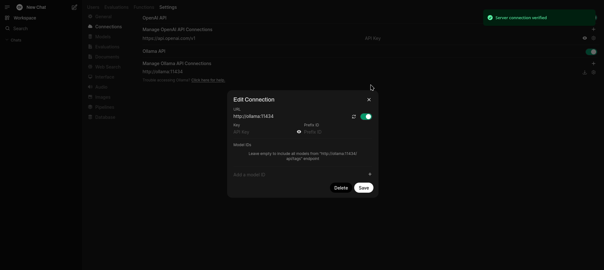
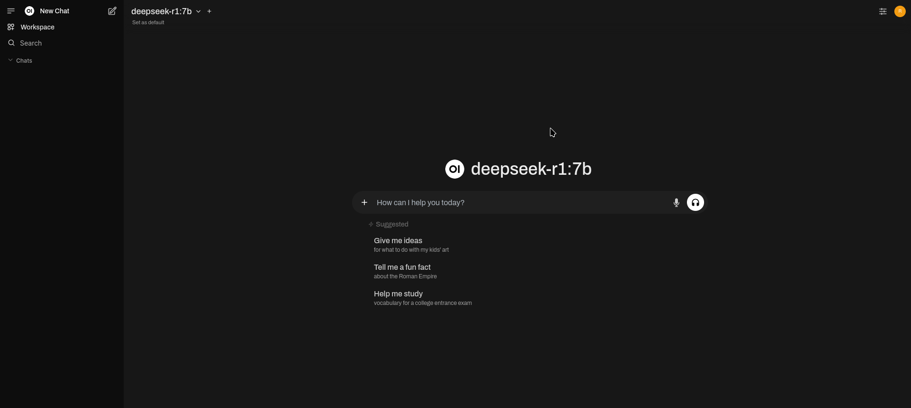
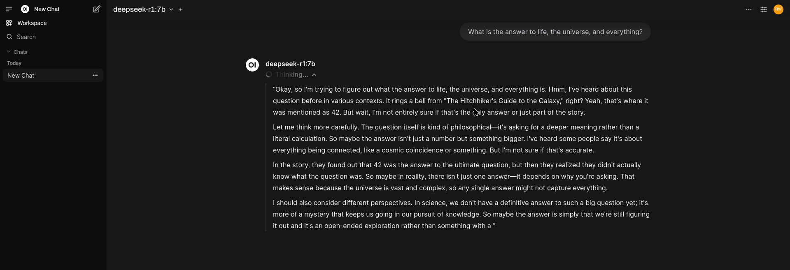

## Testing LLM's with Data Confidentiality

What is Ollama?

Ollama is an open-source tool that allows you to run a Large Language Model (LLM) on your local machine.

It has vast collections of LLM models.

It ensures privacy and security of data making it a more popular choice among AI developers, researchers, and business owners who prioritize data confidentiality.

Ollama provides full ownership of your data and avoids potential risk.

Ollama is an offline tool that reduces latency and dependency on external servers, making it faster and more reliable.

What is Open-WebUI?

Open WebUI is an extensible, self-hosted AI interface that adapts to your workflow, all while operating entirely offline.

deepseek-r1 seems to be all the hype these days, this is how you can test new LLM's locally/ephemerally, using a chat prompt UI, or in the cloud (see aws directory).

## Requirements

Ubuntu/Debian-like Distro

Podman (https://podman.io/)

NVIDIA

Verifying GPU Compatibility for Ollama

To ensure that your system is ready to run Ollama with GPU acceleration, it is crucial to verify the compatibility of your Nvidia GPU. Ollama supports Nvidia GPUs with a compute capability of 5.0 or higher. You can check your GPU's compute compatibility by visiting the official Nvidia CUDA GPUs page: Nvidia CUDA GPUs.

Checking Your GPU

Identify Your GPU: Use the following command to find out the model of your GPU:

```sh

└─$ lspci | grep -i nvidia

```

Verify Compute Capability:

https://github.com/ollama/ollama/blob/main/docs/gpu.md


## Prepare System Environment (Ubuntu/Debian)

```sh

<<comment
# Tested and working on 1/26/2025
Distributor ID: Kali
Description:    Kali GNU/Linux Rolling
Release:        2024.4
Codename:       kali-rolling
CPU:            Intel Core i7-11370H
GPU:            NVIDIA GeForce RTX 3050 Ti Laptop GPU
comment

# Modify .env
└─$ openssl rand -hex 32
# Update: WEBUI_SECRET_KEY="set_webui_secret_key" in .env

# nvidia toolkit, podman
└─$ curl -fsSL https://nvidia.github.io/libnvidia-container/gpgkey | sudo gpg --dearmor -o /usr/share/keyrings/nvidia-container-toolkit-keyring.gpg \
  && curl -s -L https://nvidia.github.io/libnvidia-container/stable/deb/nvidia-container-toolkit.list | \
    sed 's#deb https://#deb [signed-by=/usr/share/keyrings/nvidia-container-toolkit-keyring.gpg] https://#g' | \
    sudo tee /etc/apt/sources.list.d/nvidia-container-toolkit.list
└─$ sed -i -e '/experimental/ s/^#//g' /etc/apt/sources.list.d/nvidia-container-toolkit.list

└─$ apt-get update

└─$ apt-get install -y \
    linux-headers-$(uname -r) \
    podman \
    podman-compose \
    curl \
    nvidia-driver \
    nvidia-cuda-toolkit \
    nvidia-container-toolkit \
    nvidia-kernel-dkms

# Set/Check NVIDIA configuration
└─$ nvidia-ctk cdi generate --output=/var/run/cdi/nvidia.yaml
└─$ nvidia-ctk cdi generate --output=/etc/cdi/nvidia.yaml
└─$ chmod a+r /var/run/cdi/nvidia.yaml /var/run/cdi/nvidia.yaml
└─$ nvidia-smi -L
└─$ nvidia-ctk cdi list

# On Linux systems, after a suspend/resume cycle, there may be instances where
# Ollama fails to recognize your NVIDIA GPU, defaulting to CPU usage.
└─$ rmmod nvidia_uvm && modprobe nvidia_uvm

[  436.768767] nvidia-uvm: Unloaded the UVM driver.
[  445.301511] nvidia_uvm: module uses symbols nvUvmInterfaceDisableAccessCntr from proprietary module nvidia, inheriting taint.
[  445.317756] nvidia-uvm: Loaded the UVM driver, major device number 511.

```

## Spin Up Ollama/Open-WebUI, and Pull DeepSeek-R1:7b Model

```sh

└─$ podman-compose up -d

8800bb12c47202e5b6fb891f9a8f8ecbc4966f7ea7a891f2c4fc855a4978c1d8
Trying to pull ghcr.io/open-webui/open-webui:main...
Getting image source signatures
Copying blob 4f4fb700ef54 done   |
Copying blob af302e5c37e9 done   |
Copying blob 24e4d406c0e4 done   |
Copying blob e670a00cb8f8 done   |
Copying blob 76530857599c done   |
Copying blob 951ef0438920 done   |
Copying blob 483e5276db9b done   |
Copying blob 78bb4757e052 done   |
Copying blob 4f4fb700ef54 skipped: already exists
Copying blob e8c1b66294a3 done   |
Copying blob d1f379cb927e done   |
Copying blob 4bf92f02817d done   |
Copying blob c95a076c906a done   |
Copying blob 0841250aac49 done   |
Copying blob 9399b5c1fdf7 done   |
Copying blob aa537a9b900a done   |
Copying config 6e9bc29aef done   |
Writing manifest to image destination
bd8c70e8907bb49e032990982873e8ad6f85f455eb6f50d7c4db665f809b8b75
ollama-ui
Trying to pull docker.io/ollama/ollama:latest...
Getting image source signatures
Copying blob bbc15f5291c8 done   |
Copying blob ce386310af0b done   |
Copying blob 6414378b6477 done   |
Copying blob 434f39e9aa8e done   |
Copying config f1fd985cee done   |
Writing manifest to image destination
b99d385e7dcd9abd22df546b2dc582ae70e27171f3e53add0aae134ab07f25bd
ollama

└─$ podman ps -a

CONTAINER ID  IMAGE                               COMMAND        CREATED        STATUS                    PORTS                     NAMES
bd8c70e8907b  ghcr.io/open-webui/open-webui:main  bash start.sh  3 minutes ago  Up 3 minutes (healthy)    0.0.0.0:3000->8080/tcp    ollama-ui
b99d385e7dcd  docker.io/ollama/ollama:latest      serve          1 minutes ago  Up 1 minutes (healthy)    0.0.0.0:11434->11434/tcp  ollama

└─$ podman exec -it ollama ollama pull deepseek-r1:7b

pulling manifest
pulling 96c415656d37... 100% ▕████████████████████████████████████████████████████████████████████████████████████████████████████████████████████████████████████████████████████████████████████████████▏ 4.7 GB
pulling 369ca498f347... 100% ▕████████████████████████████████████████████████████████████████████████████████████████████████████████████████████████████████████████████████████████████████████████████▏  387 B
pulling 6e4c38e1172f... 100% ▕████████████████████████████████████████████████████████████████████████████████████████████████████████████████████████████████████████████████████████████████████████████▏ 1.1 KB
pulling f4d24e9138dd... 100% ▕████████████████████████████████████████████████████████████████████████████████████████████████████████████████████████████████████████████████████████████████████████████▏  148 B
pulling 40fb844194b2... 100% ▕████████████████████████████████████████████████████████████████████████████████████████████████████████████████████████████████████████████████████████████████████████████▏  487 B
verifying sha256 digest
writing manifest
success

```

## Verify GPU Utilization

```sh

└─$ podman logs ollama

#example output

level=INFO source=types.go:131 msg="inference compute" id=GPU-972ca615-7b05-3883-7f7b-fb586e033e0c library=cuda variant=v12 compute=8.6 driver=12.2 name="NVIDIA GeForce RTX 3050 Ti Laptop GPU" total="3.8 GiB" available="3.7 GiB"

```
## Open Browser

http://localhost:3000

Reset connection after pulling model:



F5 - Refresh Page

Verify deepseek-r1:7b model is being utilized:



