## Prompts to Evaluate Reasoning: (deepseek-r1:14b)

   1. What is 1+4+2+1?

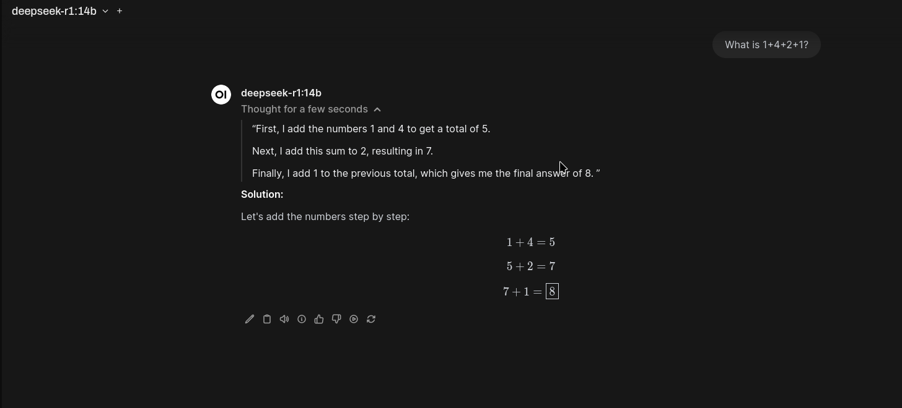

   2. What football team is based in Green Bay, Wisconsin? Use their full name.

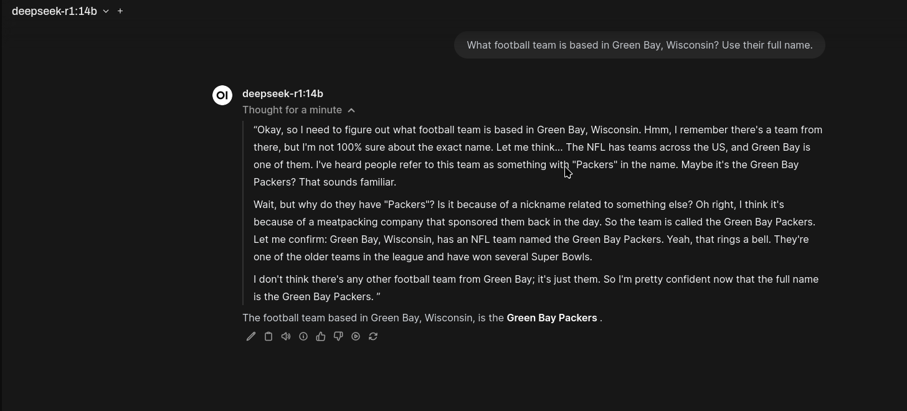

   3. What is the capital of Nauru?

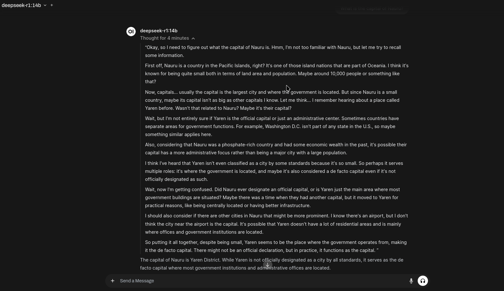

   4. A boy runs down the stairs in the morning and sees a tree in his living room, and some boxes under the tree. What day is it?

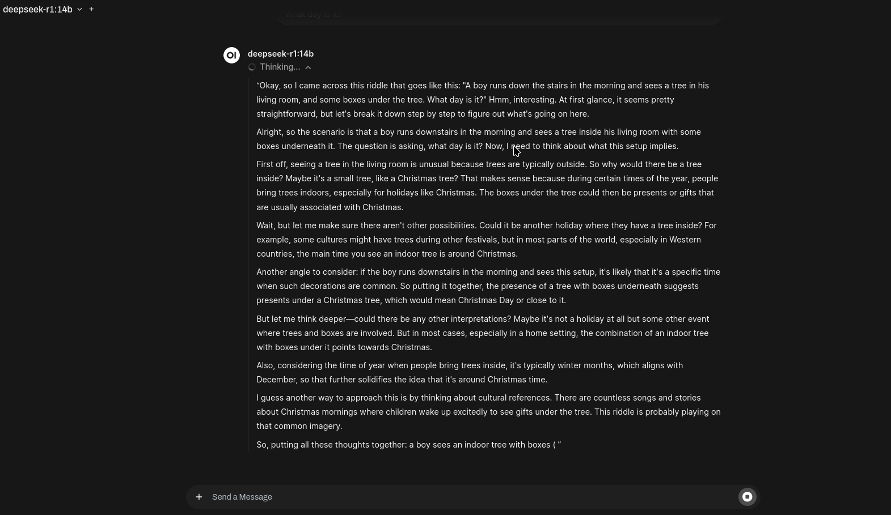

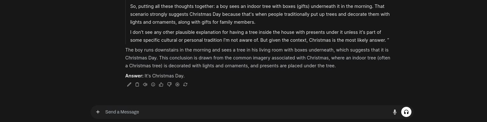

   5. If there is a shark in the pool of my basement, is it safe to go upstairs?

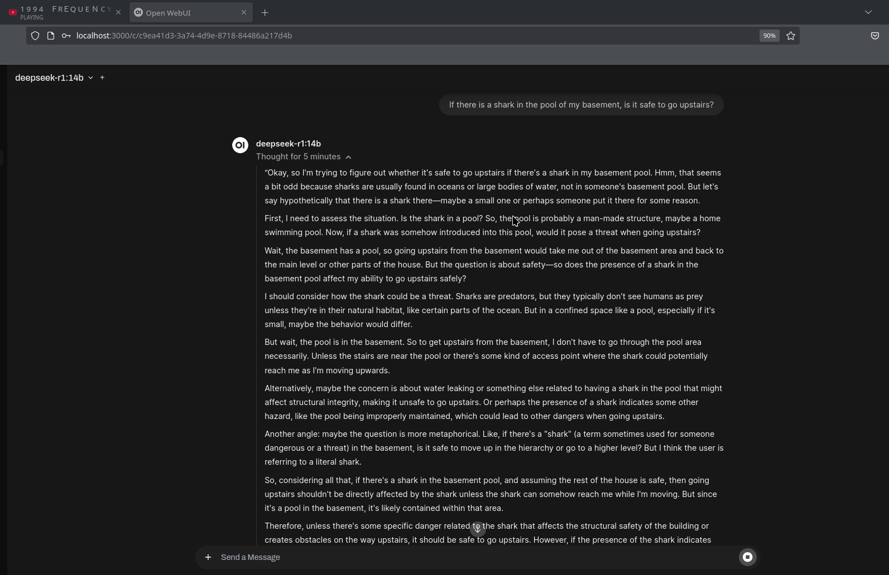

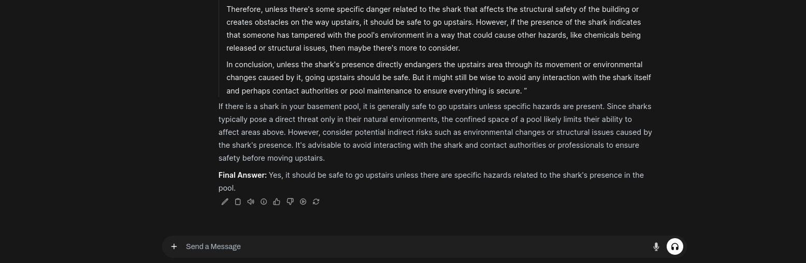

   6. Given an array of integers numbers and an integer target, return indices of the
      two numbers such that they add up to the target. You may assume that each input
      would have exactly one solution, and you may not use the same element twice.
      You can return the answer in any order.

      Total time to think: 14 mins

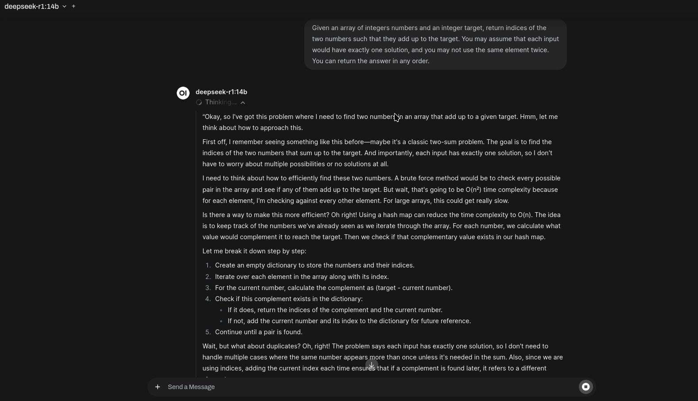

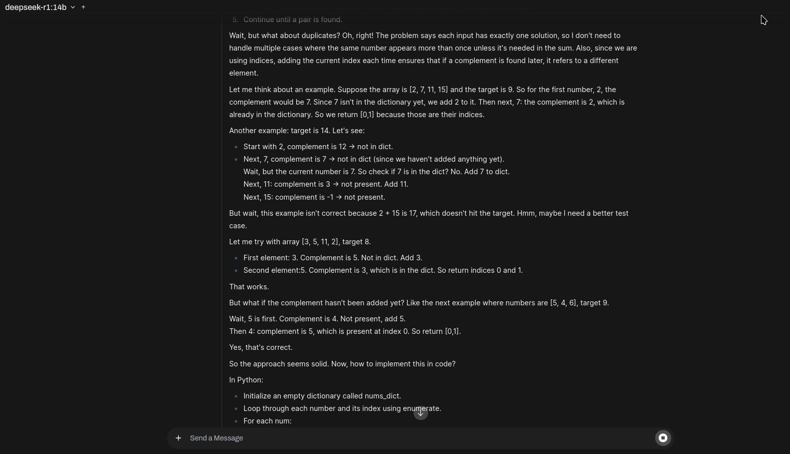

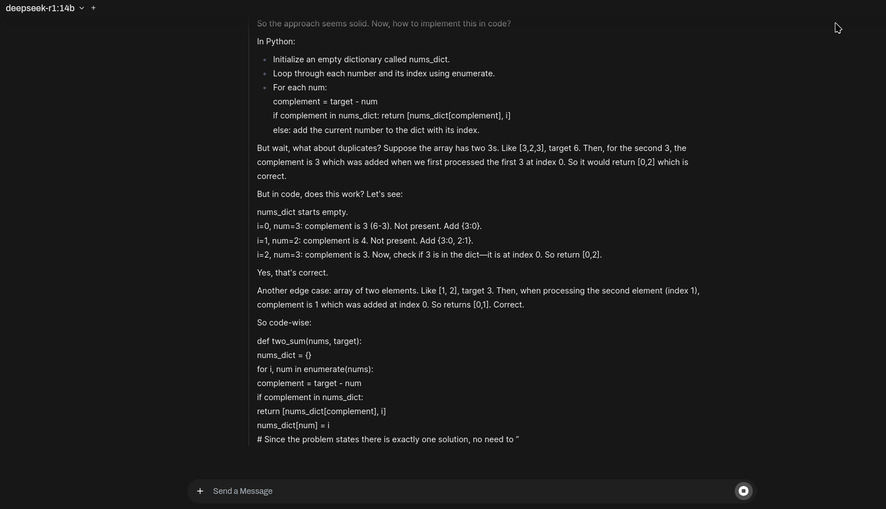

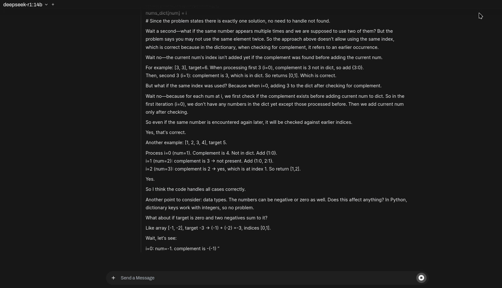

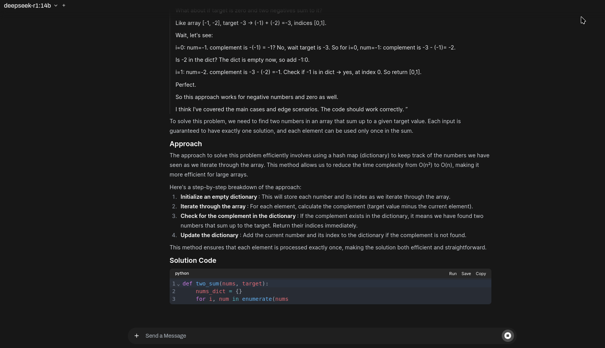

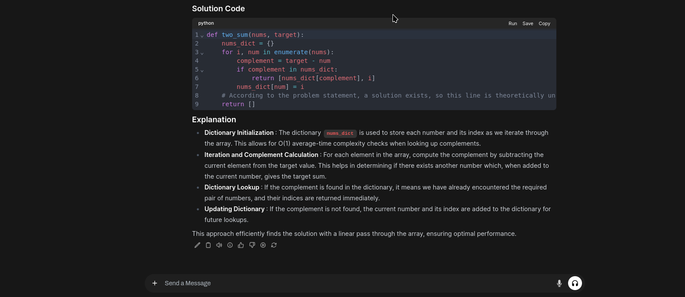
