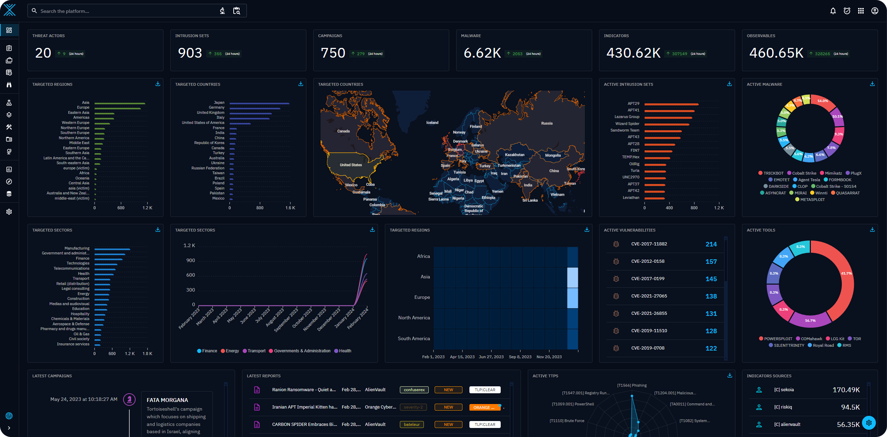
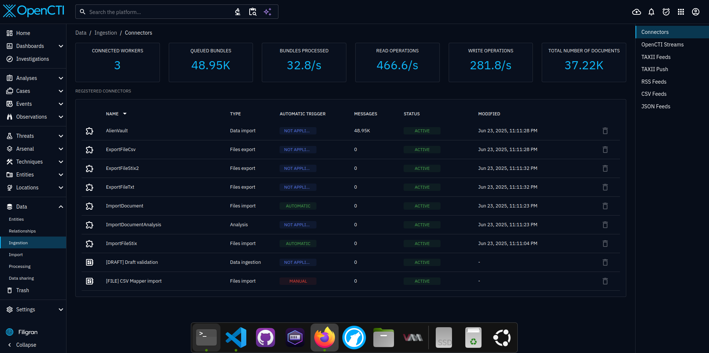
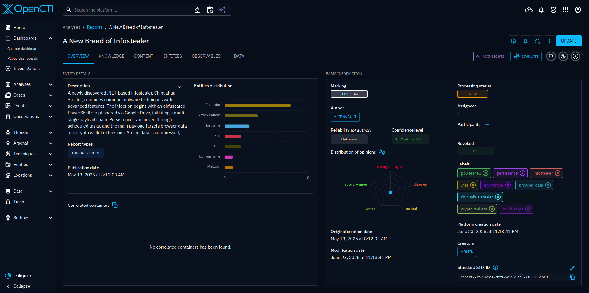

## Introduction

OpenCTI is an open source platform allowing organizations to manage their cyber threat intelligence knowledge and observables. It has been created in order to structure, store, organize and visualize technical and non-technical information about cyber threats.

The structuration of the data is performed using a knowledge schema based on the [STIX2 standards](https://oasis-open.github.io/cti-documentation/). It has been designed as a modern web application including a [GraphQL API](https://graphql.org) and an UX oriented frontend. Also, OpenCTI can be integrated with other tools and applications such as [MISP](https://github.com/MISP/MISP), [TheHive](https://github.com/TheHive-Project/TheHive), [MITRE ATT&CK](https://github.com/mitre/cti), etc.



## Objective

The goal is to create a comprehensive tool allowing users to capitalize technical (such as TTPs and observables) and non-technical information (such as suggested attribution, victimology etc.) while linking each piece of information to its primary source (a report, a MISP event, etc.), with features such as links between each information, first and last seen dates, levels of confidence, etc. The tool is able to use the [MITRE ATT&CK framework](https://attack.mitre.org) (through a [dedicated connector](https://github.com/OpenCTI-Platform/connectors)) to help structure the data. The user can also choose to implement their own datasets.

Once data has been capitalized and processed by the analysts within OpenCTI, new relations may be inferred from existing ones to facilitate the understanding and the representation of this information. This allows the user to extract and leverage meaningful knowledge from the raw data.

OpenCTI not only allows [imports](https://docs.opencti.io/latest/usage/import-automated/) but also [exports of data](https://docs.opencti.io/latest/usage/feeds/) under different formats (CSV, STIX2 bundles, etc.). [Connectors](https://filigran.notion.site/OpenCTI-Ecosystem-868329e9fb734fca89692b2ed6087e76) are currently developed to accelerate interactions between the tool and other platforms.

### Usage:

Modify "generate_env.sh" with new username/password, see also connectors.

Add API Keys to your connectors and append them to the end of the "docker-compose.yml" file.

Examples include how to integrate Alienvault OTX and Greynoise.

```bash
# change admin email/password for login
chmod +x generate_env.sh
./generate_env.sh

podman-compose up -d
```

http://localhost:8080

### Example: Alienvault OTX

##



