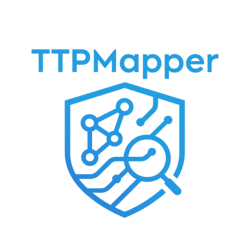

<p align="center">
  
</p>

# TTPMapper


TTPMapper is an AI-driven threat intelligence parser that converts unstructured reports whether from web URLs or PDF files into structured intelligence. Using the DeepSeek LLM, it extracts MITRE ATT&CK techniques, IOCs, threat actors, and generates contextual summaries. Results can be exported in JSON or STIX 2.1 formats for analysis or integration.

### Key Features

1. **MITRE ATT&CK techniques**
   Full mapping with:
   - `technique_id`
   - `technique_name`
   - `tactics`
   - `procedure_description`
   - `url`

2. **Indicators of Compromise (IOCs)**
   Real observed:
   - IP addresses
   - Domains
   - URLs (C2, malware hosting, etc.)
   - Hashes (MD5, SHA1, SHA256)
   - CVEs

3. **Threat actor names**
   Extracts the actors behind the activity (e.g., `APT28`, `LockBit`, etc.)

4. **Auto-generated summary**
   Auto-generated summaries highlighting threat context, attacker methods, and key findings from the report.

---

## Output Formats

| Format     | Description                             |
|------------|-----------------------------------------|
| `json`     | Default format with extracted structure |
| `stix21`   | STIX 2.1 Bundle (for CTI platforms)      |

---

## Setup

Before running TTPMapper, make sure you have a valid DeepSeek API key and set it as an environment variable:

```bash
export DEEPSEEK_API_KEY=your_api_key_here
```

## Sample Usage

```bash
# Analyze PDF threat report and get output in JSON format
python3 main.py --pdf "lockbit-report.pdf" --output json --verbose

# Analyze a web-based threat report and export as STIX 2.1
python3 main.py --url https://thedfirreport.com/2025/05/19/another-confluence-bites-the-dust-falling-to-elpaco-team-ransomware/ --output stix21

# Minimal command (default output is JSON)
python3 main.py --pdf "sample.pdf"
```

## License

This project is licensed under the GNU General Public License. For more details, please refer to the LICENSE file.
