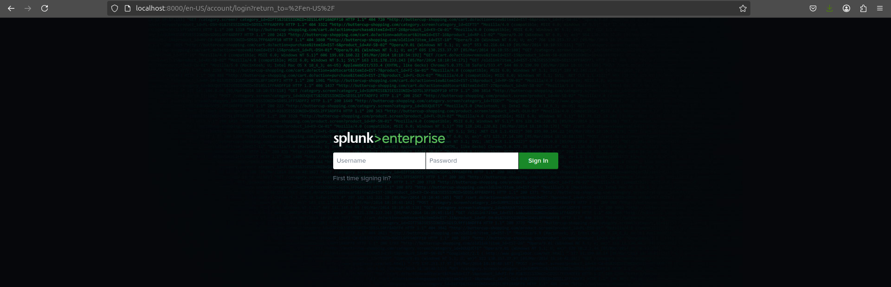
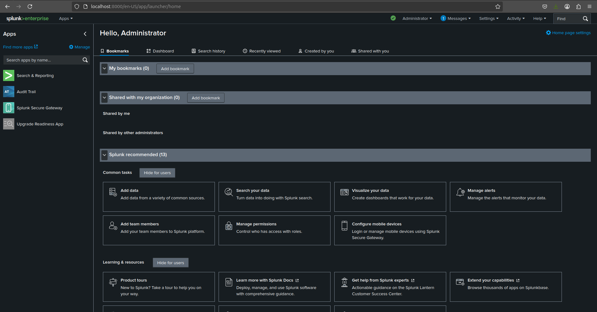

<p align="center">
  
</p>

---

Collection of various scripts used for building splunk components.

### System Requirements:
---

Supported file systems and distributed file system protocols for mounted volume must be:

Linux: 	ext3, ext4, btrfs, XFS, NFS 3/4 (C)

```bash
# execute system requirements script
sudo chmod +x sys_prep.sh
./sys_prep.sh
```

### Enterprise Spin Up
---

```sh
# as system user splunk
cd enterprise/

# debian build
podman build -t splunk .

# alma build with stig's applied
podman build -t splunk -f stig.Dockerfile

# create splunk network
podman network create splunk
```

Run splunk container:

```sh
podman run --rm -it --name splunkenterprise \
    --hostname splunkenterprise \
    --network splunk \
    -e SPLUNK_START_ARGS=--accept-license \
    -e SPLUNK_ENABLE_LISTEN=9997 \
    -e SPLUNK_ADD='tcp 1514' \
    -v opt-splunk-etc:/opt/splunk/etc:Z \
    -v opt-splunk-var:/opt/splunk/var:Z \
    -p "8000:8000" \
    -p "9997:9997" \
    -p "8088:8088" \
    -p "1514:1514" \
    splunk
```
Create splunk account and password.

##
Login to splunk:

localhost:8000

<p align="center">
  
</p>

<p align="center">
  
</p>

Continue to universal forwarder to begin data collection.