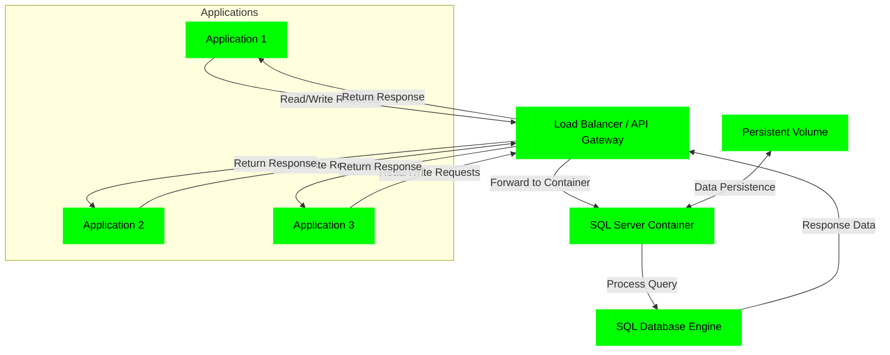
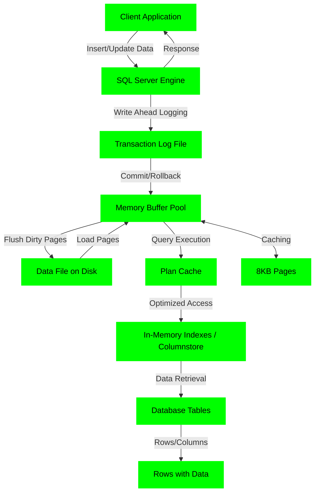

## SQL

### Application → API Gateway → SQL Container (Data Flow)



### SQL Data Flow



### How Applications Connect to the API Gateway
---

The API Gateway acts as a centralized entry point for applications to interact with the sharded SQL Server containers (each handling a separate user database). This design ensures secure, scalable, and efficient routing of high-volume traffic. Below, is an explaination of the connection process step-by-step, including code examples for client-side integration. This assumes the gateway is running (e.g., via `docker compose up`), exposed on port 3000, and configured with JWT authentication, connection pooling, and dynamic sharding via Redis.

#### 1. **Prerequisites for Applications**
   - **Endpoint URL**: Applications connect to the gateway's base URL, e.g., `http://localhost:3000` (or `https://your-domain.com:3000` in production with SSL/TLS enabled for security).
   - **Authentication**: All requests require a JWT token in the `Authorization` header (Bearer scheme). Generate tokens server-side using a shared secret (e.g., via libraries like `jsonwebtoken` in Node.js or equivalents in other languages). Example payload: `{ user: "app_user", exp: Math.floor(Date.now() / 1000) + (60 * 60) }` (1-hour expiry).
   - **Request Format**: Use HTTP POST to `/query` with a JSON body containing:
     - `user_id`: Integer for sharding/routing (e.g., 42).
     - `query`: SQL query string (e.g., "SELECT * FROM Users WHERE id = @param0").
     - `params`: Optional array of parameters for safe binding (prevents SQL injection).
   - **Libraries**: Use HTTP clients like `fetch` (JS), `requests` (Python), `HttpClient` (C#), or `OkHttp` (Java/Android) for sending requests.
   - **Error Handling**: Expect HTTP status codes (e.g., 200 OK, 400 Bad Request, 401 Unauthorized, 429 Too Many Requests for rate limiting, 500 Internal Error). Implement retries with exponential backoff for transient failures.
   - **High-Volume Considerations**: For large-scale apps, use connection pooling on the client side (if direct, but here gateway handles it), batch requests if possible, and monitor for rate limits (100 requests/IP per 15 min by default).

#### 2. **Connection Flow**
   1. **Application Prepares Request**: The app constructs the JSON payload and includes the JWT token.
   2. **Send Request to Gateway**: POST to `/query`. The gateway validates the token, rate-limits the IP, and determines the shard via Redis (dynamic) or fallback hash.
   3. **Gateway Processes**: Uses pooled connections to forward the query to the correct SQL container (e.g., sql1 or sql2), executes with param binding, and handles retries internally (up to 3 attempts).
   4. **Response**: Gateway returns JSON with results (e.g., recordset array) or errors.
   5. **Logging/Monitoring**: Gateway logs errors; apps should log responses for debugging.

#### 3. **Example Client-Side Code Snippets**
Here are examples in common languages. Assume the gateway is at `http://localhost:3000`, and you have a JWT token.

- **JavaScript (Node.js or Browser with fetch)**:
  ```javascript
  const fetch = require('node-fetch');  // For Node.js; browser has built-in fetch

  async function queryDatabase(userId, sqlQuery, params = []) {
    const token = 'your_jwt_token_here';  // Generate securely
    const response = await fetch('http://localhost:3000/query', {
      method: 'POST',
      headers: {
        'Content-Type': 'application/json',
        'Authorization': `Bearer ${token}`
      },
      body: JSON.stringify({ user_id: userId, query: sqlQuery, params })
    });

    if (!response.ok) {
      const error = await response.json();
      throw new Error(`Error: ${error.error || response.statusText}`);
    }

    return await response.json();
  }

  // Usage
  queryDatabase(42, 'SELECT * FROM Users WHERE id = @param0', [42])
    .then(results => console.log('Results:', results))
    .catch(err => console.error('Query failed:', err));
  ```

- **Python (with requests)**:
  ```python
  import requests
  import json

  def query_database(user_id, sql_query, params=[]):
      token = 'your_jwt_token_here'  # Generate securely
      url = 'http://localhost:3000/query'
      headers = {
          'Content-Type': 'application/json',
          'Authorization': f'Bearer {token}'
      }
      payload = {'user_id': user_id, 'query': sql_query, 'params': params}

      try:
          response = requests.post(url, headers=headers, json=payload)
          response.raise_for_status()  # Raise for 4xx/5xx
          return response.json()
      except requests.exceptions.HTTPError as err:
          error = response.json() if response.text else {'error': str(err)}
          raise Exception(f"Error: {error.get('error', 'Unknown')}")

  # Usage
  try:
      results = query_database(42, 'SELECT * FROM Users WHERE id = @param0', [42])
      print('Results:', results)
  except Exception as e:
      print('Query failed:', e)
  ```

- **C# (.NET with HttpClient)**:
  ```csharp
  using System;
  using System.Net.Http;
  using System.Text;
  using System.Threading.Tasks;
  using System.Text.Json;

  public class SqlGatewayClient
  {
      private static readonly HttpClient client = new HttpClient();

      public async Task<object[]> QueryDatabaseAsync(int userId, string sqlQuery, object[] paramsArray = null)
      {
          string token = "your_jwt_token_here";  // Generate securely
          string url = "http://localhost:3000/query";
          client.DefaultRequestHeaders.Add("Authorization", $"Bearer {token}");

          var payload = new { user_id = userId, query = sqlQuery, params = paramsArray ?? new object[0] };
          var content = new StringContent(JsonSerializer.Serialize(payload), Encoding.UTF8, "application/json");

          HttpResponseMessage response = await client.PostAsync(url, content);
          if (!response.IsSuccessStatusCode)
          {
              var error = await response.Content.ReadAsStringAsync();
              throw new Exception($"Error: {error}");
          }

          var result = await response.Content.ReadAsStringAsync();
          return JsonSerializer.Deserialize<object[]>(result);  // Adjust type as needed
      }
  }

  // Usage
  var client = new SqlGatewayClient();
  try
  {
      var results = await client.QueryDatabaseAsync(42, "SELECT * FROM Users WHERE id = @param0", new object[] { 42 });
      Console.WriteLine("Results: " + JsonSerializer.Serialize(results));
  }
  catch (Exception e)
  {
      Console.WriteLine("Query failed: " + e.Message);
  }
  ```

- **Java (with OkHttp)**:
  ```java
  import okhttp3.*;
  import com.google.gson.Gson;
  import com.google.gson.JsonObject;
  import java.io.IOException;

  public class SqlGatewayClient {
      private static final OkHttpClient client = new OkHttpClient();
      private static final Gson gson = new Gson();

      public Object[] queryDatabase(int userId, String sqlQuery, Object[] params) throws IOException {
          String token = "your_jwt_token_here";  // Generate securely
          String url = "http://localhost:3000/query";

          JsonObject payload = new JsonObject();
          payload.addProperty("user_id", userId);
          payload.addProperty("query", sqlQuery);
          payload.add("params", gson.toJsonTree(params != null ? params : new Object[0]));

          RequestBody body = RequestBody.create(gson.toJson(payload), MediaType.parse("application/json"));
          Request request = new Request.Builder()
                  .url(url)
                  .header("Authorization", "Bearer " + token)
                  .post(body)
                  .build();

          try (Response response = client.newCall(request).execute()) {
              if (!response.isSuccessful()) {
                  String error = response.body().string();
                  throw new IOException("Error: " + error);
              }
              return gson.fromJson(response.body().string(), Object[].class);  // Adjust type
          }
      }

      // Usage
      public static void main(String[] args) {
          SqlGatewayClient client = new SqlGatewayClient();
          try {
              Object[] results = client.queryDatabase(42, "SELECT * FROM Users WHERE id = @param0", new Object[]{42});
              System.out.println("Results: " + gson.toJson(results));
          } catch (IOException e) {
              System.out.println("Query failed: " + e.getMessage());
          }
      }
  }
  ```

#### 4. **Best Practices for Enterprise Integration**
   - **Security**: Always use HTTPS in production (configure via NGINX reverse proxy or Docker). Rotate JWT secrets. Validate/escape queries client-side if needed (though gateway binds params).
   - **High Volume**: Scale gateway replicas (e.g., `--scale api-gateway=10`). Use load balancers like NGINX/Traefik in front. Monitor with Prometheus (add endpoint in gateway.js).
   - **Dynamic Sharding**: Update mappings via `/set-shard` POST (e.g., { user_id: 42, shard_id: 2 }) for migrations.
   - **Testing**: Simulate load with tools like Apache JMeter. Check logs for errors.
   - **Alternatives**: For direct SQL (no API), use proxies like MaxScale or PgBouncer, but API adds control.

### Connecting to SQL Server Docker Container (Admin Purposes)
---

Before connecting with SSMS or Azure Data Studio, ensure the following:
- **Container Running**: Verify the SQL Server container is active (`docker ps`). Use an official image like `mcr.microsoft.com/mssql/server:2025-latest`.
- **Port Exposed**: Map port 1433 to the host (e.g., `-p 1433:1433` in `docker run` or docker-compose). If custom port, use it in connection (e.g., `localhost,1434`).
- **SA Password**: Set via `MSSQL_SA_PASSWORD` environment variable (strong password required: 8+ chars, upper/lower/number/symbol).
- **Mixed Mode Authentication**: Enabled by default in containers (allows SQL logins like SA). If not, exec into container and run: `sqlcmd -S localhost -U sa -P <password> -Q "ALTER LOGIN sa ENABLE; EXEC sp_configure 'contained database authentication', 1; RECONFIGURE;"`.
- **Firewall/Network**: Allow inbound TCP 1433 on host firewall. For remote access, use host IP (not localhost).
- **Tools Installed**: SSMS (Windows) from Microsoft downloads; Azure Data Studio (cross-platform) from Microsoft.
- **Container Config**: Ensure `ACCEPT_EULA=Y` env var is set. For Linux hosts, allocate 4GB+ memory to Docker.

### Connecting with SSMS (SQL Server Management Studio)
---

1. Launch SSMS.
2. In "Connect to Server":
   - Server name: `localhost` (or host IP).
   - Authentication: SQL Server Authentication.
   - User name: `sa`.
   - Password: Your `MSSQL_SA_PASSWORD`.
3. Click "Connect".

### Connecting with Azure Data Studio
---

1. Launch Azure Data Studio.
2. Click "New Connection".
3. In "Connection Details":
   - Server: `localhost` (or host IP).
   - Authentication type: SQL Login.
   - User name: `sa`.
   - Password: Your `MSSQL_SA_PASSWORD`.
   - Database: `<default>` or "master".
4. Click "Connect".