## SQL Troubleshooting Info
---



```mermaid
graph TD
    subgraph ClientLayer["Client / Application Layer"]
        Client[Client Application] -->|"Submit Query<br>e.g. INSERT SELECT"| Network[Network Transport<br>TCP/IP Named Pipes]
    end

    Network -->|"Incoming Request"| SQLServer[SQL Server Engine<br>sqlservr Process]

    subgraph ParsingOptimization["Query Parsing & Optimization"]
        SQLServer -->|"Parse SQL"| Parser[Parser Tokenizer<br>Troubleshooting: Syntax Errors Msg 156]
        Parser -->|"Algebrizer Bind"| Algebrizer[Algebrizer<br>Troubleshooting: Object Not Found Msg 208 Ambiguous Columns]
        Algebrizer -->|"Query Optimizer"| Optimizer[Query Optimizer<br>Uses Stats Indexes<br>Troubleshooting: Bad Plans Parameter Sniffing Outdated Stats High CPU]
        Optimizer -->|"Execution Plan"| PlanCache[Plan Cache<br>Troubleshooting: Plan Cache Bloat Recompiles Ad Hoc Workloads]
    end

    subgraph ExecutionEngine["Execution Engine"]
        PlanCache -->|"Execute Plan"| Executor[Query Executor<br>Scans Seeks Joins<br>Troubleshooting: Waits CXPACKET PAGEIOLATCH]
        Executor <-->|"Locks Blocks"| LockManager[Lock Manager<br>Troubleshooting: Deadlocks Msg 1205 Blocking Long Transactions]
        Executor -->|"Data Modification"| BufferPool[Buffer Pool Memory<br>Caches Pages<br>Troubleshooting: Memory Pressure PAGELATCH OOM]
        BufferPool -->|"Write Ahead Logging"| TransactionLog[Transaction Log LDF<br>Ensures Durability<br>Troubleshooting: Log Full Msg 9002 Long Log Chains]
        TransactionLog -->|"Checkpoint Flush"| DataFile[Data Files MDF NDF<br>Persists Data<br>Troubleshooting: I/O Bottlenecks Corruption DBCC CHECKDB]
    end

    subgraph StorageLayer["Storage Layer"]
        DataFile <-->|"Pages Extents"| Pages[8KB Pages Extents<br>IAM PFS GAM Pages<br>Troubleshooting: Fragmentation Page Splits]
        Pages -->|"Data Structures"| Indexes[Indexes Clustered Non-Clustered Columnstore<br>Troubleshooting: Missing Indexes Fragmented REBUILD REORGANIZE]
        Indexes -->|"Table Access"| Tables[Tables Heaps<br>Rows Columns<br>Troubleshooting: Heap Forwarding Data Skew]
        Tables -->|"Data Retrieval"| Rows[Rows with Data<br>Troubleshooting: Corruption CHECKSUM Large Rows VARCHAR MAX Overflow]
    end

    Executor -->|"Results"| BufferPool
    BufferPool -->|"Return Data"| SQLServer
    SQLServer -->|"Response over Network"| Client

    %% Styling - GitHub & mermaid.live safe
    classDef trouble fill:#ff4444,stroke:#cc0000,color:#ffffff,font-weight:bold
    class Parser,Algebrizer,Optimizer,PlanCache,Executor,LockManager,BufferPool,TransactionLog,DataFile,Pages,Indexes,Tables,Rows trouble

    classDef normal fill:#004400,stroke:#00ff44,color:#ffffff
    class Client,Network,SQLServer normal

    style ParsingOptimization fill:none,stroke:#00cc44,stroke-width:2px
    style ExecutionEngine fill:none,stroke:#00cc44,stroke-width:2px
    style StorageLayer fill:none,stroke:#00cc44,stroke-width:2px
    style ClientLayer fill:none,stroke:#00cc44,stroke-width:2px
```

## Troubleshooting: Syntax Errors (Msg 156)

Syntax errors like Msg 156 ("Incorrect syntax near the keyword 'X'") are common entry-level issues that prevent queries from even parsing. They often stem from typos, mismatched quotes/parentheses, invalid keywords, or version-specific syntax differences. Optimizing here involves proactive code reviews, using tools like SQL Prompt or SSMS IntelliSense, and enforcing coding standards.

### Common Causes
- Typos or misspelled keywords (e.g., "SELET" instead of "SELECT").
- Unbalanced quotes, parentheses, or brackets.
- Using reserved keywords without brackets (e.g., [Date] as a column name).
- Syntax not supported in the SQL Server version (e.g., newer features in older editions).
- Dynamic SQL with improper string concatenation leading to invalid syntax.

### Troubleshooting Steps
1. **Reproduce the Error**: Run the query in SSMS or Azure Data Studio to capture the exact message and line number.
2. **Check Query Text**: Use `PRINT` or copy-paste into a syntax checker. Look for unbalanced elements.
3. **Enable Detailed Errors**: If in an app, ensure `SET XACT_ABORT ON;` or check app logs for full query.
4. **Use DMVs**: Query `sys.dm_exec_sql_text` with session_id to see the offending SQL.
   ```sql
   SELECT t.text, r.session_id
   FROM sys.dm_exec_requests r
   CROSS APPLY sys.dm_exec_sql_text(r.sql_handle) t
   WHERE r.session_id = @@SPID;  -- Replace with problematic SPID
   ```
5. **Test in Isolation**: Break the query into parts to isolate the syntax issue.

### Fixes and Optimizations
- **Immediate Fix**: Correct the syntax (e.g., add missing comma, close quote).
- **Prevent Recurrence**:
  - Implement code linting with tools like tSQLt or SQL Code Guard.
  - Use parameterized queries to avoid dynamic SQL pitfalls.
  - Upgrade to newer SQL versions for better error messages (e.g., SQL 2022+ has improved diagnostics).
- **Performance Impact**: Syntax errors block execution, so fix early to avoid runtime failures. For apps, wrap in TRY/CATCH:
  ```sql
  BEGIN TRY
      -- Your query
  END TRY
  BEGIN CATCH
      SELECT ERROR_MESSAGE(), ERROR_LINE();
  END CATCH
  ```
- **Best Practices**: Enforce peer reviews, use schema-qualified objects, and avoid overly complex queries (split into CTEs/Views).

Monitor via Extended Events session for "error_reported" with error_number = 156.

---

## Troubleshooting: Object Not Found (Msg 208), Ambiguous Columns

Msg 208 ("Invalid object name 'X'") or ambiguous column errors occur during algebrizer binding when SQL can't resolve objects/columns. These indicate schema issues, permission gaps, or poor query design. Optimization involves schema consistency, proper qualifications, and monitoring for deprecated objects.

### Common Causes
- Object doesn't exist in the database/schema.
- Wrong database context (e.g., USE wrong DB).
- Permissions: User lacks SELECT on sys.objects or object access.
- Ambiguous columns: Same name in joined tables without qualifiers.
- Temp tables or variables not declared.
- Case sensitivity in collation.

### Troubleshooting Steps
1. **Verify Existence**:
   ```sql
   SELECT * FROM sys.objects WHERE name = 'YourTable';
   ```
2. **Check Context**: `SELECT DB_NAME(), SCHEMA_NAME(schema_id) FROM sys.tables WHERE name = 'X';`
3. **Permissions**: `EXECUTE AS USER = 'problem_user'; SELECT * FROM YourTable; REVERT;`
4. **Ambiguous**: Use aliases (e.g., t1.col) and check query joins.
5. **Trace**: Use Profiler/Extended Events for "object_missing" or query sys.dm_exec_query_stats for failing plans.

### Fixes and Optimizations
- **Immediate Fix**: Qualify objects (e.g., dbo.YourTable), create missing objects, grant permissions:
  ```sql
  GRANT SELECT ON dbo.YourTable TO [user];
  ```
- **Prevent Recurrence**:
  - Always use schema-qualified names (e.g., dbo.Table).
  - Use synonyms for cross-DB references.
  - Implement CI/CD with schema validation (e.g., DACPAC deployments).
- **Performance Impact**: Binding failures waste CPU; optimize by caching valid plans and using OPTION (RECOMPILE) for dynamic cases.
- **Best Practices**: Audit schemas regularly with:
  ```sql
  SELECT name FROM sys.objects WHERE type = 'U' AND schema_id = SCHEMA_ID('dbo');  -- List tables
  ```
  Enable database triggers for object changes.

For ambiguous, refactor queries with CTEs/aliases.

---

## Troubleshooting: Bad Plans, Parameter Sniffing, Outdated Stats, High CPU

Bad execution plans from the optimizer lead to slow queries, high CPU, or suboptimal resource use. This is a core optimization area—focus on stats, hints, and plan guides. Parameter sniffing causes plans optimized for one param value to perform poorly for others.

### Common Causes
- Outdated/missing statistics (no AUTO_UPDATE_STATS).
- Parameter sniffing: Plan cached for atypical value.
- Cardinality estimation errors (wrong join estimates).
- High CPU from complex queries, missing indexes, or spills.
- Compatibility level not matching (e.g., old CE model).

### Troubleshooting Steps
1. **Capture Plan**: Use `SET STATISTICS XML ON;` or Query Store.
2. **Check Stats**:
   ```sql
   SELECT STATS_DATE(object_id, stats_id) FROM sys.stats WHERE name = 'YourStat';
   ```
3. **Sniffing**: Compare plans with different params using OPTION (RECOMPILE).
4. **High CPU**: Query sys.dm_os_wait_stats for CPU_SIGNAL waits; top queries via sys.dm_exec_query_stats.
5. **DMVs**:
   ```sql
   SELECT * FROM sys.dm_exec_cached_plans CROSS APPLY sys.dm_exec_query_plan(plan_handle);
   ```

### Fixes and Optimizations
- **Immediate Fix**: UPDATE STATISTICS YourTable; or OPTION (OPTIMIZE FOR UNKNOWN) for sniffing.
- **Prevent Recurrence**:
  - Enable AUTO_CREATE_STATISTICS and AUTO_UPDATE_STATISTICS_ASYNC.
  - Use Query Store to force good plans:
    ```sql
    EXEC sys.sp_query_store_force_plan @query_id = 1, @plan_id = 1;
    ```
  - For CPU: Add indexes, rewrite queries (e.g., avoid functions in WHERE).
- **Performance Impact**: Bad plans can spike CPU 100%; monitor with PerfMon (Processor % Time).
- **Best Practices**: Schedule stats updates in maintenance jobs. Use Trace Flag 4199 for optimizer fixes. Upgrade CE to 150+ for better estimates.

Regularly clear bad plans: `DBCC FREEPROCCACHE (plan_handle)`.

---

## Troubleshooting: Plan Cache Bloat, Recompiles, Ad Hoc Workloads

Plan cache bloat consumes memory with single-use plans; excessive recompiles waste CPU. Optimize for reuse with params and options like "optimize for ad hoc workloads".

### Common Causes
- Ad hoc queries without params (unique plans per literal).
- Frequent schema changes or stats updates triggering recompiles.
- OPTION (RECOMPILE) overuse.
- Low memory forcing evictions.

### Troubleshooting Steps
1. **Cache Size**:
   ```sql
   SELECT COUNT(*) AS CachedPlans, SUM(size_in_bytes)/1024/1024 AS MB FROM sys.dm_exec_cached_plans;
   ```
2. **Ad Hoc**: Query for usecounts = 1.
3. **Recompiles**: sys.dm_exec_query_stats (recompile_count); Extended Events "sql_statement_recompile".
4. **Bloat**: Check sys.dm_os_memory_clerks for CACHESTORE_SQLCP.

### Fixes and Optimizations
- **Immediate Fix**: sp_configure 'optimize for ad hoc workloads', 1; DBCC FREESYSTEMCACHE('SQL Plans');
- **Prevent Recurrence**:
  - Parameterize queries (e.g., sp_executesql).
  - Use stored procs/views for reuse.
  - Limit cache with max server memory.
- **Performance Impact**: Bloat reduces buffer pool; recompiles spike CPU.
- **Best Practices**: Monitor with:
  ```sql
  SELECT text, usecounts FROM sys.dm_exec_cached_plans CROSS APPLY sys.dm_exec_sql_text(plan_handle) WHERE usecounts = 1;
  ```
  Schedule cache cleanup jobs for large ad hoc environments.

---

## Troubleshooting: Waits (CXPACKET for Parallelism, PAGEIOLATCH for I/O)

Waits like CXPACKET (parallelism sync) or PAGEIOLATCH (disk I/O) indicate bottlenecks during execution. Tune MAXDOP, storage, and queries to reduce waits.

### Common Causes
- CXPACKET: Uneven parallel work distribution, high MAXDOP.
- PAGEIOLATCH: Slow disk reads (pages from disk to buffer).
- Other: ASYNC_NETWORK_IO (client delays), LCK_M_XX (locking).

### Troubleshooting Steps
1. **Capture Waits**:
   ```sql
   SELECT * FROM sys.dm_os_wait_stats ORDER BY wait_time_ms DESC;
   ```
2. **Active Waits**: sys.dm_os_waiting_tasks.
3. **Query-Specific**: sys.dm_exec_requests (wait_type).
4. **I/O Stalls**: sys.dm_io_virtual_file_stats.

### Fixes and Optimizations
- **Immediate Fix**: For CXPACKET, set MAXDOP=4 (match cores); cost threshold for parallelism=50.
- **Prevent Recurrence**:
  - Optimize queries (add indexes to avoid scans).
  - Upgrade storage (SSD, more spindles).
  - For I/O: Enable instant file initialization, compress backups.
- **Performance Impact**: High waits = slow queries; aim for <10ms avg.
- **Best Practices**: Clear waits: `DBCC SQLPERF('sys.dm_os_wait_stats', CLEAR);`. Use Query Store for wait stats per query.

Monitor with Performance Monitor (Wait Time counters).

---

## Troubleshooting: Deadlocks (Msg 1205), Blocking (Long Transactions)

Deadlocks (Msg 1205) occur when sessions block each other cyclically; blocking from long/open transactions. Minimize with isolation levels, indexing, and monitoring.

### Common Causes
- Concurrent updates without proper indexing (scans lock more rows).
- Long-running transactions (no COMMIT).
- Escalation from row to table locks.
- Cross-DB deadlocks.

### Troubleshooting Steps
1. **Capture Deadlocks**: Extended Events "xml_deadlock_report" or Trace Flag 1222.
2. **Blocking**:
   ```sql
   SELECT * FROM sys.dm_exec_requests WHERE blocking_session_id <> 0;
   ```
3. **Graph**: Use deadlock XML from error log.
4. **Sessions**: sp_who2 or sys.dm_tran_locks.

### Fixes and Optimizations
- **Immediate Fix**: Kill blocker: `KILL spid;`. Use READ COMMITTED SNAPSHOT for readers.
- **Prevent Recurrence**:
  - Index hot columns to reduce locks.
  - Shorten transactions (batch updates).
  - Use NOLOCK or SNAPSHOT isolation cautiously.
- **Performance Impact**: Deadlocks abort transactions; blocking queues queries.
- **Best Practices**: Alert on deadlocks via Agent jobs parsing logs. Optimize with:
  ```sql
  ALTER DATABASE YourDB SET READ_COMMITTED_SNAPSHOT ON;
  ```

Regularly review top blocking queries.

---

## Troubleshooting: Memory Pressure (PAGELATCH Waits, OOM Errors)

Memory pressure causes PAGELATCH waits (buffer contention) or OOM (Out of Memory) errors. Tune max/min memory, monitor clerks, and optimize queries to reduce spills.

### Common Causes
- Insufficient max server memory (SQL takes all, starves OS).
- Plan cache/query workspace bloat.
- Large sorts/hashes spilling to TempDB.
- External pressure (other apps on server).

### Troubleshooting Steps
1. **Memory Usage**:
   ```sql
   SELECT * FROM sys.dm_os_memory_clerks ORDER BY pages_kb DESC;
   ```
2. **Waits**: sys.dm_os_wait_stats (PAGELATCH_XX).
3. **OOM**: Check error log for "There is insufficient memory".
4. **Buffer**: sys.dm_os_buffer_descriptors.

### Fixes and Optimizations
- **Immediate Fix**: Set max server memory to 80% of physical (e.g., 6144 MB for 8GB).
- **Prevent Recurrence**:
  - Enable 'optimize for ad hoc workloads'.
  - Limit workspace with RESOURCE GOVERNOR.
  - Add RAM or scale up.
- **Performance Impact**: Pressure causes paging/swaps, slow performance.
- **Best Practices**: Monitor with:
  ```sql
  SELECT total_physical_memory_kb / 1024 AS Total_MB FROM sys.dm_os_sys_memory;
  ```
  Use LPIM (Lock Pages in Memory) privilege.

---

## Troubleshooting: Log Full (Msg 9002), Long Log Chains (No Backups)

Msg 9002 ("The transaction log for database 'X' is full") halts writes. Long chains from no backups inflate log size. Manage log with backups and sizing.

### Common Causes
- No transaction log backups (FULL recovery model).
- Long open transactions.
- Replication/mirroring delays.
- Disk space full.

### Troubleshooting Steps
1. **Log Size**:
   ```sql
   DBCC SQLPERF(LOGSPACE);
   ```
2. **Active VLFs**: sys.dm_db_log_stats.
3. **Open Trans**: `DBCC OPENTRAN;`
4. **Error Log**: Check for log reuse waits.

### Fixes and Optimizations
- **Immediate Fix**: Backup log: `BACKUP LOG YourDB TO DISK = 'NUL';` (truncate) or add space.
- **Prevent Recurrence**:
  - Schedule log backups every 15min in FULL mode.
  - Use SIMPLE recovery if no point-in-time needed.
  - Shrink log file cautiously: `DBCC SHRINKFILE (LogFile, TargetSize);`
- **Performance Impact**: Full log blocks writes; long chains slow recovery.
- **Best Practices**: Pre-grow log files, monitor with Agent alerts on log used >70%.

---

## Troubleshooting: I/O Bottlenecks, Corruption (DBCC CHECKDB Errors)

I/O bottlenecks slow reads/writes; corruption from hardware/power failures. Use fast storage, checksums, and regular checks.

### Common Causes
- Slow disks (HDD vs SSD), high latency.
- Fragmented files, insufficient IOPS.
- Corruption: Bad sectors, incomplete writes.
- No page verify (NONE instead of CHECKSUM).

### Troubleshooting Steps
1. **I/O Stalls**:
   ```sql
   SELECT * FROM sys.dm_io_virtual_file_stats(NULL, NULL);
   ```
2. **Corruption**: `DBCC CHECKDB (YourDB) WITH NO_INFOMSGS;`
3. **PerfMon**: Disk sec/Read, Queue Length.
4. **Waits**: sys.dm_os_wait_stats (IO_COMPLETION).

### Fixes and Optimizations
- **Immediate Fix**: For corruption, restore from backup or DBCC CHECKDB REPAIR_ALLOW_DATA_LOSS (last resort).
- **Prevent Recurrence**:
  - Set PAGE_VERIFY CHECKSUM.
  - Use SSD/NVMe, RAID10 for redundancy.
  - Defrag indexes/files.
- **Performance Impact**: High I/O waits = slow queries; corruption = data loss.
- **Best Practices**: Schedule weekly DBCC CHECKDB, monitor I/O with:
  ```sql
  ALTER DATABASE YourDB SET PAGE_VERIFY CHECKSUM;
  ```

---

## Troubleshooting: Fragmentation (High FILLFACTOR Needed), Page Splits

Fragmentation causes I/O inefficiency; page splits from inserts into full pages. Rebuild/reorganize indexes and set fillfactor.

### Common Causes
- Random inserts (GUID keys) causing splits.
- Default fillfactor=0 (100% full pages).
- No maintenance.

### Troubleshooting Steps
1. **Fragmentation Level**:
   ```sql
   SELECT * FROM sys.dm_db_index_physical_stats(DB_ID(), NULL, NULL, NULL, 'LIMITED');
   ```
2. **Splits**: sys.dm_db_index_operational_stats (page_split_count).
3. **FILLFACTOR**: sys.indexes.

### Fixes and Optimizations
- **Immediate Fix**: `ALTER INDEX ALL ON YourTable REBUILD WITH (FILLFACTOR=80);`
- **Prevent Recurrence**:
  - Set fillfactor 70-90 for write-heavy tables.
  - Use sequential keys (IDENTITY) over GUIDs.
  - Schedule Ola Hallengren maintenance scripts.
- **Performance Impact**: >30% frag = extra I/O; splits log heavy.
- **Best Practices**: Reorganize if frag 5-30%, rebuild >30%. Monitor with jobs.

---

## Troubleshooting: Missing Indexes, Fragmented Indexes (REBUILD/REORGANIZE)

Missing indexes cause scans; fragmentation scatters data. Use DMVs for suggestions and maintenance for defrag.

### Common Causes
- No indexes on filter/join columns.
- Outdated after schema changes.
- Fragmentation from updates/deletes.

### Troubleshooting Steps
1. **Missing**:
   ```sql
   SELECT * FROM sys.dm_db_missing_index_details;
   ```
2. **Usage**: sys.dm_db_index_usage_stats.
3. **Frag**: sys.dm_db_index_physical_stats.

### Fixes and Optimizations
- **Immediate Fix**: Create suggested indexes; REBUILD/REORGANIZE.
- **Prevent Recurrence**:
  - Analyze Query Store for top missing.
  - Automate with Agent jobs: REORGANIZE if frag 10-30%, REBUILD >30%.
- **Performance Impact**: Scans = high CPU/I/O; frag = extra reads.
- **Best Practices**: Avoid over-indexing (update overhead). Use INCLUDE columns.

---

## Troubleshooting: Heap Forwarding (No Clustered Index), Data Skew

Heaps (no clustered index) cause forwarding pointers; data skew unevenly distributes data. Always add clustered indexes and partition for skew.

### Common Causes
- Tables without clustered index (heaps).
- Skewed keys (e.g., most rows one value).
- Poor partitioning.

### Troubleshooting Steps
1. **Heaps**:
   ```sql
   SELECT * FROM sys.tables WHERE is_ms_shipped = 0 AND index_id = 0;
   ```
2. **Forwarding**: sys.dm_db_index_physical_stats (forwarded_record_count).
3. **Skew**: Query distribution with GROUP BY key.

### Fixes and Optimizations
- **Immediate Fix**: Add clustered index: `CREATE CLUSTERED INDEX IX ON YourHeap (KeyCol);`
- **Prevent Recurrence**:
  - Always create clustered on new tables.
  - For skew, use partitioning or filtered indexes.
- **Performance Impact**: Forwarding = extra I/O; skew = uneven parallelism.
- **Best Practices**: Rebuild heaps weekly. Monitor forwarding >10%.

---

## Troubleshooting: Corruption (CHECKSUM Errors), Large Rows (VARCHAR MAX Overflow)

Corruption from torn pages; large rows spill to LOB storage. Enable checksums and design for row size <8060 bytes.

### Common Causes
- No page verify, hardware failures.
- Rows >8KB from VARBINARY/VARCHAR(MAX).
- Improper shutdowns.

### Troubleshooting Steps
1. **Detect**: `DBCC CHECKDB;`
2. **Checksum**: Error log for "checksum mismatch".
3. **Row Size**:
   ```sql
   SELECT MAX(DATALENGTH(col)) FROM YourTable;
   ```

### Fixes and Optimizations
- **Immediate Fix**: Restore page or DB from backup.
- **Prevent Recurrence**:
  - Set PAGE_VERIFY CHECKSUM.
  - Store large data in FILESTREAM or separate tables.
- **Performance Impact**: Corruption = downtime; overflows = extra I/O.
- **Best Practices**: Run DBCC CHECKDB weekly. Compress large columns.