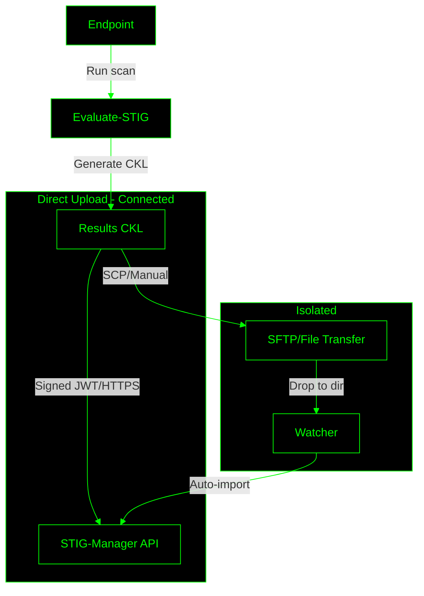

# STIG-Manager with Evaluate-STIG Integration

## Overview
This project deploys a production-ready STIG-Manager instance using Docker Compose, integrated with Evaluate-STIG for automated assessment ingestion. Supports direct API uploads or file-based transfers for isolated networks.

## Components
- **STIG-Manager**: Open-source API and web client for managing STIG (Security Technical Implementation Guide) assessments. Handles compliance tracking, reviews, and imports from checklists (CKL/XCCDF). Sponsored by NAVSEA Warfare Centers.
  GitHub: [https://github.com/NUWCDIVNPT/stig-manager](https://github.com/NUWCDIVNPT/stig-manager)
  Docs: [https://stig-manager.readthedocs.io](https://stig-manager.readthedocs.io)

- **Evaluate-STIG**: PowerShell tool for automating STIG evaluations on Windows endpoints. Generates checklists/results for import into STIG-Manager. Developed by DISA/NUWC.
  Download: Requires DoD access (e.g., CAC-enabled sites). Available via [https://spork.navsea.navy.mil/nswc-crane-division/evaluate-stig](https://spork.navsea.navy.mil/nswc-crane-division/evaluate-stig) or [https://public.cyber.mil/stigs/supplemental-automation-content/](https://public.cyber.mil/stigs/supplemental-automation-content/).

## Deployment
1. Run orchestration script (bash/python) to install dependencies, generate certs/passwords, build images, and start stack.
2. Configure Keycloak for Signed JWT client.
3. On endpoints, run Evaluate-STIG-Integration.ps1 for scans/uploads.

## Workflow Diagram
