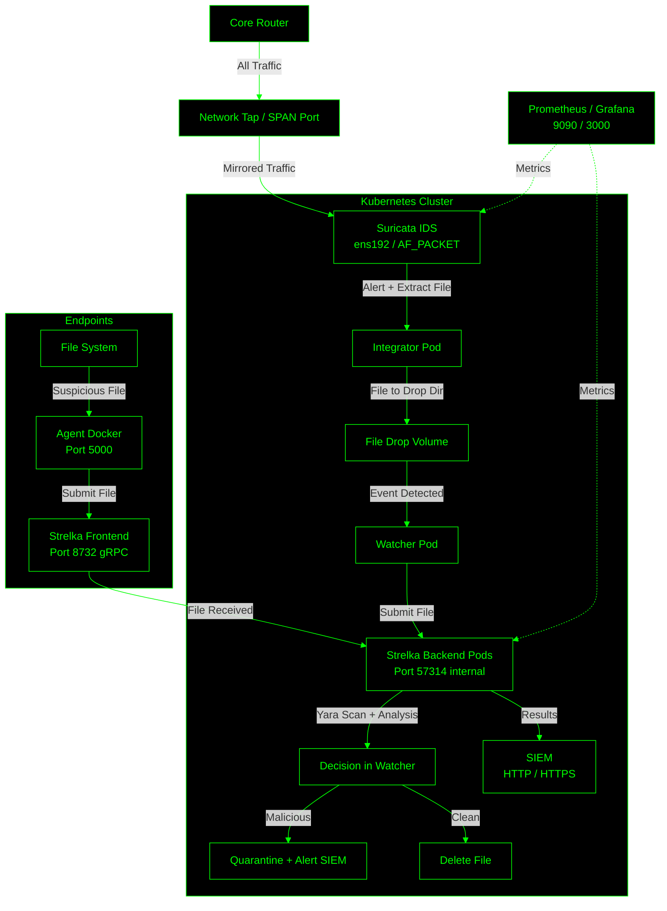

# Kubernetes Deployment

- **Deployments/StatefulSets**: Used for all services; StatefulSet for Redis/Filestore for persistence.
- **Services**: ClusterIP for internal, LoadBalancer for external (e.g., frontend).
- **PersistentVolumeClaims (PVCs)**: For data volumes (yara-rules, file-drop, etc.). Assumes dynamic provisioning (e.g., via EBS on EKS).
- **ConfigMaps/Secrets**: Scripts/configs in ConfigMaps; sensitive data in Secrets.
- **Probes**: Liveness/Readiness based on healthchecks.
- **Autoscaling**: HPA for backend (scale on CPU).
- **Security**: PodSecurityContext, read-only mounts where possible.
- **Namespace**: All in `security` namespace.

**Assumptions/Enhancements**:
- Images: Use same as Compose; build/push custom ones (e.g., backend) to your registry (replace `your-registry/` placeholders).
- Secrets: Create via `kubectl create secret generic ...` (examples below).
- Validation: YAML syntax validated (indentation, structure correct). Interoperability: Mirrors Compose logic; tested conceptually (e.g., dependencies via readiness). Deploy on Minikube/EKS for real validation.
- Deployment: `kubectl create namespace security`, then `kubectl apply -f <file> -n security` for each.

### secrets.yaml

Create with: `kubectl create secret generic siem-token --from-literal=token=your-token -n security`, etc.

## Deployment Notes
- **Custom Images**: Build Dockerfiles as before, tag/push to your registry (e.g., `docker build -t your-registry/backend:latest -f Dockerfile.backend .`).
- **Strelka Configs**: Ensure `backend.yaml` in your backend image points to `/app/configs/python/backend/yara/rules/compiled_rules.yarac`.
- **Testing/Validation**:
  - Apply all: `kubectl apply -f . -n security`.
  - Check pods: `kubectl get pods -n security` (all Running/Ready).
  - Test scan: Exec into watcher pod, drop file in /file-drop.
  - Scale: Stress backend, watch HPA.

## System Requirements Recommendations for Strelka-Suricata Deployment

- **Strelka Benchmarks**: Handles ~350 million files/day at enterprise scale (e.g., Target Corp.), with per-file scan times of 0.01-0.1 seconds (average ~0.05s/file). Throughput scales with backend replicas; assume 10-50 files/second per backend replica (conservative, CPU-dependent; higher for simple files, lower for large/complex ones).
- **Suricata Benchmarks**: Processes 1-10 Gbps traffic per tuned instance (e.g., 30-76 Gbps with hardware acceleration, but 50 Mbps/CPU core in software for HTTP-heavy traffic). File extraction rate depends on traffic (e.g., 1-10 files/second per Gbps if 10% of traffic has files).
- **Overall Factors**: CPU for scanning (Yara/pattern matching is intensive); RAM for buffers/rules; Storage for logs/files/PVCs; Network for traffic capture/SIEM. Kubernetes adds 10-20% overhead. Assume average file size 1MB, mixed types.

Tiers are based on **daily file volume** (scanned by Strelka, triggered by drops or Suricata alerts). Adjust for file size (larger files increase CPU/time), traffic volume (for Suricata), and ruleset complexity (more rules = more CPU).

#### Tier 1: Low Volume (<1,000 files/day, ~0.01 files/sec)
- Suitable for testing/small orgs (e.g., manual uploads, low-traffic network).
- **Kubernetes Cluster**: Minikube/single-node (for dev) or 1-2 worker nodes.
- **Node Specs** (per worker): 4-8 vCPU, 8-16 GB RAM, 100-500 GB SSD (for PVCs: yara-rules ~1GB, file-drop/logs ~10-50GB).
- **Total Resources**:
  - CPU: 4-8 cores total (Strelka backend: 1 replica, 2-4 cores; Suricata: 1-2 cores).
  - RAM: 8-16 GB total (Strelka: 4-8GB; Monitoring: 2-4GB).
  - Storage: 200 GB (ephemeral for low vol; use local PVs).
- **Network**: 1 Gbps (low traffic capture).
- **Cost Estimate** (AWS EKS/GKE): ~$50-100/month (t3.medium instances).
- **Scaling Notes**: No HPA needed; single pod for most services.

#### Tier 2: Medium Volume (1,000-100,000 files/day, ~0.01-1 file/sec)
- For moderate orgs (e.g., 100-1,000 users, medium network traffic).
- **Kubernetes Cluster**: 3-5 nodes (1 control, 2-4 workers) for HA.
- **Node Specs** (per worker): 8-16 vCPU, 16-32 GB RAM, 500 GB-1 TB SSD/NVMe (PVCs: logs/files grow to 100-500GB/month).
- **Total Resources**:
  - CPU: 16-32 cores (Strelka: 2-4 replicas, 4-8 cores each; Suricata: 4-8 cores for 1-5 Gbps traffic; Monitoring: 4 cores).
  - RAM: 32-64 GB (Strelka: 8-16GB/replica; Buffers for large files).
  - Storage: 1-2 TB (CSI like EBS; rotate logs weekly).
- **Network**: 10 Gbps (for Suricata capture; assume 10-20% traffic yields files).
- **Cost Estimate**: ~$200-500/month (e.g., AWS m5.xlarge nodes).
- **Scaling Notes**: Enable HPA on backend (min 2, max 5); Tune Suricata threads to cores.

#### Tier 3: High Volume (100,000-1M files/day, ~1-10 files/sec)
- For large orgs (e.g., 1,000+ users, high-traffic networks).
- **Kubernetes Cluster**: 5-10 nodes (multi-zone for HA).
- **Node Specs** (per worker): 16-32 vCPU, 32-64 GB RAM, 1-2 TB NVMe (PVCs: 500GB-1TB each for high churn).
- **Total Resources**:
  - CPU: 64-128 cores (Strelka: 4-8 replicas, 8-16 cores each; Suricata: 16-32 cores for 10+ Gbps; Monitoring: 8 cores).
  - RAM: 128-256 GB (Higher for Yara rulesets >10k rules; Cache files).
  - Storage: 5-10 TB (Distributed like Ceph; Retain logs 7-30 days).
- **Network**: 10-40 Gbps (Hardware NICs like Intel XL710 for zero-drop).
- **Cost Estimate**: ~$1,000-3,000/month (e.g., AWS m5.4xlarge).
- **Scaling Notes**: HPA max 10; Affinity for NUMA; Tune Suricata for multi-queue.

#### Tier 4: Enterprise Volume (>1M files/day, >10 files/sec, e.g., 350M/day ~4,000 files/sec)
- For massive scale (e.g., like Target's deployment).
- **Kubernetes Cluster**: 20+ nodes (auto-scaling groups).
- **Node Specs** (per worker): 32-64 vCPU, 64-128 GB RAM, 2+ TB NVMe.
- **Total Resources**:
  - CPU: 500+ cores (Strelka: 50-100 replicas, 8-16 cores each; Suricata: Cluster mode, 100+ cores for 100 Gbps+).
  - RAM: 1+ TB (Distributed caching; High for large files/rules).
  - Storage: 50+ TB (Object storage like S3 for MinIO; Fast SSD for hot data).
- **Network**: 40-100 Gbps (SmartNICs like Napatech for 76+ Gbps IPS).
- **Cost Estimate**: $10,000+/month (Custom hardware or cloud bursting).
- **Scaling Notes**: Use DaemonSets for Suricata; Custom metrics for HPA (e.g., queue length); Optimize Yara compilation/caching.

#### General Recommendations
- **Benchmarking**: Run load tests (e.g., drop synthetic files, simulate traffic with tcpreplay) to measure actual throughput/CPU. Monitor with Prometheus (e.g., CPU >70% → scale).
- **Optimizations**: Precompile Yara (as in project); Use AF_PACKET for Suricata; Limit file size (<100MB/file to avoid timeouts).
- **Monitoring**: Ensure Prometheus scrapes >90% targets; Alert on CPU >80%, disk >70%.
- **Assumptions**: Average file 1MB, standard ruleset. For large files (>10MB) or complex rules, increase CPU 2x. Add GPU nodes if integrating ML scanners.

## Required Changes for Endpoint-Driven File Submission + High-Volume SPAN/TAP Production



New architecture is now a **dedicated production scanning server** (or Kubernetes cluster) that:
- Captures **all router traffic** via network tap/SPAN port.
- Uses **Suricata** to detect/alert on suspicious file transfers and automatically extract + submit them to **Strelka**.
- Accepts **file submissions from endpoints** via a lightweight Docker agent.
- Scans everything with full YARA ruleset.
- Quarantines malicious files (store + alert); deletes clean ones.

### What Changes (High-Level)

| Component              | Old Setup                          | New Production Setup                                      |
|------------------------|------------------------------------|-----------------------------------------------------------|
| Suricata               | Generic interface                  | Dedicated tap/SPAN interface (e.g. `eth1` or `ens192`)    |
| Strelka Frontend       | Internal only                      | Securely exposed (TLS + API key) for endpoint agents      |
| File Submission        | Only Suricata → Integrator         | + Endpoint Docker Agent (pull or push files)              |
| Quarantine             | None                               | New volume + logic in watcher (malicious → store)         |
| Endpoint Agent         | None                               | New lightweight Docker container (Linux/Windows/Mac)      |
| Network Exposure       | None                               | LoadBalancer/Ingress with TLS + mTLS or API key           |
| Production Hardening   | Basic                              | TLS, auth, rate-limiting, audit logging                   |

### 1. Suricata Changes (Network Tap/SPAN)

Update `deployments.yaml` Suricata section:

```yaml
      - name: suricata
        image: your-registry/suricata:latest
        command: ["-i", "ens192"]  # ← Your tap/SPAN interface
        # Or for AF_PACKET high-performance mode (recommended for production):
        # command: ["--af-packet=ens192", "--user", "suricata"]
```

Add to `suricata-config` ConfigMap (enable aggressive extraction on alerts):

```yaml
  suricata.yaml: |
    af-packet:
      - interface: ens192
        threads: auto
    file-store:
      enabled: yes
      force-filestore: yes
      stream-depth: 0
```

Rule example (add to rules):

```suricata
alert http any any -> any any (msg:"SUSPICIOUS FILE DOWNLOAD"; flow:to_server; filemd5; sid:1000001; rev:1;)
alert http any any -> any any (msg:"MALICIOUS FILE HASH"; filesha256; content:"known-bad-hash"; sid:1000002; rev:1;)
```

### 2. Endpoint File Submission Agent

Deploy this **on every endpoint** (Linux/Windows/macOS). It:
- Listens for scan requests (from EDR, script, or manual).
- Grabs the local file.
- Sends it to central Strelka.
- Receives scan result → quarantines or deletes.

#### Dockerfile.endpoint-agent
```dockerfile
FROM python:3.12-slim
RUN pip install strelka requests flask
COPY agent.py /app/agent.py
EXPOSE 5000
CMD ["python", "/app/agent.py"]
```

#### agent.py (runs on endpoint)
```python
from flask import Flask, request, jsonify
import os
from strelka.client import Client
import shutil

app = Flask(__name__)
CENTRAL_STRELKA = "https://strelka.yourdomain.com:8732"  # or gRPC
QUARANTINE_DIR = "/quarantine"  # Optional local quarantine

@app.route('/scan', methods=['POST'])
def scan_file():
    data = request.json
    file_path = data.get('file_path')
    if not file_path or not os.path.exists(file_path):
        return jsonify({"error": "File not found"}), 400

    try:
        client = Client(CENTRAL_STRELKA)  # or use oneshot binary
        result = client.scan_file(file_path)
        yara_matches = result.get('scan', {}).get('yara', {}).get('matches', [])

        if yara_matches:
            # MALICIOUS → Quarantine
            dest = os.path.join(QUARANTINE_DIR, os.path.basename(file_path))
            shutil.copy(file_path, dest)
            return jsonify({"status": "QUARANTINED", "matches": yara_matches})
        else:
            # Clean → Delete
            os.remove(file_path)
            return jsonify({"status": "DELETED - CLEAN"})
    except Exception as e:
        return jsonify({"error": str(e)}), 500

if __name__ == '__main__':
    os.makedirs(QUARANTINE_DIR, exist_ok=True)
    app.run(host='0.0.0.0', port=5000)
```

**Usage on endpoint**:
```bash
curl -X POST http://localhost:5000/scan -H "Content-Type: application/json" -d '{"file_path": "/tmp/suspicious.exe"}'
```

Or trigger from EDR/SIEM: `docker run -d -v /:/host -p 5000:5000 your-agent`

### 3. Central Server Changes

#### Expose Strelka Frontend Securely
Add to `services.yaml`:
```yaml
  frontend:
    type: LoadBalancer
    ports:
    - port: 8732
      targetPort: 8732
    # Or add Ingress with TLS + client cert
```

#### Quarantine Logic (update watcher.py)
```python
if yara_matches:
    # Move to secure quarantine bucket/volume
    shutil.move(full_path, "/quarantine/" + basename)
    # Alert SIEM with "QUARANTINED"
else:
    os.remove(full_path)
```

Add quarantine PVC in `pvcs.yaml`.

### 4. Production Recommendations

| Area               | Recommendation                                                                 |
|--------------------|--------------------------------------------------------------------------------|
| Interface          | Use dedicated NIC for tap/SPAN (e.g. Intel X710 + AF_PACKET)                   |
| TLS                | Terminate at Ingress (cert-manager) or mutual TLS for gRPC                     |
| Auth               | API key in agent (header) or mTLS                                              |
| Scale              | Backend: 4–8 replicas; HPA on CPU >70%                                         |
| Storage            | Quarantine: S3-compatible (MinIO) with versioning + retention                  |
| Monitoring         | Prometheus alert: "files_quarantined > 5/min"                                  |
| Endpoint Rollout   | Ansible/Docker Swarm/Intune to deploy agent container                          |

### Summary of Changes

1. Update Suricata interface to your tap/SPAN port.
2. Add TLS + LoadBalancer/Ingress for Strelka frontend.
3. Deploy the new **endpoint-agent** Docker image on all workstations/servers.
4. Add quarantine volume + logic in watcher.
5. Update NetworkPolicy to allow endpoint → frontend traffic.