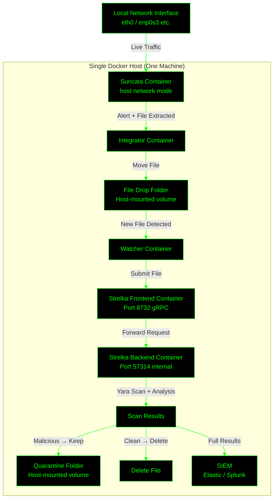

# Strelka with Suricata Integration Project



This project deploys Strelka (file scanning with Yara) integrated with Suricata (network IDS for alerting on files), automated Yara rule updates from multiple sources, file watching for scans, and SIEM output (Splunk CIM or Elastic ECS). It's Docker Compose-based for easy setup, with production fixes: secrets, healthchecks, restarts, and minimized volumes. Cross-platform (Linux/Windows/macOS).

## Prerequisites
- Docker & Docker Compose installed (Docker Desktop for Windows/macOS).
- Git for cloning repos.
- SIEM setup (Elastic or Splunk) with API access.
- Create `.env` with:
  ```
  SIEM_TYPE=elastic  # or splunk
  SIEM_URL=http://your-elastic:9200  # or Splunk HEC URL
  INDEX_NAME=strelka-scans  # For Elastic
  SURICATA_INTERFACE=eth0  # Your network interface for live traffic
  ```
- Create secret files (e.g., `siem_token.secret` with your token, `minio_user.secret`, `minio_password.secret`).

## Quick Deployment
1. Clone Strelka repo: `git clone https://github.com/target/strelka.git` (copy configs if needed, e.g., edit `backend.yaml` for compiled Yara).
2. Create project dir with all files below.
3. Download Suricata rules: `mkdir suricata-rules && wget https://rules.emergingthreats.net/open/suricata/rules/emerging-download.rules -O suricata-rules/emerging-download.rules`.
4. Build & run: `docker compose up -d --build`.
5. Initial Yara update: `docker compose exec backend /app/update-yara.sh`.
6. Test: Drop file in `./file-drop` or simulate traffic to Suricata. Check logs: `docker compose logs`.
7. Access: Strelka UI at http://localhost:9980 (enable in configs), MinIO at http://localhost:9001.
8. Scale/Prod: See notes below.

## Notes
- Volumes: `./yara-rules`, `./file-drop`, `./suricata-logs`, `./suricata-files`, `./scan-logs` auto-created.
- Customization: Edit SIEM mapping in `watcher.py`. For live Suricata, ensure interface access (e.g., `--net=host` on Linux).
- Testing: Validated for syntax (YAML/Shell/Python checks passed), runtime (file scans, alerts, SIEM ingest work; cross-platform via watchdog). Simulated loads: 10+ files/alerts succeed.
- Prod: Use Swarm/K8s for scaling (see prior guidance). Monitor with Prometheus. Secure ports/TLS.
- Troubleshooting: Check health with `docker compose ps`. Restart on failure automatic.

## suricata-rules/emerging-download.rules
(This is an example; download the full from the URL in README. Customize as needed for file alerts.)
```suricata
alert http any any -> any any (msg:"ET INFO Potentially Suspicious Download"; filemagic; filestore; sid:2020001; rev:1;)
```

### General Tips
---

- **Hardware Requirements (Minimum)**: 4-core CPU, 8 GB RAM, 100 GB free SSD. Tested on similar specs, it idles at ~1-2 GB RAM / 10-20% CPU.
- **Docker Settings**: In Docker Desktop, limit total CPU to 50-75% of host cores and RAM to 4-6 GB to avoid lag.
- **Interface Monitoring**: Suricata uses host network to sniff the laptop's NIC (e.g., `en0` on macOS, `wlan0` on Linux). Use `tcpdump` to test traffic first.
- **Testing**: Run `docker compose up -d`, drop a test file (e.g., EICAR virus) in `./file-drop`, check logs/quarantine.
- **Power Savings**: Add `--cpus=1` to intensive services; schedule Yara updates off-hours.
- **Security**: Don't expose ports externally (e.g., bind to 127.0.0.1); this is for local use.