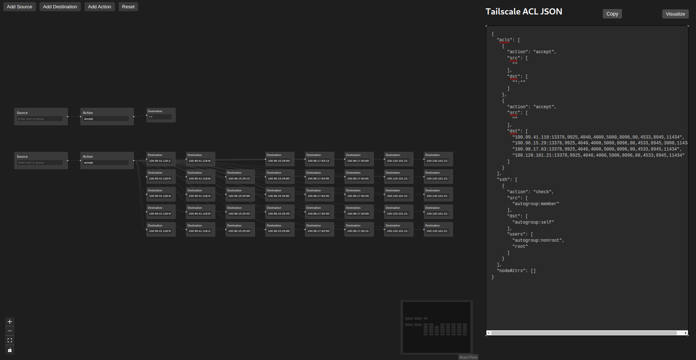

# Tailscale-ACL-Builder

Build and visualize Tailscale ACLs with a reactflow diagram.



## Features

- **Visual ACL Building**: Drag-and-drop interface for creating Tailscale ACLs
- **Node Types**:
  - Source nodes (users, groups, tags)
  - Destination nodes (IP:port)
  - Action nodes (accept/deny)
  - Tag nodes for tag definitions
- **Real-time Validation**:
  - Source format validation (email, group:name, tag:name)
  - Destination format validation (IP:port)
  - Action validation (accept/deny)
  - Tag format validation
- **Import/Export**:
  - Import existing Tailscale ACL JSON
  - Export flow as JSON
  - Copy ACL to clipboard
- **Search & Filter**:
  - Search through nodes by value
  - Filter visible nodes dynamically
- **Visual Tools**:
  - Mini-map for navigation
  - Node controls
  - Dark mode interface
- **Keyboard Shortcuts**:
  - Delete selected nodes
  - Reset flow
- **HuJSON Support**:
  - Parse and validate HuJSON format
  - Maintain comments in ACL configuration

## Deployment

### Docker/Podman

```
podman build -t tailscale-acl-builder .
podman run -p 8080:8080 --name tailscale-acl-builder -d tailscale-acl-builder
```
localhost:8080


