### How to store Defender XDR data for years in Sentinel data lake without expensive ingestion cost
---

<p align="center">
  
</p>

In recent years, an increasing number of customers have requested options to extend retention in Microsoft Defender XDR beyond the default 30 days at a low cost, all with the requirement of having the KQL experience available.

Feature is currently in public preview – please be aware of the public preview state. This blog is not responsible for any misconfiguration or data loss in the environment. Recommended to evaluate it in smaller test environments first.

By default, Defender XDR retains incidents, alerts, and related data for 180 days, while Advanced Hunting data is limited to just 30 days. For proactive threat hunting and compliance, these retention periods are often too short – making extended storage essential.

Customers normally need to keep data accessible for longer than three months. In some cases, this is just due to regulatory requirements, but in some other cases, they need to be able to run investigations on older data for hunting.

### Previous solutions
---

Previously, there were a couple of options with the use of the streaming API in Defender XDR and Azure Data Explorer:

    Azure Data Explorer

    Stream data directly to Log Analytics

    Stream data directly to a Storage account/ event hub

### Azure Data Explorer
---

In the past years, I deployed many Azure Data Explorer clusters for smaller companies and larger enterprises with up to 6TB ingested daily. Previously, it was quite hard to have a solution where the KQL language is available at a low cost. Azure Data Explorer is a great solution without relying on Microsoft Sentinel for the expensive analytics tier ingestion cost.

<p align="center">
  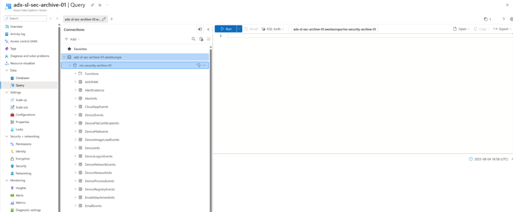
</p>

The downside of Azure Data Explorer is the maintenance and complexity of setting up a cluster. In short, it requires:

    Eventhub or Storage account

    Maintain Throughput Units to handle the events per second to avoid data loss

    Azure Data Explorer cluster

    Azure Data Explorer sizing

    Need to maintain and track performance/ ingestion

    Need to be parsed and transformed

    Tables need to be maintained

    Active reporting to track performance peaks

    Maintenance for new tables and data schemas

So keep in mind that running Event Hub Namespaces and Azure Data Explorer clusters requires additional troubleshooting/ operational tasks and active reporting. When the people and knowledge are available, it is a great solution for relatively low cost – it seems still cheaper in comparison with the new Sentinel Datalake, all keep in mind – it requires operation and more maintenance to keep it running. It is far from managed.

### Log Analytics/ Microsoft Sentinel
---

Streaming logs directly in Log Analytics/ Microsoft Sentinel is the easiest way – and also the most expensive way of ingesting and storing data for archiving purposes. You’ll be billed for the ingestion into Sentinel before these logs can be stored. And ingestion in Microsoft Sentinel is not cheap. The benefit is that Microsoft is automatically creating the mappings and doing all the data transformations as part of the ingestion.

### Why is it a challenge?
---

Advanced Hunting is included in Defender XDR Advanced Hunting – this data is part of the Defender license and is already paid. All the hunting and detections can be created directly on top of Defender XDR dataset – with the migration from Sentinel to the Unified SecOps platform, it is more clear that Microsoft follows the direction to put all the analytics and detections in Defender XDR. So the data is available in Defender XDR and mirrored to Sentinel, where you pay the expensive ingestion cost of Sentinel. That can be better and more efficient without ingesting data in Sentinel.

### What do we need?
---

It is simple: use the Defender XDR dataset for running queries/ analytics and all the analytics functionalities, and store the data cheaper for longer retention without the need to ingest data first in Microsoft Sentinel:

What we want: Logs directly from Defender XDR to the Sentinel Datalake without expensive ingestion in the Analytics tier.

<p align="center">
  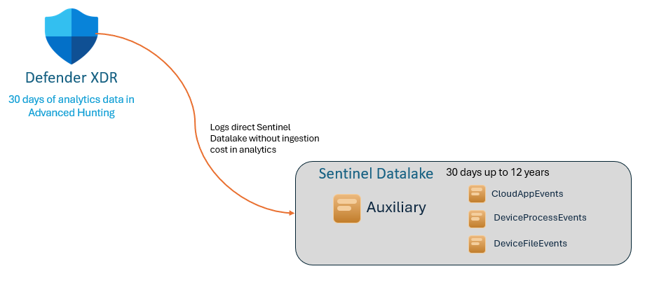
</p>

What we don’t want: Since there is an expensive ingestion cost in the analytics tier for each GB in Sentinel.Of course, when many detections and use-cases are part of Sentinel this is a different story.

<p align="center">
  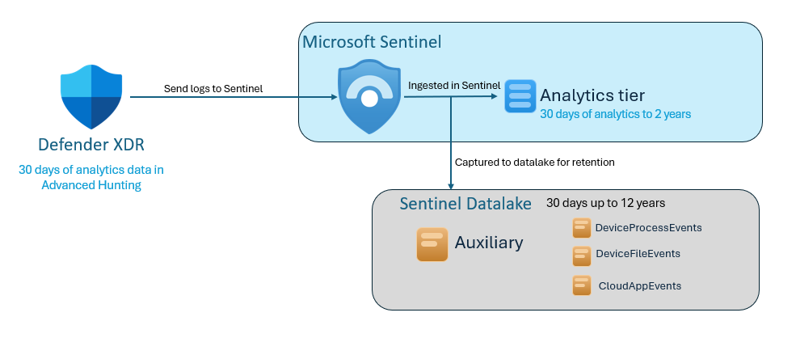
</p>

Solution: Logs via Workspace Transformations DCR directly in the Sentinel Datalake custom tables.

<p align="center">
  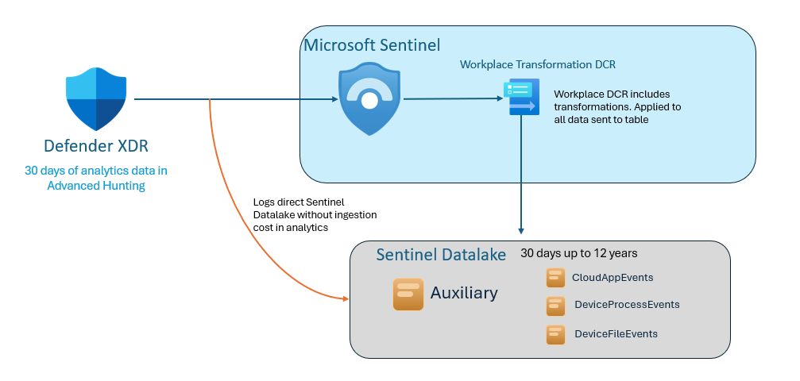
</p>

### The new solution: Microsoft Sentinel data lake
---

https://techcommunity.microsoft.com/blog/microsoft-security-blog/introducing-microsoft-sentinel-data-lake/4434280

<p align="center">
  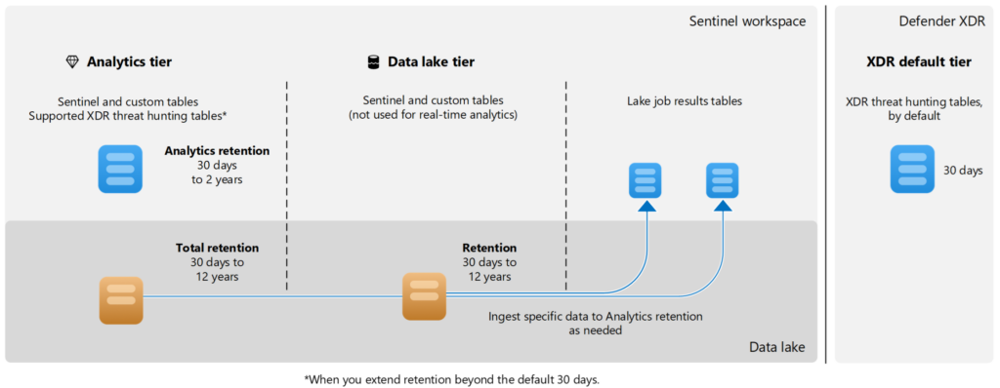
</p>

### How works the ingestion?
---

With the release of the new data lake, Microsoft released a new feature named Table Settings, where it is possible to manage the ingestion pipeline. In the Table Settings, we can configure the ingestion tier (analytics or data lake).

All now the trick – it depends a bit on which table you’re configuring – not all the tables can be configured directly to be ingested in the Data Lake tier. The following tiers are available;

Analytics tier: Data is ingested in Log Analytics mirrored to data lake, and stored in the data lake for longer retention.

Data lake tier: Data is directly ingested in the data lake and never goes to the Log Analytics and pricing is cheaper.

When switching to data lake tier only, the table is changed from the Analytics Tier to the Auxiliary tier. All keep in mind – it will have fewer analytics functions and is a bit slower, but still queryable via KQL. Auxiliary is the table type for the Data lake.

### XDR data
---

This blog is focused on storing Defender XDR cheaper. When you go to the Table Settings in Defender XDR you will see there is no option to store the data directly in the data lake. The only option is the following:

<p align="center">
  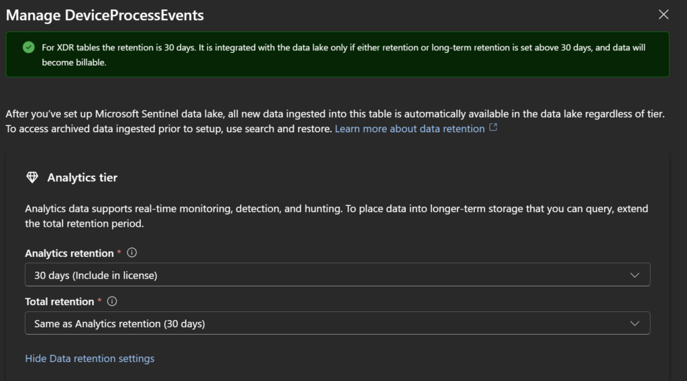
</p>

When configured as in the above screenshot, it will not create any table/events in the data lake (only when the retention or long-term retention is set above 30 days.

When setting the following:

<p align="center">
  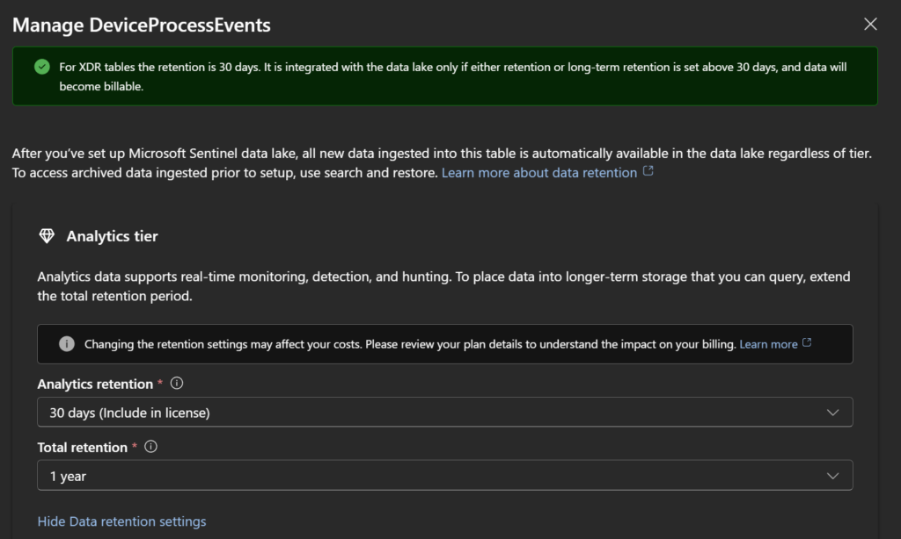
</p>

With 30-day analytics (as part of Defender XDR) and 1-year total retention, it will perform the following:

    In the Sentinel Defender XDR connector, the DeviceProcessEvents will be streamed to LAW/ Sentinel

    Data will go first to Analytics (Which means the data will go first in Sentinel Log Analytics and become part of the Analytics tier before it is sent to the datalake)

Conclusion: Additional cost for the ingestion, and still based on Microsoft Sentinel ingestion as part of the connector. Not ideally, since the data is ingested in the expensive Analytics tier first. The “included in license” is focussed on the Defender XDR Advanced Hunting data.

### Table creation tool

Table Creation can be hard since the table mapping needs to be available/ mirrored from the original table structure, or easy with the use of the tableCreator.ps1 script. (see sentinel-scripts/)

Important: The auxiliary table does not support the Dynamic type. When not giving any parameter, it will skip the dynamic type tables that are not supported by the Auxiliary table. As an alternative, the -ConvertToString can be used to convert the dynamic type to a string type.

When creating the table first in Analytics and moving it via the Table Settings in Defender XDR – Dynamic is supported:) – The trick is; create the table first in Analytics and move it in the portal from Analytics to data lake.

Microsoft Docs: Tables with the Auxiliary plan don’t support columns with dynamic data. Source: https://learn.microsoft.com/en-us/azure/azure-monitor/logs/create-custom-table-auxiliary

Run the script via the Azure CLI. Before running, update the resourceID details in the script with the resourceID of the Log Analytics workspace. Since the datalake is created on top of Auxiliary, this can be used for creating custom tables.

Enter new table name, table type, and total retention period, shown below. Create the table first in the Analytics table type and not directly to Auxiliary. When creating the table directly in Auxiliary, the dynamic field is not created in the schema.

Now go to the table management in Defender XDR (and change the custom-created table from analytics to datalake only)

<p align="center">
  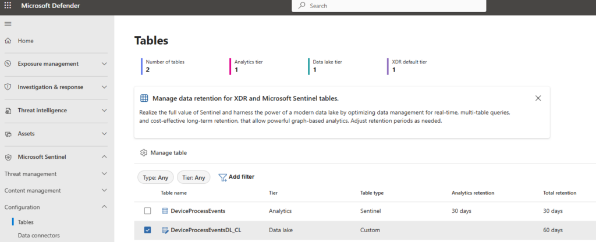
</p>

Change the tier from Analytics to data lake for the custom-created table.

<p align="center">
  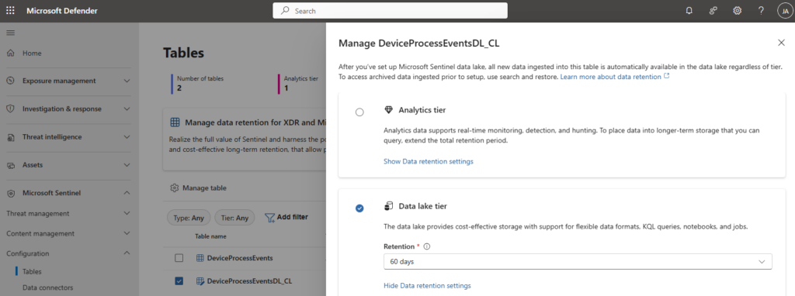
</p>

As result, the table (DeviceProcessEventsDL_CL) is created in the Auxiliary type with the dynamic tables copied from the original table.

<p align="center">
  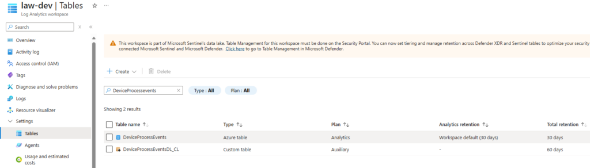
</p>

### Data Collection rule (transform data)
---

Since the Auxiliary table (datalake table) has been created, the next step is to implement transformation logic at the data collection rule level.

Since we already created a custom table, we should create a transformation logic to move all data from the original DeviceProcessEvents table to the DeviceProcessEventsDL_CL table. Since there is no AMA agent, it is a bit different and can be used via Data collection rules.

<p align="center">
  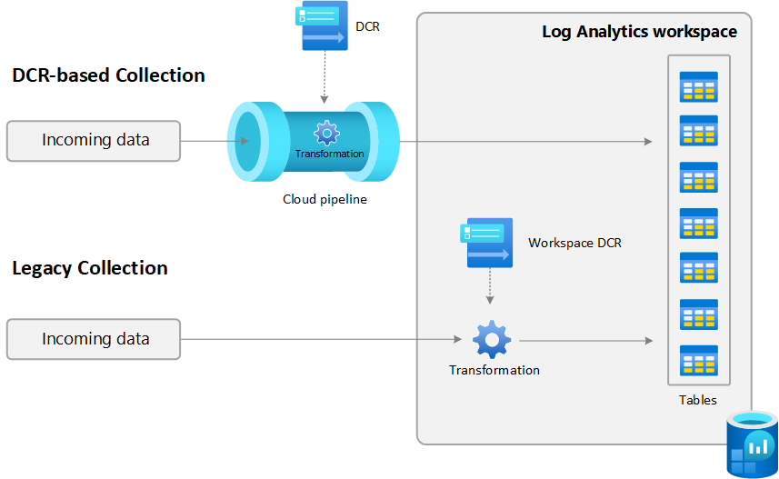
</p>

### Workspace transformation DCR
---

The workspace transformation data collection rule (DCR) is a special DCR that’s applied directly to a Log Analytics workspace. Since the Defender logs are not routed via the AMA agent, we need to create a workspace transformation DCR for the workspace.

In short; all tables that don’t use DCR for data ingestion can be managed via workspace transformation data collection rules

<p align="center">
  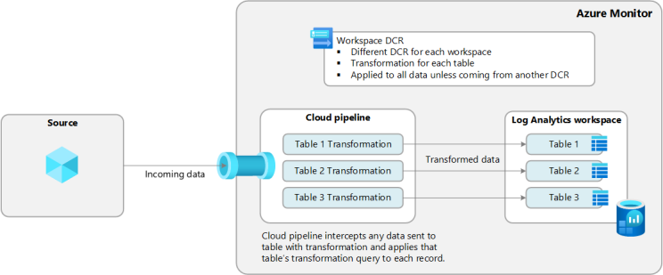
</p>

There can only be one transformation for each workspace, but it can include transformations for multiple tables. Via the Azure portal, we can easily create a workspace transformation rule:

More information: Create a transformation in Azure Monitor – Azure Monitor | Microsoft Learn: https://learn.microsoft.com/en-us/azure/azure-monitor/data-collection/data-collection-transformations-create?tabs=portal#create-workspace-transformation-dcr

To create the transformation rule, go to the Log Analytics workspace and search for a default table, such as DeviceProcessEvents. Click on Edit transformation

<p align="center">
  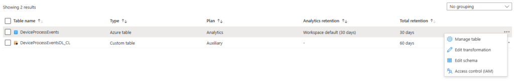
</p>

Create the data collection rule; there can only be one transformation rule for the workspace So give it a general name and not focus only on the specific table in the name convention.

Now we need to change the content of the default transformation rule – this cannot be done via UI and needs to be performed via code. The data collection rule must be created with the Kind: WorkspaceTransforms. This can be validated via the Data Collection rules overview.

<p align="center">
  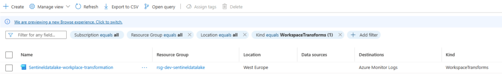
</p>

Open the DCR, click on Export template > Deploy > Edit Template as shown below:

<p align="center">
  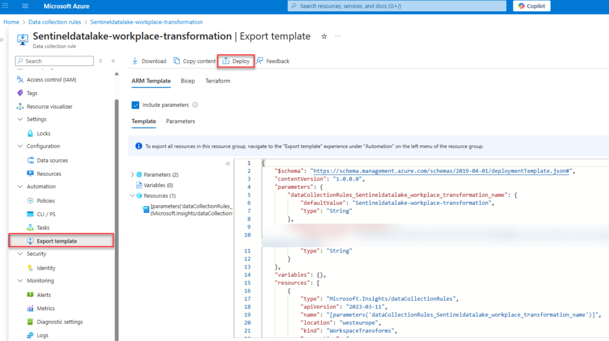
</p>

Click on Edit template to change the template

<p align="center">
  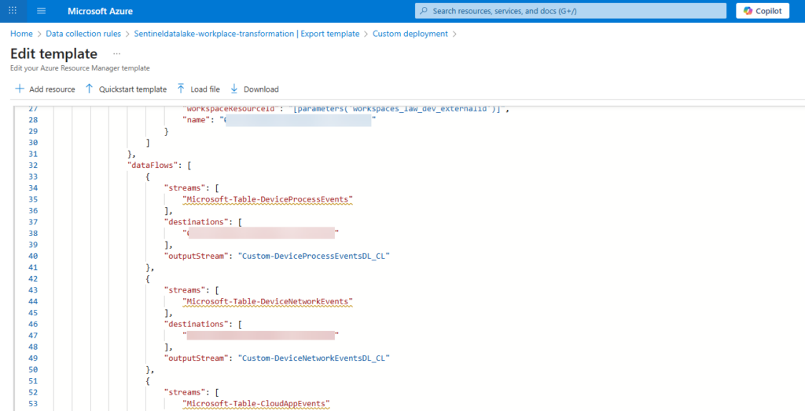
</p>

In the dataFlows section, we need to change the transformations for each stream. As already mentioned, we can add all the transformations in one single file.

In the example below, the stream: Microsoft-Table-DeviceProcessEvents is moved to the destination (LAW) – with the output a custom table Custom-DeviceProcessEventsDL_CL

For custom tables, the name convention must start with Custom- in the template.

Note: The destination ID is different for each tenant.

```json
"dataFlows": [
                    {
                        "streams": [
                            "Microsoft-Table-DeviceProcessEvents"
                        ],
                        "destinations": [
                            "0281239d889a430ba48eafac28f5284b"
                        ],
                        "outputStream": "Custom-DeviceProcessEventsDL_CL"
                    },
```

Example of a dataflow for multiple Defender XDR streams:

```json
"dataFlows": [
                    {
                        "streams": [
                            "Microsoft-Table-DeviceProcessEvents"
                        ],
                        "destinations": [
                            "02331269d889a430bfdfeafac28fb284b"
                        ],
                        "outputStream": "Custom-DeviceProcessEventsDL_CL"
                    },
                    {
                        "streams": [
                            "Microsoft-Table-DeviceNetworkEvents"
                        ],
                        "destinations": [
                            "02331269d889a430bfdfeafac28fb284b"
                        ],
                        "outputStream": "Custom-DeviceNetworkEventsDL_CL"
                    },
                    {
                        "streams": [
                            "Microsoft-Table-CloudAppEvents"
                        ],
                        "destinations": [
                            "02331269d889a430bfdfeafac28fb284b"
                        ],
                        "outputStream": "Custom-CloudAppEventsDL_CL"
                    },
                    {
                        "streams": [
                            "Microsoft-Table-DeviceInfo"
                        ],
                        "destinations": [
                            "02331269d889a430bfdfeafac28fb284b"
                        ],
                        "outputStream": "Custom-DeviceInfoDL_CL"
                    }
                ]
```

Deploy the changed DCR configuration. When the changed file is deployed, the data is transformed directly into the custom tables, which means all data is routed from the original table to the custom table, which is in the cheaper data lake tier. All hunting activities and custom detections can be created on top of the XDR Advanced Hunting data, which is already “included” in the license. In general, it will avoid double costs for ingestion. Ensure that all detection rules are migrated from Log Analytics to Custom Detections in Defender XDR before stopping ingestion in Microsoft Sentinel.

This stream still requires the Defender XDR connector in Microsoft Sentinel to be enabled for sending logs. When the event categories are enabled, it will stream via the transformation rule in the custom-created tables.

### Result
---

Original DeviceProcessEvents table empty:

<p align="center">
  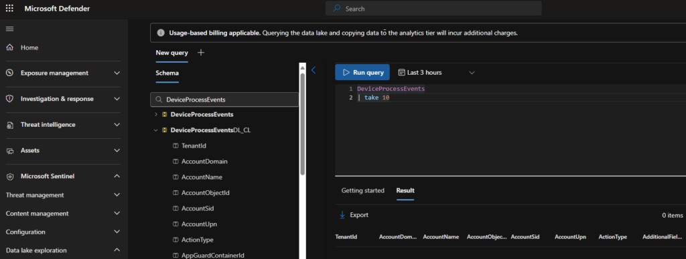
</p>

Custom table filled with data via the transformation rule, and ingestion is based on the Auxiliary tier and not the Analytics tier.

<p align="center">
  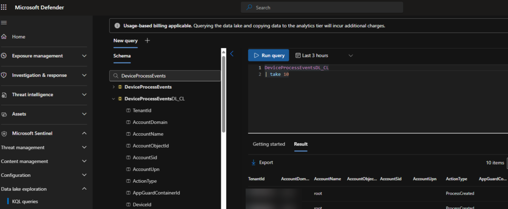
</p>