## Microsoft Sentinel Data Lake: How to use/enable and set-up the unified datalake

  

Microsoft Sentinel data lake simplifies data management with a flexible, centralized experience in the Defender XDR portal – it is scalable and all managed by Microsoft. For analysts, it is possible to move between the analytics tier and the data lake tier. At the moment of writing, the Sentinel data lake is available in public preview. Let’s deep dive into the new options and data lake configuration.

  

### Fully managed
---

Microsoft Sentinel data lake enables a fully managed, cloud-native data lake that is purposefully designed for security, right inside Defender XDR and created on top of Sentinel. The new data lake is fully managed and created out of the box without the need to create a full custom data warehouse. More on this later.

### Compare with Azure Data Explorer
---

Ok; but the main question – what is the difference between Sentinel data lakeand auxiliary logging or ADX/ Storage accounts?

The main reason for the difference is the ease of use. The data lake is sort of managed and configured with a pricing plan, so everything is natively available in the portal of Defender without complex data migration/ setup and configuration and using the Sentinel connectors as part of the available data connectors.

Of course; Azure Data Explorer (ADX) is fine to use and has additional components. Management overhead is a big cost/investment for ADX, tables/ functions and monitoring need to be created and maintained with new structures and table mappings. In the new data lake feature this is sort of managed by Microsoft.

### Auxiliary logs
---

Once Sentinel data lake is enabled, auxiliary log tables are no longer visible in Defender Advanced hunting or the Microsoft Sentinel portal. All auxiliary data is available in the data lake and can be viewed via KQL or Jupyter notebooks. So in short – Auxiliary tables are converted to data lake tiers automatically.

### Prerequisites
---

Of course, each solutions have some prerequisites. To  onboard to the Microsoft Sentinel data lake Public Preview, the following prerequisites must be in place:

    Microsoft Defender and Microsoft Sentinel are available and integrated in Defender XDR

    Existing Azure subscriptions and resource group for billing for the datalake

    Subscription owner on the subscription

    Microsoft Sentinel primary workspace connected to the Microsoft Defender portal

    Microsoft Sentinel primary workspace and other workspaces in the same region as your tenant’s home region

    Read privileges to the primary and other workspaces so they can be attached to the data lake.

 If you have connected Sentinel to the Defender XDR portal to onboard to the data lake, the primary workspace must be in the tenant’s home geographic region. So in short, the geographic region must be the same for both Defender and Sentinel. Keep in mind – not all regions are currently supported as part of the preview.

Note: During public preview, your primary and other workspaces must be in the same region as your tenant’s home region. Only workspaces in the same region as your tenant home region can be attached to the data lake.

### Onboard Microsoft Sentinel data lake
---

Onboarding the tenant to the Microsoft Sentinel data lake is quite easy and starts in the Defender XDR portal via https://security.microsoft.com.

You can initiate onboarding by navigating to the data lake settings page under System > Settings > Microsoft Sentinel > Data lake. or by clicking on the home page on the “Set up Microsoft Sentinel data lake” button.

When the following message is visible, it means the tenant is not configured to follow all the needed prerequisites. One of the requirements is to connect Sentinel with the Defender portal via the SIEM workspaces features.

  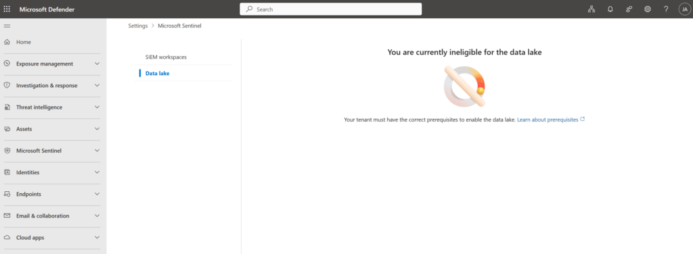

After some time, when all the prerequisites are met, the connection button is visible. When clicking on the “Start setup” button, it will launch the data lake wizard.

  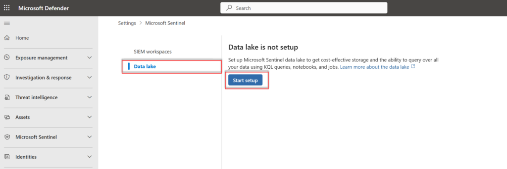

When all the prerequisites are in place, a side panel appears with the wizard for the billing and cost configuration. In addition to your data ingestion costs, you will also be responsible for other costs, including charges for extended data retention and queries against data in the lake. The Azure subscription can be defined. It can be a new one. I like the way of storing all the data lake resources in a different resource group to get more in-depth insights into the cost of the data lake. It can be the same as the Microsoft Sentinel instance.

Keep in mind – If an existing Microsoft Sentinel workspace uses search jobs, queries, auxiliary logs, or long-term retention (also known as ‘archive’), billing and pricing for those features will switch to the Microsoft Sentinel data lake meters, potentially increasing your cost. This means that when the archive and auxiliary logs are used, they will be moved to the new data lake meters and configuration.

When all is good and filled in, click on “Set up data lake“

  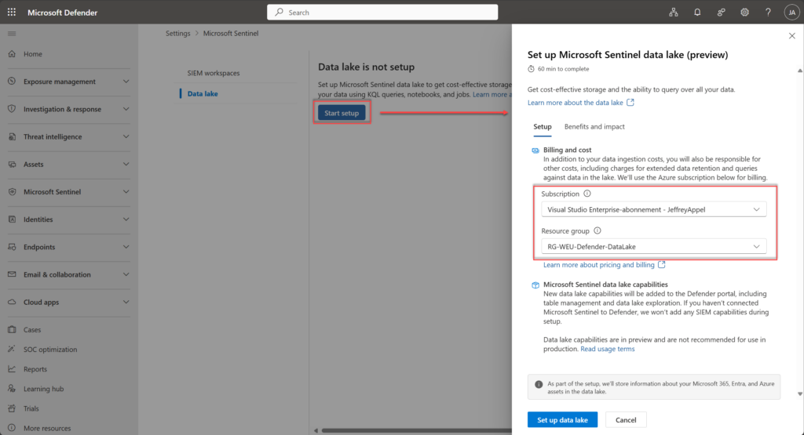

It will take up to 60 minutes before the datalake is fully created and linked with the Defender tenant. When the process is pending, the message; Lake setup in progress is visible. Now let’s wait some time before the magic starts within the data lake.

  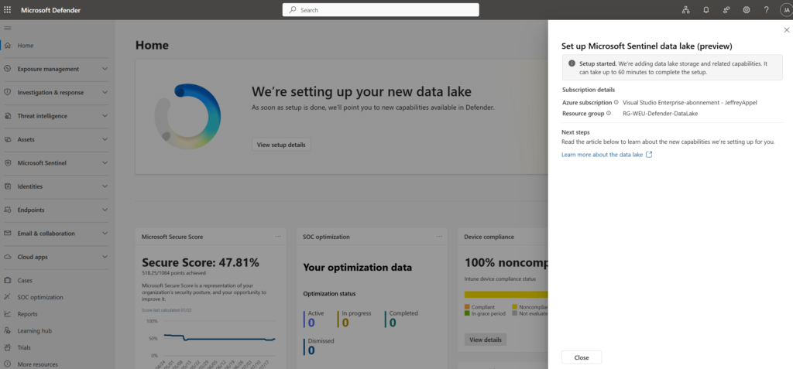

After quite some time (in my lab around 30-40 minutes) the datalake setup is completed:

  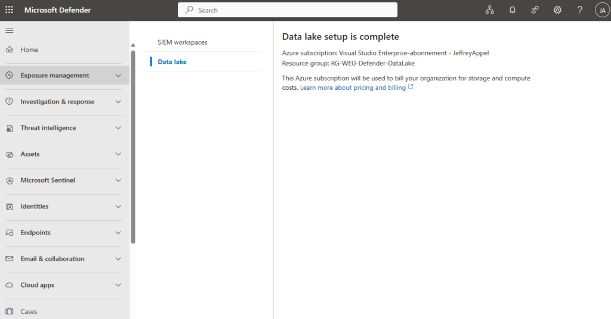

Defender XDR homepage shows the banner with the message that the data lake is created:

  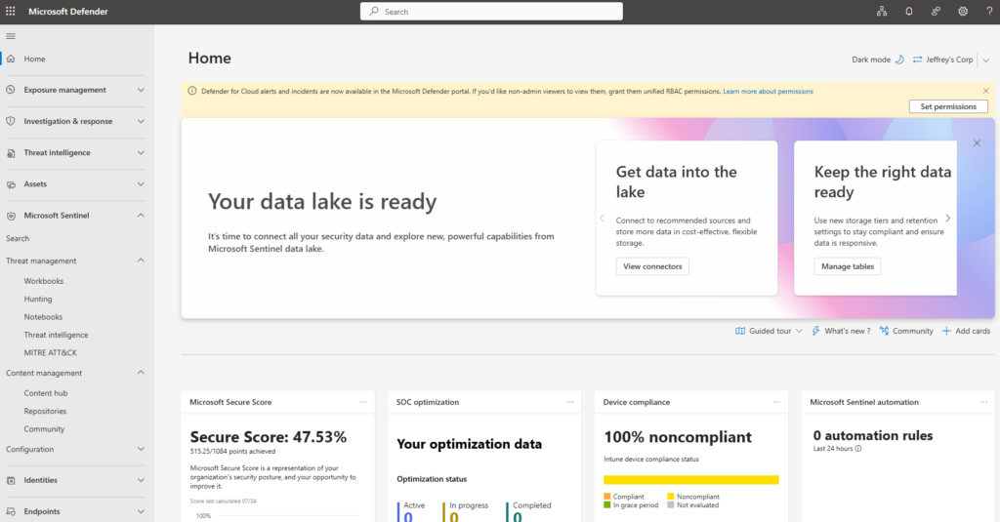

Created automatically?

As part of the provisioning, a managed identity is created with the prefix msg-resources- This managed identity is required to keep the data lake functionality working. The identity has Azure Reader subscriptions over all the subscriptions onboarded in the data lake.

  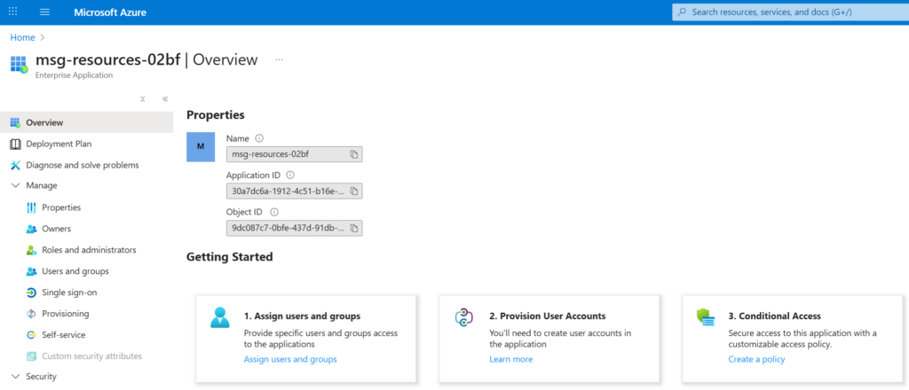

### Default datalake
---

When the setup is completed, it will show in Defender XDR a new data lake exploration view. As part of the provisioning is a workspace with the name default

The “Default” workspace you see in the workspace selector for KQL queries is created by Microsoft Sentinel data lake when you onboard: A handful of logs are automatically available. It is more of a workspace specifically for data lake to start as minimal.

  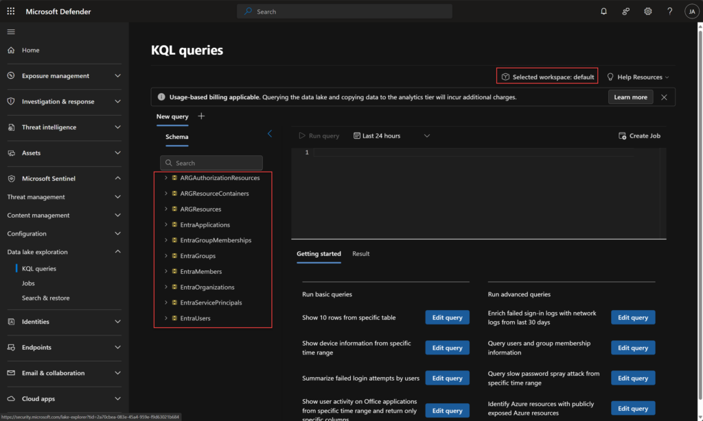

### Different data tiers
---

Before we deep-dive further into the options of the new Sentinel data lake. Let’s explain first the available tiers in Sentinel:

Analytics tier: Hot state tier. This tier makes data available for alerting, hunting, workbooks, and all Microsoft Sentinel features. By default, data is stored for 30 days for Microsoft Sentinel and Defender XDR. Tables in the Analytics tier can be extended up to 2 years at a monthly long-term retention charge. When using Microsoft Sentinel the data can be stored up to 90 days for free in the Analytics tier. In this tier, detection rules are available and supported.

Data lake tier: Data in the data lake tier isn’t available for real-time analytics features and threat hunting. The data is in a low-cost cold tier.

  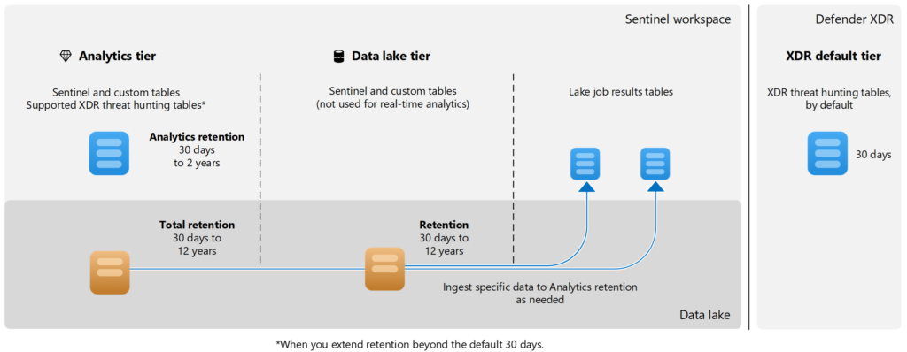

### Data connectors and flow
---

One of the major items for the Sentinel data lake is the configuration of the data connectors. With the use of the connectors, it will send data to the Sentinel data lake. It works based on the following:

    Microsoft Sentinel data connectors are configured to send data to both the analytics tier and the data lake tier for long-term storage

Below is a good example; when Sentinel data connectors are enabled, the data will be pushed to the Analytics Tier and mirrored to the Data Lake Tier automatically.

  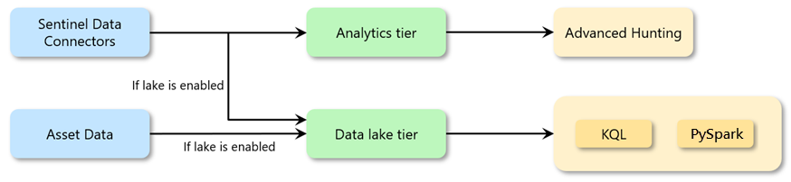

Good to know that when a connector is enabled, the default is that data is sent automatically to the analytics tier and mirrored in the data lake tier. Mirroring data in the data lake with the same retention as the analytics tier doesn’t incur additional billing charges. Only when the retention is increased will it generate additional cost for the storage, and KQL jobs can be used to query data scheduled and promote the results to the analytics tier. Once in the analytics tier, the advanced KQL features are available.

Another method is ingesting data to the data lake tier only – with this, the data will be ingested only to the data lake tier, and ingestion in the analytics tier stops. With this, the data is only stored in the data lake.

If you switch from analytic + datalake mirror (default) to only ingesting into the data lake tier, any new data will stop coming to the analytic tier table, and data will be stored only in the data lake.

  

### Ok; what is the data connector and how it works?
---

The data connector is the Microsoft Sentinel connector. All connectors are available in the Data Connectors tab in the Defender portal:

  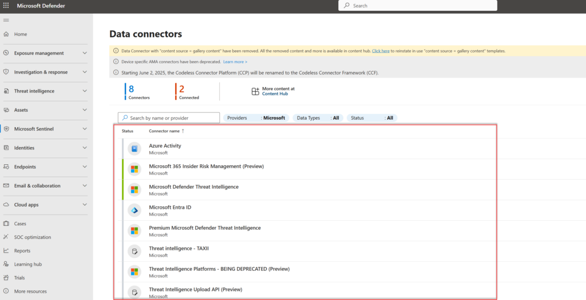

More information: https://learn.microsoft.com/en-us/azure/sentinel/configure-data-connector?tabs=defender-portal#enable-a-data-connector

Additional settings can be changed via the connector page when multiple tables are used. Example Syslog via AMA:

  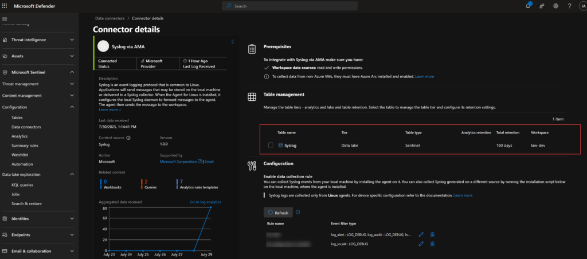

### Data transformations
---

When the Sentinel data lake is enabled, it is possible to configure the data retention and tiering for the data connector. On the Connector details page, in the Table management section, select the table you want to manage. For some tables, it is possible to change the tier only to the analytics tier and not send data only to the datalake.

For example, when syslog data is coming directly into Sentinel Log Analytics- by default it is part of the analytics table and mirrored in the datalake automatically.

Syslog data as part of the Data lake with KQL ( KQL queries are visible via the new Data lake exploration view)

  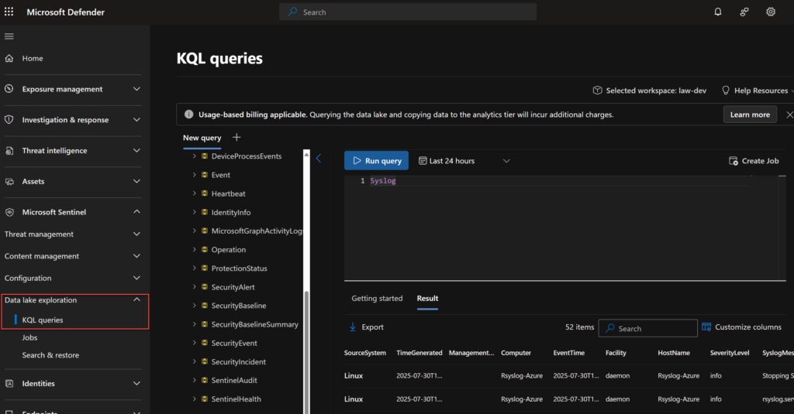

Syslog data as part of the Analytics data in Defender XDR/Sentinel

  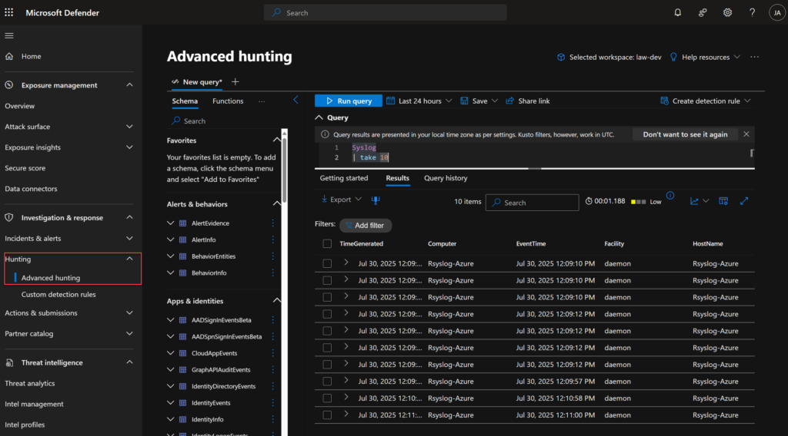

When opening table management, it is possible to tweak the data flow and retention policy. By default, the data is stored with the following retention: (30 days)

  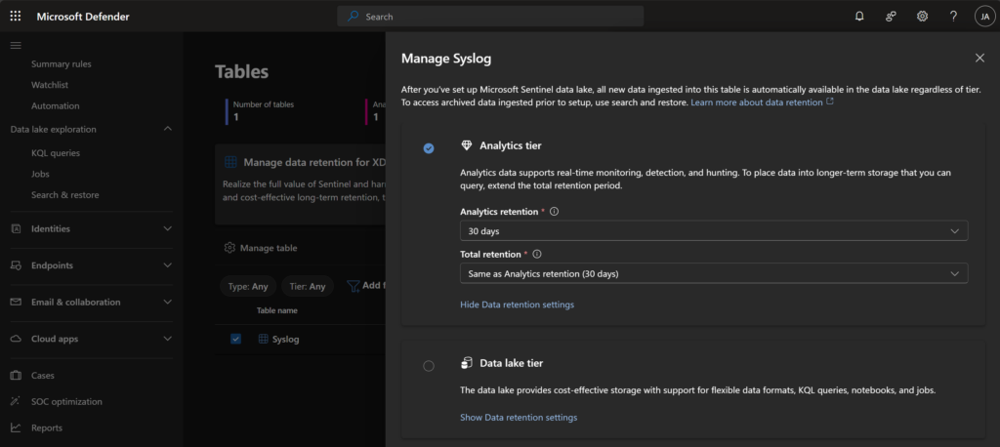

For 30 days analytics and 1 year retention, the configuration is the following. With this, the data will still be ingested in the Analytics tier for 30 days (Sentinel) and will be stored for 1 year in the data lake. Since the data is mirrored, there is no ingestion cost for the datalake.

  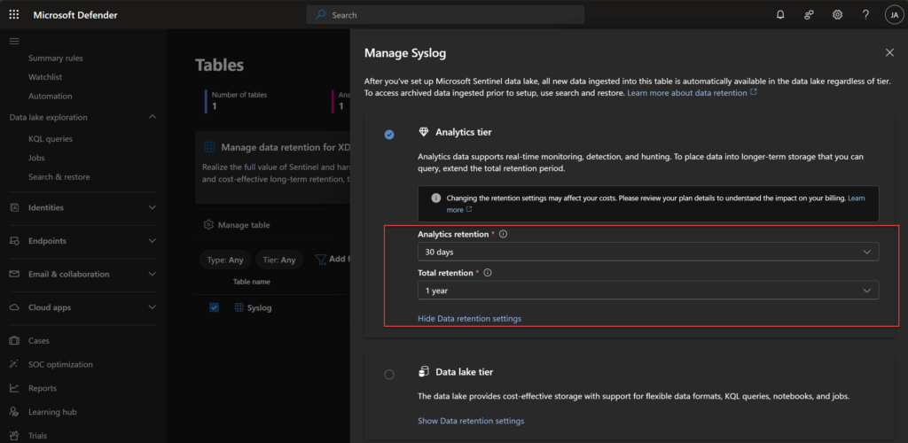

When it is needed to store Syslog only in the Data Lake tier, the configuration can be changed to store the data directly in the Data Lake tier. When changing the settings to data lake tier, any existing content will stop working after changing to the lake tier.

  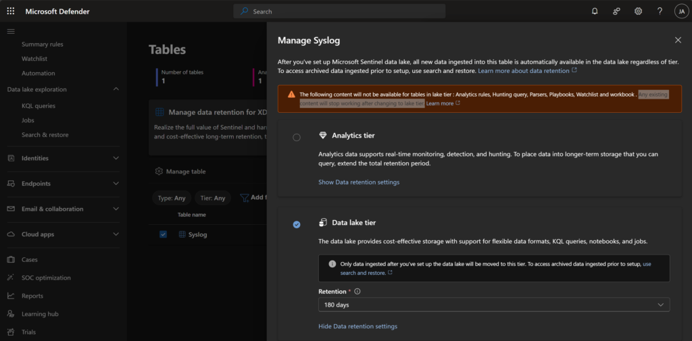

When the table is changed to Data lake tier only mode, the table settings will be changed and visible as Tier “Data lake” with the table type Sentinel and total retention of 180 days. As of this moment, there is only data in the data lake table and not in the analytics table. This resulted in less cost, since the data is “skipping” the analytics ingestion.

  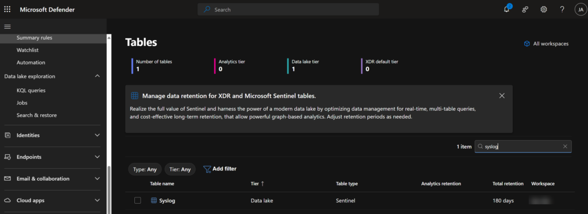

### Tables management
---

Table management under data management is the new view to get a unified view across the tables in analytics tier/ data lake tier and XDR default tier. When tables are in analytics it means data is in Log Analytics as part of Microsoft Sentinel. Where tables in Data lake tier are only available in the data lake. XDR default tier are the tables as part of the XDR solution. (Natively in Defender XDR)

The overview shows a complete view of the analytics retention and total retention for all tables across Analytics/ Data Lake and XDR.

  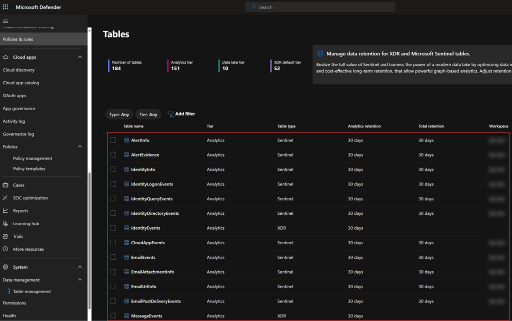

### KQL jobs
---

Logs like network/ firewall and other high-loaded data are really expensive when directly ingested in the Analytics Tier. With the use of the new datalake, it is possible to stream data directly into the datalake and skip the Analytics Tier of Sentinel. And use KQL jobs to move a small set of data from the datalake directly into the analytics tier, without ingesting it first in the analytics tier.

A job is a one-time or repeatedly scheduled task that runs a KQL (Kusto Query Language) query against the data in the data lake tier to promote the results to the analytics tier.

  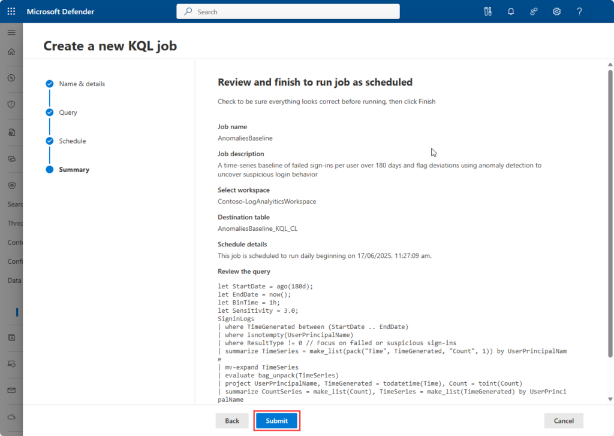

Storage in the analytics tier incurs higher billing rates than in the data lake tier. With the use of KQL, the data can be reduced and filtered, to save cost and promoted to the analytics tier with more filtering. With this, the logs are available for retention, where specific hits are populated in the Analytics tier for further hunting.

More information: https://learn.microsoft.com/en-us/azure/sentinel/datalake/kql-jobs

KQL jobs currently only run daily at the fastest, while summary rules run every 20 minutes. This means the time of the KQL job is currently each day. It is daily/ weekly/ monthly.

  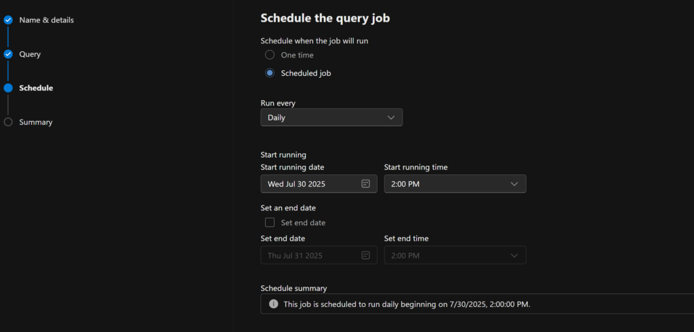

Currently researching more into the summary rules and KQL job part – for now, it seems the summary rules are supported. More on this later. The benefit of summary rules is that they run at a faster frequency.

Microsoft published the following on the learn website: https://learn.microsoft.com/en-us/azure/sentinel/manage-data-overview#how-data-tiers-and-retention-work

Data in the data lake tier isn’t available for real-time analytics features and threat hunting. However, you can access data in the lake whenever you need it through KQL jobs, analyze trends over time by running scheduled KQL or Spark jobs, and aggregate insights from incoming data at a regular cadence by using summary rules. https://learn.microsoft.com/en-us/azure/sentinel/datalake/kql-jobs

### Alerting and analytics rules
---

In Sentinel Data Lake there is a new way to create analytics rules and alerting. Of course, as part of the datalake is the option to run KQL queries against the lake at the query cost. With the use of KQL jobs, it is possible to run a scheduled task and move the resulting data from the datalake tier directly to the analytics tier.

### Pricing?
---

Pricing in the Data Lake tier is a cost-effective option based on a rate per GB. The following meters are part of the pricing:

    Data lake ingestion charges are incurred per GB of data ingested for tables in Lake only mode.

    Data lake storage charges are incurred per GB per month for any data stored beyond the interactive retention period or in Lake only mode.

    Data lake query charges are incurred per GB of data analyzed using data lake exploration KQL queries, KQL jobs, or Search.

    Advanced data insights charges are incurred per compute hour used when using data lake exploration notebook sessions or running data lake exploration notebook jobs. Compute hours are calculated by multiplying the number of cores in the pool selected for the notebook with the amount of time a session was active or a job was running.

When the data is stored in the analytics tier, it will be automatically part of the data lake tier. Only in the Lake only mode, it will charge a cost per GB.

For XDR tables, the retention is 30 days. It is integrated with the data lake only if either retention or long-term retention is set above 30 days, and data will become billable.

In combination with the below configuration, it is 30 days part of the Analytics retention tier (included as part of the Defender XDR license), and for 12 years in the total retention of the data lake when the data is integrated.

Pricing is subject to change: visit microsoft pricing for more info.

  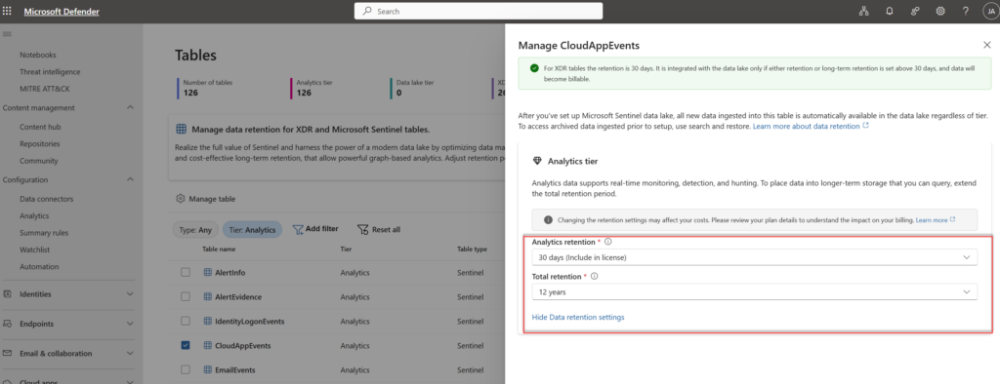

### Interface
---

All data as part of the Sentinel data lake is visible directly in the data lake exploration -> KQL queries view.

  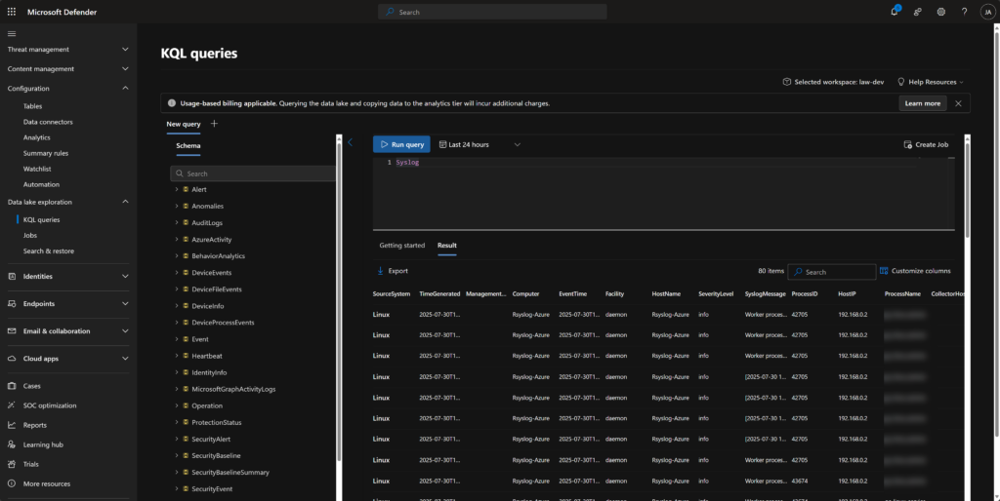

### Unified Defender RBAC
---

Microsoft Sentinel data lake is integrated within the Unified RBAC as part of Defender XDR. As part of the existing model is a new Data Operations permissions section with support for the Microsoft Sentinel data lake feature. The following permissions are available:

More information: Create custom roles with Microsoft Defender XDR Unified role-based access control (RBAC) – Microsoft Defender XDR | Microsoft Learn

https://learn.microsoft.com/en-us/defender-xdr/create-custom-rbac-roles#create-a-custom-role

  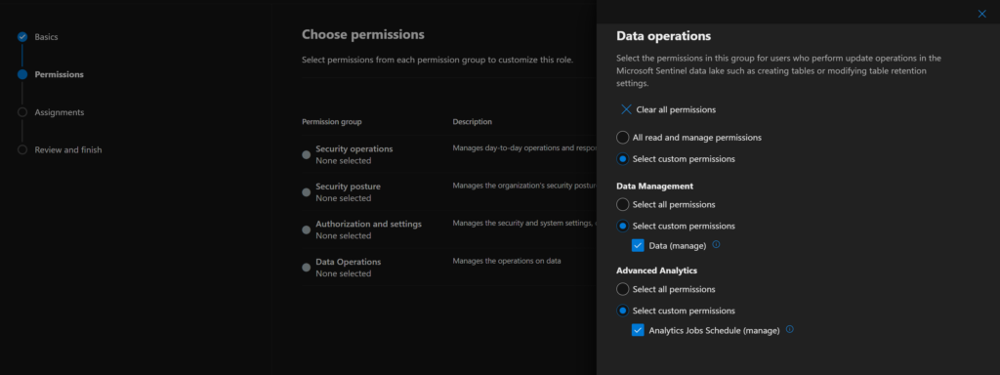

### Conclusion
---

I’ve been exploring the new Sentinel Data Lake, and honestly, it’s a refreshing shift from the usual complexity. No more fiddling with storage accounts, Event Hubs, or spinning up data clusters just to manage retention. This new approach feels like a cleaner, more future-proof way to handle security data at scale. All in the upcoming weeks, more will be clear – since I’m still evaluating the product and collecting feedback/ checking items with Microsoft.

Right now, it’s still in preview, but it already shows a lot of promise. Over the next few weeks, I’ll be diving deeper into some of the more advanced features—think Jupyter notebooks, reporting, cost insights, Defender XDR transformations and more. I’m especially curious to see how flexible it becomes when it comes to transforming data and building native dashboards directly on top of the dataset.

For now, it looks like a solid first version. One to keep an eye on as it evolves rapidly with more futures, is expected.