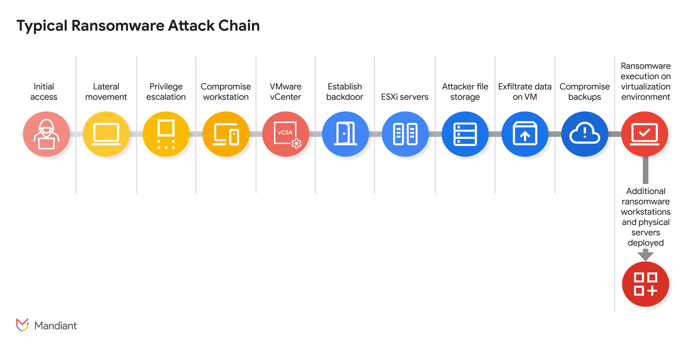

### UNC3944's Hypervisor-Level Attacks on VMware vSphere
---

UNC3944, also known as Octo Tempest or Scattered Spider, is a financially motivated threat group that employs sophisticated social engineering tactics to gain initial access, primarily targeting IT help desks to compromise user accounts. The group then leverages this access to pivot to VMware vSphere environments, enabling data exfiltration and ransomware deployment directly from the hypervisor, often bypassing traditional endpoint security solutions.

Recent intelligence indicates UNC3944 has expanded its targeting to include the aviation sector and has been observed utilizing various Ransomware-as-a-Service (RaaS) platforms, such as DragonForce, BlackCat/ALPHV, RansomHub, and Qilin, showcasing a shift towards more scalable attacks and a diversified ransomware approach.

### Actionable Threat Data
---

Monitor for AD Event ID `4728` (A member was added to a security-enabled global group) or `4732` (local group) for changes to sensitive Active Directory groups like "`vSphere Admins`" or "`ESX Admins`", especially when correlated with `wsmprovhost.exe` launching `net.exe` commands.

Create high-priority alerts for `vim.event.VmReconfiguredEvent` on staging VMs that contain file paths of critical virtual machine disks (e.g., `fileName = '.../ACME-DC01/ACME-DC01_4.vmdk'`).

Implement critical alerts for any power-on or reconfiguration events on VMs located in "Decommissioned" or "Orphaned" folders, as these are frequently used by threat actors as staging environments.

Monitor ESXi host logs for the execution of esxcli system settings kernel `set -s execInstalledOnly -v FALSE` and correlate with subsequent host reboots within a short timeframe, as this indicates an attempt to disable a key security defense.

Scrutinize network flow logs for large file transfers to and from ESXi hosts over SSH/SCP, which could indicate data exfiltration or ransomware payload delivery.

<p align="center">
  
</p>

### AD Group Membership Change
---
```sql
`comment("
name: VMware - AD Group Membership Change via WinRM
author: Rob Weber
date: 2025-07-25
description: >
  Detects the addition of a member to a sensitive Active Directory group related to VMware administration (e.g., 'vSphere Admins', 'ESX Admins') using net.exe executed via WinRM (wsmprovhost.exe). This behavior is a key TTP used by threat groups like UNC3944 to escalate privileges and gain control over the vSphere environment after an initial compromise.
references:
  - https://cloud.google.com/blog/topics/threat-intelligence/defending-vsphere-from-unc3944/
how_to_implement: >
  This detection requires process execution logs (e.g., Sysmon Event ID 1, Windows Security Event ID 4688) ingested and mapped to the Endpoint data model. The `Processes.parent_process_name`, `Processes.process_name`, and `Processes.process` fields are required. Tune the list of sensitive group names in the `where` clause to match your organization's naming conventions for privileged VMware-related groups.
known_false_positives: >
  Legitimate remote administration by system administrators may trigger this alert. If this is a common and approved administrative practice, consider creating a filter to exclude known administrator accounts or specific source/destination pairs.
")`

`comment("The tstats command is used for performance, searching summarized data from the Endpoint data model for net.exe or net1.exe being run by wsmprovhost.exe, which indicates remote execution via WinRM.")`
| tstats `security_content_summariesonly` count min(_time) as firstTime max(_time) as lastTime from datamodel=Endpoint.Processes where (Processes.parent_process_name="wsmprovhost.exe" AND Processes.process_name IN ("net.exe", "net1.exe")) by Processes.dest Processes.user Processes.parent_process Processes.process_name Processes.process
| `drop_dm_object_name(Processes)`

`comment("Filter for command-line arguments indicating a user is being added to a group. The wildcard search for sensitive group names is a placeholder. For better performance and accuracy, replace this with a more specific lookup or macro tailored to your environment.")`
| where (like(process, "% group %") AND like(process, "% /add%")) AND (like(process, "%vSphere Admins%") OR like(process, "%ESX Admins%") OR like(process, "%Veeam Administrators%"))

`comment("Potential False Positives: Legitimate remote administration may trigger this alert. Tune the sensitive group list to be as specific as possible. Consider filtering out known administrative accounts or scripts if this is a common, legitimate activity in your environment.")`

`comment("Extract the group name and the user being added from the command line for better context in the alert.")`
| rex field=process "group\s+(?:\"(?<modified_group>[^\"]+)\"|(?<modified_group>\S+))\s+(?<added_member>\S+)\s+\/add"

`comment("Group the results by the key fields to create a single alert for each distinct event.")`
| stats count values(process) as cmdline by firstTime, lastTime, dest, user, parent_process, modified_group, added_member
| `security_content_ctime(firstTime)`
| `security_content_ctime(lastTime)`
| rename dest as endpoint, user as user_performing_action
| fields - count
| `vmware_ad_group_membership_change_via_winrm_filter`
```

### VM Disk Reconfiguration
---
```sql
`comment("
name: VMware - Suspicious Cross-VM Disk Attachment
author: Rob Weber
date: 2025-07-25
description: >
  Detects when a virtual disk (.vmdk) from one virtual machine is attached to a different virtual machine. This is a key TTP used by threat groups like UNC3944 to perform offline credential theft (e.g., copying NTDS.dit from a domain controller) by mounting the disk to a separate, attacker-controlled staging VM.
references:
  - https://cloud.google.com/blog/topics/threat-intelligence/defending-vsphere-from-unc3944/
how_to_implement: >
  This detection requires VMware vCenter logs (e.g., sourcetype=vmware:vclog) to be ingested. The `event_type_id`, `change_details`, `vm_name`, and `user` fields are essential. For optimal performance and accuracy, you must configure the `vmware_critical_asset_list` macro with a list of your Tier 0/critical asset names (e.g., Domain Controllers, Certificate Authorities, etc.).
known_false_positives: >
  Legitimate, though uncommon, administrative tasks such as certain disaster recovery tests, migrations, or manual data recovery efforts may trigger this alert. These events should be correlated with change management records. If this is a standard procedure, consider filtering by specific users or staging VM names.
")`

`comment("Start by searching for VM reconfiguration events from VMware logs.")`
`vmware` event_type_id="vim.event.VmReconfiguredEvent"

`comment("Extract the name of the VM from the attached disk's file path. The VM name is assumed to be the parent directory of the .vmdk file.")`
| rex field=change_details "fileName\s*=\s*'.*?\/vmfs\/volumes\/.*?\/+(?<original_disk_vm_name>[^\/]+)\/[^\/]+\.vmdk'"

`comment("Filter for events where a disk was successfully identified and the disk's original VM is different from the VM it's being attached to.")`
| where isnotnull(original_disk_vm_name) AND vm_name != original_disk_vm_name

`comment("Focus on events where the disk belongs to a critical asset. This macro should be customized for your environment to reduce false positives.")`
| `vmware_critical_asset_list(original_disk_vm_name)`

`comment("Aggregate results to create a single alert per incident.")`
| stats count min(_time) as firstTime max(_time) as lastTime values(change_details) as change_details by user, vm_name, original_disk_vm_name, dest
| `security_content_ctime(firstTime)`
| `security_content_ctime(lastTime)`
| rename vm_name as staging_vm, dest as vcenter_server, user as user_performing_action
| fields - count
| `vmware_suspicious_cross_vm_disk_attachment_filter`
```

### Orphaned VM Activity
---
```sql
`comment("
name: VMware - Activity on Orphaned or Decommissioned VM
author: Rob Weber
date: 2025-07-25
description: >
  Detects power-on or reconfiguration events for virtual machines located in vCenter folders designated for decommissioned or orphaned assets. Threat groups like UNC3944 are known to use such forgotten VMs as staging points for attacks, such as mounting disks from critical systems for offline data theft. Activity on these VMs is highly anomalous and warrants investigation.
references:
  - https://cloud.google.com/blog/topics/threat-intelligence/defending-vsphere-from-unc3944/
how_to_implement: >
  This detection requires VMware vCenter logs (e.g., sourcetype=vmware:vclog) to be ingested. The detection relies on a field named `vm_folder` that contains the vCenter inventory folder for the virtual machine. If this field is not populated by default in your environment, you may need to extract it from other fields (e.g., `vm_path`, `FullFormattedMessage`). Crucially, you must customize the list of folder names in the `where` clause (e.g., 'decommissioned', 'orphaned') to match your organization's specific naming conventions for retired assets.
known_false_positives: >
  Legitimate, though rare, administrative tasks such as data recovery or forensic analysis on a decommissioned VM may trigger this alert. These events should be correlated with change management records or verified with the user performing the action.
")`

`comment("Search for VM power-on or reconfiguration events, which indicate activity.")`
`vmware` (event_type_id="vim.event.VmPoweredOnEvent" OR event_type_id="vim.event.VmReconfiguredEvent")

`comment("Filter for VMs in folders designated for decommissioned assets. This list must be customized for your environment's naming conventions.")`
| where match(vm_folder, "(?i)decommissioned|orphaned|retired|archive")

`comment("Note: Legitimate, though rare, administrative tasks on old VMs can trigger this alert. Correlate with change tickets.")`

`comment("Aggregate results to create a single alert per incident.")`
| stats count min(_time) as firstTime max(_time) as lastTime values(event_type_id) as event_types by user, vm_name, vm_folder, dest
| `security_content_ctime(firstTime)`
| `security_content_ctime(lastTime)`
| rename dest as vcenter_server, user as user_performing_action
| fields - count
| `vmware_activity_on_orphaned_or_decommissioned_vm_filter`
```

### ESXi Security Setting Modification
---
```sql
`comment("
name: VMware - ESXi execInstalledOnly Disabled
author: Rob Weber
date: 2025-07-25
description: >
  Detects the disabling of the 'execInstalledOnly' kernel setting on an ESXi host, a critical security control that prevents the execution of unsigned binaries. This is often followed by a host reboot to apply the change. This TTP is used by threat groups like UNC3944 to prepare the hypervisor for custom ransomware execution.
references:
  - https://cloud.google.com/blog/topics/threat-intelligence/defending-vsphere-from-unc3944/
how_to_implement: >
  This detection requires ESXi host shell logs (e.g., sourcetype=vmware:esxlog:shell) and VMware vCenter logs (e.g., sourcetype=vmware:vclog) to be ingested. The `host` field must be consistent across both log sources to allow for correlation. The sourcetypes and index may need to be adjusted for your environment.
known_false_positives: >
  Disabling this security feature is highly unusual and should be a rare event. Legitimate administrative activity during deep troubleshooting or a system rollback could trigger this, but any occurrence warrants investigation and should be correlated with change management records.
")`

`comment("Find instances where the execInstalledOnly setting was disabled on an ESXi host. This is the primary indicator of compromise.")`
`vmware` sourcetype=vmware:esxlog:shell "*esxcli*system*settings*kernel*set*s*execInstalledOnly*v*FALSE*"
| rename host as esxi_host

`comment("For each host where the setting was changed, find the time of the change and the user who performed it.")`
| stats earliest(_time) as change_time values(user) as user by esxi_host

`comment("Use the map command to search for a subsequent reboot event (HostShutdownEvent) for each affected host. The subsearch is constrained to look for events only after the setting was changed.")`
| map maxsearches=100 search="search `vmware` sourcetype=vmware:vclog event_type_id=vim.event.HostShutdownEvent host=$esxi_host$ _time>$change_time$ | head 1 | eval change_time=$change_time$, user_performing_change=\"$user$\""

`comment("Filter for reboots that occur within 30 minutes of the setting change, a reasonable timeframe for an attacker to apply the change.")`
| where (_time - change_time) <= 1800

`comment("Format the fields for the final alert.")`
| rename _time as reboot_time, user as user_initiating_reboot
| `security_content_ctime(change_time)`
| `security_content_ctime(reboot_time)`
| fields change_time, reboot_time, esxi_host, user_performing_change, user_initiating_reboot
| `vmware_esxi_execinstalledonly_disabled_filter`
```

### Large File Transfer on ESXi
---
```sql
`comment("
name: VMware - Large File Transfer to or from ESXi Host
author: Rob Weber
date: 2025-07-25
description: >
  Detects large data transfers over SSH/SCP (port 22) to or from an ESXi host. This activity is highly suspicious and could indicate an attacker delivering a ransomware payload to the hypervisor or exfiltrating sensitive data (like VMDK files), a TTP associated with groups like UNC3944.
references:
  - https://cloud.google.com/blog/topics/threat-intelligence/defending-vsphere-from-unc3944/
how_to_implement: >
  This detection requires network traffic logs (e.g., Zeek, firewall logs) that are mapped to the Splunk Common Information Model (CIM), specifically the 'Network_Traffic' data model. The `esxi_host_list` macro must be configured with the IP addresses or subnets of your ESXi hosts for the detection to work. The transfer size threshold (`total_mb > 10`) is a starting point and may need to be tuned for your environment to balance detection with potential false positives.
known_false_positives: >
  Legitimate administrative activities, such as uploading large ISO files, VIB packages for patching, or downloading large log bundles for support, can trigger this alert. These events should be rare and verifiable through change management records.
")`

`comment("Use tstats to efficiently search summarized network traffic data for connections on port 22 involving an ESXi host.")`
| tstats `security_content_summariesonly` min(_time) as firstTime, max(_time) as lastTime, sum(All_Traffic.bytes) as total_bytes from datamodel=Network_Traffic where All_Traffic.dest_port=22 AND (`esxi_host_list(All_Traffic.src_ip)` OR `esxi_host_list(All_Traffic.dest_ip)`) by All_Traffic.src_ip, All_Traffic.dest_ip, All_Traffic.user
| `drop_dm_object_name("All_Traffic")`

`comment("Calculate the total data transferred in megabytes (MB).")`
| eval total_mb = round(total_bytes / (1024*1024), 2)

`comment("Filter for transfers greater than 10 MB. This threshold is a potential tuning point to reduce false positives from legitimate, smaller file transfers.")`
| where total_mb > 10

`comment("Identify which host is the ESXi host and determine the direction of the transfer.")`
| eval esxi_host = if(`esxi_host_list(src_ip)`, src_ip, dest_ip), remote_host = if(`esxi_host_list(src_ip)`, dest_ip, src_ip)
| eval direction = if(`esxi_host_list(src_ip)`, "Outbound from ESXi", "Inbound to ESXi")

`comment("Format the fields for the final alert.")`
| `security_content_ctime(firstTime)`
| `security_content_ctime(lastTime)`
| fields firstTime, lastTime, esxi_host, remote_host, user, direction, total_mb
| `vmware_large_file_transfer_to_or_from_esxi_host_filter`
```