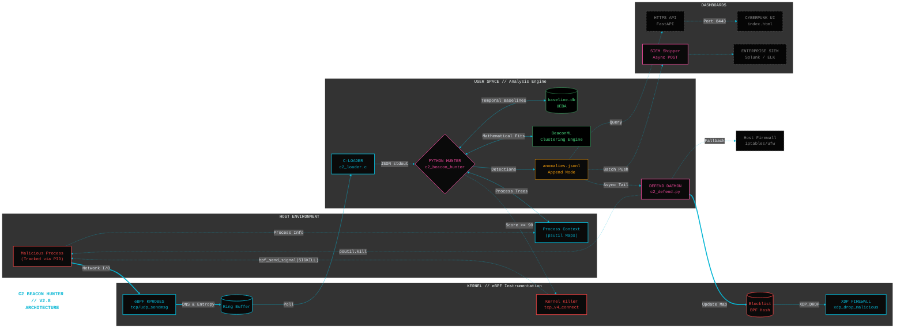
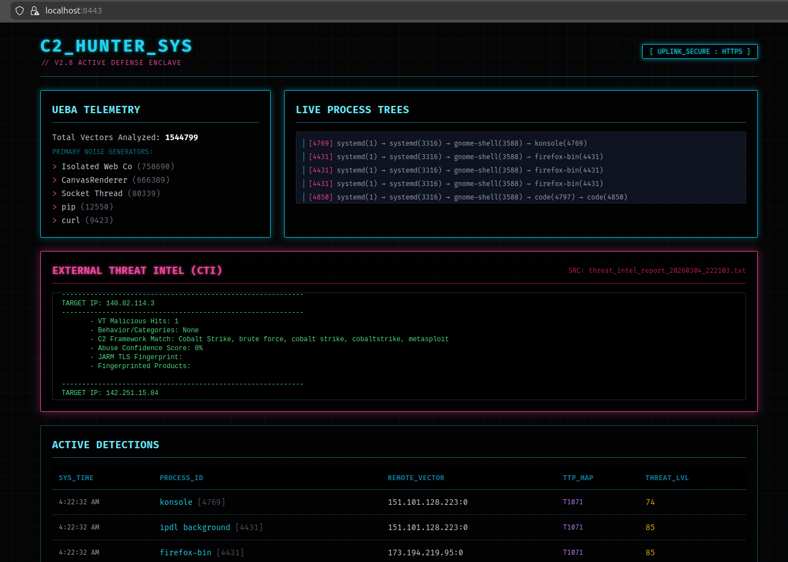

# **c2_beacon_hunter**
**Native Linux C2 Beacon & Stealthy Channel Detector (v2.8)**

*Advanced host-based detection with adaptive learning, eBPF integration, sparse beacon tracking, malleable C2 resistance, and enhanced DNS detection*

### Security Warning
This tool can **kill processes**, **inject eBPF XDP maps**, and **modify the host firewall**.
It must be run with **root privileges** directly on the host.

---

### Overview
`c2_beacon_hunter` is a lightweight, **100% native Linux** tool that detects and actively mitigates command-and-control (C2) beacons in real time using statistical analysis, machine learning, spectral methods, and adaptive baselines with eBPF for low-level monitoring.

**v2.8** elevates the platform into an enterprise-ready security sensor featuring closed-loop Active Defense via wire-speed XDP network blackholing and in-kernel process termination (SIGKILL). It introduces a FastAPI REST backend for dashboard visualization, asynchronous SIEM forwarding (ELK/Splunk), and Live DFIR triage orchestration for volatile memory extraction.

This builds directly upon the **v2.7** introduction of adaptive learning via `baseline_learner.py`, modular eBPF collectors (BCC and libbpf backends), and in-kernel payload entropy calculations, while strictly preserving all **v2.6** features like long-sleep/sparse beacon detection, packet direction analysis, enhanced DNS tracking, and per-process behavioral baselining.

---

### Architecture



---

### Proactive Protection
The `c2_defend/` incident response suite turns detections into active containment and forensic intelligence:

**Active Defense & Containment:**
- **Wire-Speed eBPF Blackholing:** Drops malicious packets at the NIC level using pinned XDP maps before they reach the Linux network stack.
- **Surgical Process Termination:** Issues immediate kernel-level SIGKILL or SIGSTOP commands to halt reverse shells and beaconing loops.
- **Defense-in-Depth Firewalls:** Dynamically isolates networks using OS-level fallbacks (`firewalld`, `ufw`, or `iptables`) to ensure redundant blocking.
- **Automated Daemon Mode:** A background worker (`c2_defend.py`) continuously tails telemetry to automatically mitigate high-confidence (Score >= 90) threats in near real-time.

**DFIR & Rollback Operations:**
- **Live Volatile Triage:** Extracts the true command line, open file descriptors, and binary hashes directly from memory prior to process termination.
- **CTI Enrichment:** Asynchronously queries Threat Intel platforms (AlienVault, VirusTotal, GreyNoise) to identify malicious IPs and C2 framework fingerprints.
- **Safe Rollback Utility (`undo.py`):** Parses the persistent containment ledger (`blocklist.txt`) to instantly reverse XDP map pins and OS firewall rules, ensuring safe recovery from false positives.
- **Comprehensive Auditing:** Full operational logging is maintained via `defender.log` and `c2_defend_daemon.log`.

---

## Project Structure

```bash
c2_beacon_hunter/
├── README.md                         # Top-level documentation and architecture overview
├── setup.sh                          # Unified deployment script for host, container, and eBPF modes
├── config.ini                        # Main configuration for thresholds, ML flags, and whitelists
├── requirements.txt                  # Core Python dependencies
├── c2_beacon_hunter.py               # v2.8 main detection engine and SIEM shipper
├── BeaconML.py                       # Core mathematical clustering and spectral analysis engine
├── Dockerfile                        # Legacy container build instructions
├── ebpf.Dockerfile                   # Container build for the eBPF native C probes and Python environment
├── docker-compose.yaml               # Orchestrates the eBPF hunter and API dashboard services
├── beaconing_algorithms_summary.md   # Documentation on mathematical approaches and detection logic
│
├── tests/
│   └── test_beacon_simulator.py      # Simulates C2 traffic to validate detection mechanisms
│
├── c2_defend/                        # Proactive Protection module
│   ├── README.md                     # Active defense documentation and workflow guide
│   ├── run.sh                        # Interactive wrapper for orchestration and DFIR triage
│   ├── analyzer.py                   # Read-only CLI viewer for detection summaries
│   ├── c2_defend.py                  # Background daemon for automated XDP and firewall containment
│   ├── defender.py                   # Interactive containment engine for manual process termination and blocking
│   └── undo.py                       # Rollback utility to reverse XDP map pins and firewall rules
│
├── output/                           # Auto-created artifacts directory
│   ├── detections.log                # Human-readable running log of scored anomalies
│   ├── anomalies.csv                 # Formatted export of clustered anomalies
│   ├── anomalies.jsonl               # Append-only stream tailed by the active defense daemon
│   └── c2_beacon_hunter.log          # Application execution and debug logging
│
├── audit_rules.d/                    # Legacy Linux auditd rules for process tracking
├── systemd/                          # Systemd service definitions for native host execution
├── venv/                             # Python virtual environment directory
│
└── ebpf/                             # eBPF telemetry and analytics module
    ├── config_dev.ini                # Development-specific configuration overrides
    ├── run_full_stack.py             # Unified launcher for the baseline learner, collector, and hunter
    ├── requirements.txt              # Extra development and eBPF-specific dependencies
    ├── plan.md                       # Roadmap, epic tracking, and architectural notes
    │
    ├── src/                          # Core eBPF Python package
    │   ├── __init__.py               # Package initialization
    │   ├── baseline_learner.py       # Builds statistical and Isolation Forest behavioral models
    │   ├── ebpf_collector_base.py    # Abstract base class for telemetry collectors
    │   ├── bcc_collector.py          # BCC-based eBPF collector backend for development
    │   ├── libbpf_collector.py       # CO-RE libbpf collector backend for production
    │   └── collector_factory.py      # Dynamically selects the eBPF backend based on configuration
    │
    ├── probes/                             # Native C components
    │   ├── c2_loader.c                     # User-space application to load probes and parse the ring buffer into JSON
    │   ├── c2_probe.bpf.c                  # In-kernel CO-RE program for telemetry, entropy calculation, and XDP drops
    │   ├── Makefile                        # Build instructions for the eBPF object, skeleton, and loader
    │
    └── tests/                              # Validation scripts
        ├── __init__.py                     # Test package initialization
        ├── test_baseline_learner.py        # Validates Isolation Forest and statistical profiling logic
        └── test_c2_simulation_libbpf.py    # Simulates network traffic to test C-Loader ingestion
```

---

## Quick Start

Make the script executable and install the required host dependencies (including `auditd` and systemd templates):
```bash
chmod +x setup.sh
sudo ./setup.sh install
```

### Choose Your Engine
v2.8 introduces a dual-routing architecture. You can run the new high-speed eBPF kernel pipeline, or fall back to the classic v2.6 Legacy modes.

**Option A: eBPF Full Stack (Recommended)**
Runs the Native C-Loader, SQLite event broker, and Baseline Learner via `docker-compose`.
```bash
sudo ./setup.sh container --ebpf  # Build the eBPF probe and container
sudo ./setup.sh run --ebpf        # Start the full stack in the background
```

**Option B: Legacy Container Mode**
Runs the classic v2.6 engine using a standard Docker/Podman container and host `psutil` scraping.
```bash
sudo ./setup.sh container         # Build the legacy image
sudo ./setup.sh run --container   # Start the background container
```

**Option C: Legacy Native Service**
Runs directly on the host metal utilizing `auditd` telemetry and systemd persistence.
```bash
sudo ./setup.sh run               # Starts the native c2_beacon_hunter.service
```

---

### Testing & Mitigation

**Run a Full Test:**
Simulates a live C2 beacon on your local machine to verify the ML engine is catching anomalies.
```bash
sudo ./setup.sh test
```

**Activate Proactive Protection:**
Turns detections into active containment (process termination & IP blackholing).
```bash
cd c2_defend
sudo ./run.sh
```

**Graceful Shutdown:**
Safely flushes all databases, terminates collectors, and stops whichever engine you are currently running.
```bash
sudo ./setup.sh stop
```

**Quick Test:**

- Health Check:
```bash
sudo podman exec -it c2-beacon-hunter /bin/bash ebpf/health_check.sh
```

- config.ini
```ini
score_threshold = 45
```

- Low CV + perfect 5s timing → +30
- ML K-Means / DBSCAN / Isolation Forest result → +60
- Unusual port 8443 → +15
- High-entropy payload (random data) → +25
- Python process → passes whitelist
- Total score usually 85–110

```bash
python3 -c '
import socket, time, random, string
print("=== C2 BEACON SIMULATOR (>75 score) ===")
IP = socket.gethostbyname("httpbin.org")
PORT = 8443                                      # unusual port = +15 score
PAYLOAD = b"POST /post HTTP/1.1\r\nHost: httpbin.org\r\nContent-Length: 120\r\n\r\n" + \
          (b"x"*40 + bytes("".join(random.choices(string.ascii_letters + string.digits, k=80)), "utf-8"))

for i in range(1, 35):                           # 35+ beacons = strong ML clusters
    try:
        s = socket.socket(socket.AF_INET, socket.SOCK_STREAM)
        s.settimeout(3)
        s.connect((IP, PORT))
        s.sendall(PAYLOAD)
        s.close()
        print(f"[BEACON {i:02d}] Sent to {IP}:{PORT} (5s perfect timing)")
    except:
        pass
    time.sleep(5.0)                              # rock-solid 5-second interval
print("Simulation finished — check for red [DETECTION] lines in ~60 seconds")
'
```

- Jitter
```bash
python3 -c '
import socket, time, random
print("=== JITTER C2 TEST - Detection (50 beacons) ===")
IP = socket.gethostbyname("httpbin.org")
BASE_PORT = 4444
for i in range(1, 51):
    PORT = BASE_PORT + random.randint(0, 200)   # random high port every time
    try:
        s = socket.socket(socket.AF_INET, socket.SOCK_STREAM)
        s.settimeout(3)
        s.connect((IP, PORT))
        s.sendall(b"POST /data HTTP/1.1\r\nHost: test\r\nContent-Length: 120\r\n\r\n" + b"x"*120)
        s.close()
        print(f"[BEACON {i:02d}] Sent to {IP}:{PORT}")
    except:
        pass
    jitter = random.uniform(-0.85, 0.85)
    time.sleep(5.0 + jitter)
    print(f"   → slept {5+jitter:.2f}s")
print("\n=== Test finished ===")
print("Watch for red [DETECTION] lines in the next 60 seconds")
'
```

---

### How It Works
- **Core Detection**: Polls connections via `ss` (fallback psutil), analyzes intervals/CV/entropy/outbound ratios, runs ML (K-Means/DBSCAN/Isolation Forest/Lomb-Scargle), and checks process trees/masquerading.
- **Adaptive Baselines**: `baseline_learner.py` builds per-process/dest/hour/weekend models (stats + Isolation Forest) from eBPF data, where UEBA deviations from baselines boost anomaly scores.
- **v2.8 Enhancements (Latest Architecture)**:
  - **In-Kernel Analytics**: eBPF natively parses DNS strings and calculates payload Shannon entropy using scaled Look-Up Tables directly on the `tcp_sendmsg` buffer, bypassing user-space bottlenecks.
  - **Closed-Loop Active Defense**: An asynchronous daemon (`c2_defend.py`) tails JSONL logs to trigger surgical process termination (SIGKILL) and XDP wire-speed network blackholing for high-confidence threats (Score >= 90).
  - **Enterprise Telemetry**: A thread-safe `SIEMShipper` forwards anomalies to ELK/Splunk via HTTP POST, while a secure FastAPI REST backend serves real-time metrics and Threat Intel reports to a SOC dashboard.
  - **Full Stack Orchestration**: `run_full_stack.py` launches the baseline learner, eBPF collector, main hunter, and API endpoints together for holistic, unified operation.

## The eBPF Pipeline

1. **Kernel Hooks & Enforcement:** `c2_probe.bpf.o` attaches to the Linux network stack, intercepting deep events (`tcp_v4_connect`, `udp_sendmsg`) to extract precise IPs, PIDs, and packet sizes. It additionally enforces active defense via XDP packet dropping and direct `bpf_send_signal(SIGKILL)` process termination.
2. **The Streamer:** The native C-Loader (`c2_loader`) polls the eBPF ring buffer, formats the kernel-extracted DNS strings and unscaled floating-point entropy scores into strict JSON, and flushes them to the Python backend via `stdout`.
3. **The Broker:** The collector ingests the data and writes it to a high-speed SQLite database (`baseline.db`) utilizing Write-Ahead Logging (WAL) to ensure zero dropped events and prevent race conditions.
4. **The Hunter:** `c2_beacon_hunter.py` reads the database concurrently, reconstructing process trees and piping the microsecond intervals and payload entropy into the Machine Learning engine (K-Means, DBSCAN, Isolation Forests) to catch the beacon.
5. **The Exporter & Responder:** Anomalies are exported to CSV/JSONL, asynchronously shipped to external SIEMs, and actively monitored by the `c2_defend` daemon for immediate wire-speed containment.

---

### Dashboard & API

The API provides real-time visibility into the eBPF pipeline.

    Port: 8443 (HTTPS with self-signed certs)

    Endpoints: /api/v1/metrics, /api/v1/anomalies, /api/v1/threat_intel

<p align="center">
  
</p>

---

### Features
- **Real-time beacon detection** (periodic, jittered, sparse/long-sleep).
- **Malleable C2 resistance** (outbound consistency, in-kernel payload entropy scoring).
- **Enhanced DNS tracking** (In-kernel eBPF parsing + Scapy fallback).
- **Per-process UEBA** (lite in-memory + advanced multi-dimensional Isolation Forest baselines).
- **Process tree analysis + masquerading detection**.
- **Closed-Loop Active Defense:** eBPF XDP wire-speed network dropping and native kernel-level `SIGKILL` process termination.
- **Enterprise Telemetry:** FastAPI REST backend for SOC dashboarding and asynchronous SIEM (ELK/Splunk) HTTP forwarding.
- **DFIR Orchestration:** Automated volatile memory triage and CTI (Threat Intel) enrichment prior to containment.
- **Configurable whitelists** (processes, destinations).
- **Container support** with host visibility and Docker/Podman Compose scaling.
- **MITRE ATT&CK mappings** integrated directly into anomaly JSON logs.
- **Low overhead** (SQLite WAL database, threaded ingestion, and unscaled integer math in-kernel).

See `beaconing_algorithms_summary.md` for detection details.

---

### Dependencies
- **Python 3.12+** (venv recommended).
- **Core Python Packages:** `psutil`, `numpy`, `pandas`, `scikit-learn`, `joblib`, `requests`, `fastapi`, `uvicorn[standard]`, `pydantic`.
- **eBPF Native Stack:** `clang`, `gcc`, `llvm`, `libbpf-dev`, `libelf-dev`, `zlib1g-dev`, `make`, `linux-tools-common`, `linux-tools-generic`, `bpftool`.
- **Installation:** Managed natively via `sudo ./setup.sh install` and `sudo ./setup.sh container --ebpf`.

---

### Configuration (`config.ini`)
```ini
[general]
snapshot_interval = 60
analyze_interval = 300
score_threshold = 60
max_flow_age_hours = 48
max_flows = 5000
output_dir = output
long_sleep_threshold = 1800
min_samples_sparse = 3

[ml]
std_threshold = 10.0
use_dbscan = true
use_isolation = true
max_samples = 2000
use_ueba = true
use_enhanced_dns = true

[ebpf]
backend = auto  # auto, bcc, libbpf
enabled = true

[whitelist]
benign_processes = NetworkManager,pipewire,pulseaudio,nautilus,tracker
benign_destinations = 192.168.,10.,172.16.,172.17.,172.18.,172.19.,172.20.,172.21.,172.22.,172.23.,172.24.,172.25.,8.8.8.8,8.8.4.4,1.1.1.1,1.0.0.1,9.9.9.9

[container]
enabled = true
runtime = auto
```

---

### Testing
- `tests/test_beacon_simulator.py`: Simulates beacons for core detection.
- `dev/tests/test_c2_simulation_libbpf.py`: Generates traffic for eBPF/learner validation.
- `dev/tests/test_baseline_learner.py`: Verifies model building.

Run `sudo ./setup.sh test` for end-to-end.

---

### Roadmap
See `v3.0/plan.md`

**Last updated:** March 2026 (v2.8)

---

### Monitoring and Tuning Steps:

- Events will start to populate that mimic c2 behavior, over time the ```baseline_learner.py```will eventually learn that your specific machine constantly runs certain processes, and the UEBA logic will begin to naturally suppress the score.

- Add to the benign_processes in the config.ini

```ini
[whitelist]
# lower threshold to see detection
# warning: heavy alert detections the lower the score, in 1-2 hours the baseline learner will suppress them
score_threshold = 90
# warning: adding here would blind the detector to real LOLBins/LOTL attacks (proceed with caution)
# example
benign_processes = firefox-bin, code, chrome_childiot, socket thread, gvfsd-wsdd
```

- Run the CTI tool to check IP's for potential known C2 Servers:

Configure the API keys in dfir/config.ini:
```ini
[API_KEYS]
VIRUSTOTAL_KEY=""
ALIENVAULT_OTX_KEY=""
GREYNOISE_KEY=""
ABUSEIPDB_KEY=""
SHODAN_KEY=""
```

```bash
# After alerts populate in output:
cd dfir
bash threat_intel_check.sh
```

---

***Example***

```json
{"timestamp": "2026-03-01T19:26:33.358749", "dst_ip": "0.0.0.0", "dst_port": 0, "process": "python3", "cmd_snippet": "", "pid": 5902, "process_tree": "systemd(1) \u2192 systemd(3312) \u2192 gvfsd(3559) \u2192 gvfsd-wsdd(5897) \u2192 python3(5902)", "masquerade_detected": true, "avg_interval_sec": 0.16, "cv": 0.9961, "entropy": 0.985, "outbound_ratio": 1.0, "ml_result": "ML K-Means Beaconing (Clusters: 5, Min StdDev: 0.01, Score: 0.85); ML Adaptive DBSCAN Beaconing (Core StdDev: 0.16, eps=0.500)", "score": 85, "reasons": ["Advanced_ML: ML K-Means Beaconing (Clusters: 5, Min StdDev: 0.01, Score: 0.85); ML Adaptive DBSCAN Beaconing (Core StdDev: 0.16, eps=0.500)", "process_masquerade"], "mitre_tactic": "TA0005", "mitre_technique": "T1036", "mitre_name": "Masquerading", "description": "C2 Beacon detected - ML K-Means Beaconing (Clusters: 5, Min StdDev: 0.01, Score: 0.85); ML Adaptive DBSCAN Beaconing (Core StdDev: 0.16, eps=0.500)"}
{"timestamp": "2026-03-01T19:31:38.816719", "dst_ip": "0.0.0.0", "dst_port": 0, "process": "python3", "cmd_snippet": "", "pid": 5902, "process_tree": "systemd(1) \u2192 systemd(3312) \u2192 gvfsd(3559) \u2192 gvfsd-wsdd(5897) \u2192 python3(5902)", "masquerade_detected": true, "avg_interval_sec": 0.16, "cv": 0.9961, "entropy": 0.985, "outbound_ratio": 1.0, "ml_result": "ML K-Means Beaconing (Clusters: 5, Min StdDev: 0.01, Score: 0.86); ML Adaptive DBSCAN Beaconing (Core StdDev: 0.16, eps=0.500)", "score": 85, "reasons": ["Advanced_ML: ML K-Means Beaconing (Clusters: 5, Min StdDev: 0.01, Score: 0.86); ML Adaptive DBSCAN Beaconing (Core StdDev: 0.16, eps=0.500)", "process_masquerade"], "mitre_tactic": "TA0005", "mitre_technique": "T1036", "mitre_name": "Masquerading", "description": "C2 Beacon detected - ML K-Means Beaconing (Clusters: 5, Min StdDev: 0.01, Score: 0.86); ML Adaptive DBSCAN Beaconing (Core StdDev: 0.16, eps=0.500)"}
```

- The hunter caught ```gvfsd-wsdd```, which is the GNOME Virtual File System Web Services Dynamic Discovery daemon. It is a standard Linux background service used to discover Windows/SMB shares on your local network.

***Here is exactly why C2 Hunter flagged it with a score of 85***:

1. It acts exactly like a UDP Beacon

```gvfsd-wsdd``` is designed to continuously broadcast UDP packets to the local network on a robotic timer to see if any new Windows file shares have come online. Because the timing is perfectly scripted, ML clustering algorithms correctly identified it as a mathematical beacon (Min StdDev: 0.01).

2. It triggered the "Process Masquerade" penalty (+25 points)

```gvfsd-wsdd``` is actually a Python script. When it starts up, it uses a trick to rewrite its own process name from python3 to gvfsd-wsdd so it looks prettier in htop or ps.

- However, ```c2_beacon_hunter.py``` masquerading logic looks at the underlying executable path (```/usr/bin/python3```) and compares it to the running process name (```gvfsd-wsdd```). Because they didn't match, the engine immediately (and correctly) flagged it as Masquerading / Process Hollowing.

- Initial tuning will be required.  Consult/Research events like this to understand what is happening and why the benign_processes is important.

- If the intent is to monitor everything, then do not add to the benign_processes filter (lots of alerts/event will occur and require false-positive review).

### baseline_learner.py

***Understanding the "Burn-In" Period (Initial Alert Volume)***

When first deploying `c2_beacon_hunter`'s Machine Learning and UEBA (User and Entity Behavior Analytics) engine, it is normal to experience a high volume of initial alerts that gradually tapers off over the first few days. In data science, this is known as the **"Burn-In Period"** or **"Learning Phase."** Here is a breakdown of why this occurs and how the engine dynamically adapts to your specific host environment.

***1. Phase One: The Blank Slate (High Noise)***

Upon initial startup, the anomaly detection engine has no historical context for what constitutes "normal" background activity on your specific machine. Algorithms like K-Means and DBSCAN are mathematically rigid; they look for exact, repeating network patterns. A benign developer tool checking for an update every 60 seconds looks mathematically identical to a stealthy C2 beacon. Because the historical baseline database is empty, the engine conservatively flags all highly structured, repetitive network traffic.

***2. Phase Two: Baseline Maturation (Learning the Noise)***

As the background learning engine (`baseline_learner.py`) runs over the subsequent hours and days, it silently ingests these events and maps the baseline ecosystem of the host. The model builds multi-dimensional profiles, learning facts such as:
* *"Process X always connects to IP Y at 9:00 AM."*
* *"Process Z always sends exactly 64 bytes of data on a perfect 30-second loop."*

The machine learning model establishes a complex mathematical boundary around these benign, everyday behaviors.

***3. Phase Three: The Drop-Off (Steady State)***

Once the models mature, the alert volume drops off significantly. When a known benign tool executes its daily update loop, the core clustering algorithms still detect the mathematical pattern, but the UEBA engine cross-references the mature baseline and suppresses the alert. The ambient noise drops to near zero, preserving high-severity alerts strictly for true, unprofiled anomalies.

> **The Train Track Analogy**
> Deploying this tool is similar to moving into a house next to a busy train track. On the first night, a train passing at 2:00 AM is a massive anomaly that triggers a startle response. By day 14, your brain has built a baseline of the train's schedule, volume, and vibration. By day 30, you sleep right through it. However, if your bedroom door suddenly creaks open—a true anomaly that falls *outside* the baseline—you wake up instantly. The `c2_beacon_hunter` UEBA engine operates on this exact same principle.