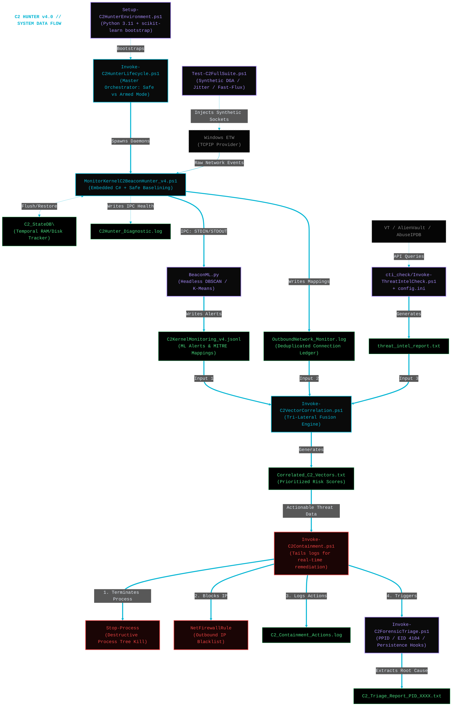

# Windows Kernel C2 Beacon Hunter v4.0

## Overview
A **kernel-native, diskless** Command and Control (C2) detection and automated response engine for Windows. This project bridges the gap between raw Windows kernel telemetry (ETW) and advanced Machine Learning to catch modern, evasive C2 frameworks (Sliver, Cobalt Strike, Nighthawk) without relying on heavy third-party agents or static IOCs.

By default, the suite operates in a **Safe Baselining Mode (Dry-Run)** to prevent accidental termination of legitimate business applications while mapping your environment's network profile.

---

## V4 Architectural Highlights
* **Zero-Disk I/O Pipeline:** Embedded C# directly intercepts the `Microsoft-Windows-TCPIP` ETW provider in RAM, extracting connections and passing them to the Python ML engine via STDIN pipes. Zero heavy `.etl` trace files are written to disk.
* **Multi-Dimensional ML Clustering:** The Python daemon utilizes highly optimized, single-threaded DBSCAN and K-Means algorithms to evaluate interval rigidity, packet sizes, subnet diversity, and payload entropy to identify jittered/sparse beacons and Fast-Flux infrastructure.
* **Temporal Evasion Mitigation:** The system employs a hybrid state management architecture—balancing high-speed RAM processing with a persistent NTFS JSON database—to identify "Low and Slow" beaconing behavior while maintaining a resilient detection posture across system reboots.
* **Universal Diagnostic Engine:** A toggleable, millisecond-precision IPC logging engine that tracks matrix handoffs and explicitly intercepts underlying Python C-library exceptions for rapid troubleshooting.
* **Automated Lifecycle Management:** A master orchestrator handles dependency bootstrapping (Python 3.11 + ML libraries), parallel daemon execution, and pristine artifact teardown.
* **Post-Processing CTI Enrichment:** An automated script to parse unique outbound flows and query them against VirusTotal, AlienVault OTX, GreyNoise, AbuseIPDB, and Shodan for JARM fingerprints and framework tagging.
* **Tri-Lateral Vector Correlation:** A dedicated fusion engine that cross-references mathematically validated anomalies, the local connection ledger, and external CTI enrichment reports to generate a prioritized investigation report ranked by an aggregate risk score.
* **Automated Active Defense:** Executes multi-tiered remediation by forcefully terminating malicious process trees and injecting permanent outbound firewall block rules for identified C2 infrastructure.
* **Deep-Dive Forensic Triage:** Automatically reconstructs process lineage (PPID), extracts de-obfuscated PowerShell script blocks (Event ID 4104), and enumerates advanced persistence hooks—including WMI event consumers, scheduled tasks, and Image File Execution Options (IFEO) injections—immediately following containment.
* **Evidence-Led Eradication:** Provides actionable intelligence and specific artifact locations to facilitate the systematic removal of malicious staging files, persistence mechanisms, and the rotation of compromised credentials as identified in the forensic triage report.

### System Diagram
---



---

## Prerequisites
* Windows 10 / Windows 11 / Windows Server 2019+
* PowerShell 5.1+ (Must be run as Administrator)
* *Note: The orchestrator will automatically download and silently install Python 3.11 and the required ML dependencies (`scikit-learn`, `numpy`) if they are not found on the host.*

---

## Quick Start Guide

### 1. Launch the Lifecycle Manager (Safe Mode)
Run the master orchestrator. It will bootstrap the environment, load the ML matrices, and spawn the Monitoring and Defender daemons in **Dry-Run Mode**.
```powershell
.\Invoke-C2HunterLifecycle.ps1
```
*In Dry-Run mode, the Active Defender will only print out the processes and IPs it **would** have terminated or blocked. Leave this running to analyze your environment for false positives.*

### 2. Launch the Lifecycle Manager (Armed Mode)
Once baselining is complete, pass the `-ArmedMode` switch. The Defender daemon will actively terminate malicious processes and add outbound Windows Firewall block rules for high-confidence C2 IPs.
```powershell
.\Invoke-C2HunterLifecycle.ps1 -ArmedMode
```

### 3. Run the Threat Intelligence Enrichment
To retrospectively analyze the outbound IPs captured by the monitor against community CTI databases, ensure your `cti_check/config.ini` is populated with your API keys, then execute:
```powershell
cd cti_check/
.\Invoke-ThreatIntelCheck.ps1
```

---

## Validation & Testing
To ensure the IPC pipes, ML engine, and telemetry parsers are functioning correctly, the project includes an AV-safe validation suite.

While the lifecycle orchestrator is running, open a new Administrative PowerShell window and execute:
```powershell
.\Test-C2FullSuite.ps1
```
This script uses raw `.NET` TCP sockets to bypass OS HTTP stack pollution and safely simulates:
* DGA (Domain Generation Algorithm) queries.
* Rigid (0% jitter) and Jittered (30%) script-kiddie/APT beacons.
* Fast-Flux infrastructure routing.

Monitor the main orchestrator console. You should see simultaneous ML detections trigger approximately 30 seconds after the test suite completes.

---

## Core File Manifest
* **`Invoke-C2HunterLifecycle.ps1`**: The master orchestration, dependency injection, and teardown manager.
* **`Setup-C2HunterEnvironment.ps1`**: Handles unattended Python 3.11 and `pip` dependency installations.
* **`MonitorKernelC2BeaconHunter_v4.ps1`**: The core C# ETW listener, PowerShell state manager, and IPC pipeline.
* **`BeaconML.py`**: The headless Python mathematical daemon providing DBSCAN and interval analysis.
* **`c2_defend.ps1`**: The real-time active defense engine that tails JSONL logs for automated remediation.
* **`cti_check/Invoke-ThreatIntelCheck.ps1`**: The CTI API aggregation and reporting tool.
* **`cti_check/config.ini`**: Secure credential storage for CTI API keys (VirusTotal, AlienVault, etc.).
* **`Invoke-C2VectorCorrelation.ps1`**: The DFIR fusion engine that correlates mathematical anomalies, network flow logs, and CTI data.
* **`Invoke-C2Containment.ps1`**: The automated remediation engine that terminates malicious processes and applies firewall blocks.
* **`Invoke-C2ForensicTriage.ps1`**: The forensic enumeration engine that reconstructs process lineage and identifies persistence mechanisms.
* **`Test-C2FullSuite.ps1`**: The synthetic C2 traffic generator for validation testing.

---

## Telemetry and Persistent Storage
The engine operates primarily in-memory but preserves critical forensic telemetry and state data in `C:\Temp\` for investigation and SIEM ingestion:

| File/Directory | Description | Purpose |
| :--- | :--- | :--- |
| **`C2_StateDB\`** | Directory containing JSON-serialized flow states. | Persistence for "Low and Slow" beacon detection. |
| **`C2KernelMonitoring_v4.jsonl`** | Structured JSON alerts with MITRE ATT&CK mappings. | SIEM ingestion and real-time alerting. |
| **`OutboundNetwork_Monitor.log`** | Deduplicated ledger of all outbound network flows. | Process-to-IP mapping and traffic auditing. |
| **`Correlated_C2_Vectors.txt`** | Prioritized investigation report with aggregate risk scores. | Analyst triage and threat prioritization. |
| **`C2_Containment_Actions.log`** | Forensic audit ledger of all process kills and firewall blocks. | Incident response accountability. |
| **`C2_Triage_Report_PID_XXXX.txt`** | Deep-dive forensic evidence (lineage, script blocks, persistence). | Root cause analysis and eradication. |
| **`C2Hunter_Diagnostic.log`** | Operational health log for IPC and internal state tracking. | System troubleshooting. |

---

## Correlation, Containment, and Eradication Workflow

### Stage 0: Configuration
Credentials for threat intelligence services must be configured in `cti_check/config.ini`. The system requires these keys to validate the reputation of beacon destinations identified by the ML daemon.

### Stage 1: Enrichment and Correlation
1. **`Invoke-ThreatIntelCheck.ps1`**: Once network telemetry is gathered, this module queries global CTI databases.
2. **`Invoke-C2VectorCorrelation.ps1`**: Combines the mathematical alerts from the ML daemon with CTI results and the process ledger to identify definitive attack vectors.

### Stage 2: Containment and Triage
**Component**: `Invoke-C2Containment.ps1`

When an actionable threat is identified (default score threshold - 100), the containment engine executes a three-tiered response:

1. **Isolation**: Forcefully terminates the malicious process tree (unless whitelisted) and creates outbound firewall blocks for the C2 IP.
2. **Automated Triage**: Immediately invokes `Invoke-C2ForensicTriage.ps1` to capture the process context before volatile data is lost.
3. **Forensic Reporting**:
    * Reconstructs the Parent Process ID (PPID) to find the initial dropper.
    * Extracts de-obfuscated PowerShell script blocks (Event ID 4104).
    * Identifies persistence hooks including Scheduled Tasks, WMI event consumers, and Registry Run keys.

---

## Technical Performance Notes
The v4.0 architecture includes a high-fidelity noise reduction layer. It utilizes process and IP-prefix whitelists to ignore known-benign telemetry from browsers (Chrome, Edge) and system keep-alives, ensuring that the correlation engine focuses exclusively on anomalous outbound behavior.
