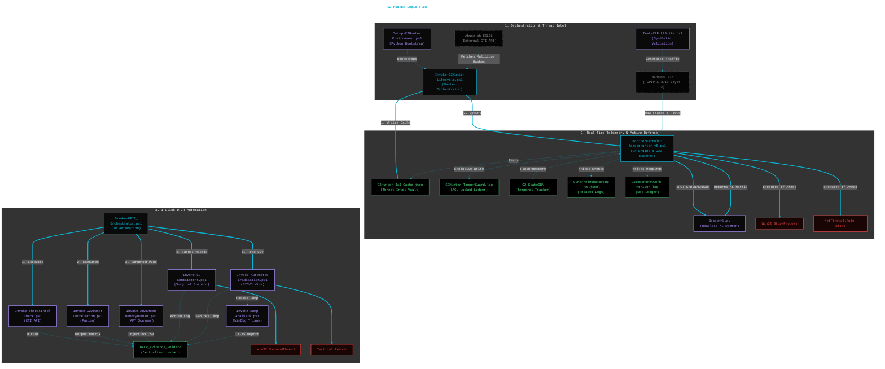

# Windows Kernel C2 Beacon Hunter v5.0

## Overview
A **kernel-native, diskless** Command and Control (C2) detection and automated response engine for Windows. This project bridges the gap between raw Windows kernel telemetry (ETW), Cryptographic Deep Packet Inspection, and advanced Machine Learning to catch modern, evasive C2 frameworks (Sliver, Cobalt Strike, Nighthawk) without relying on heavy third-party agents or static IOCs.

By default, the suite operates in a **Safe Baselining Mode (Dry-Run)** to prevent accidental termination of legitimate business applications while mapping your environment's network profile.

---

## V5 Architectural Highlights
* **Cryptographic DPI & JA3 Profiling (Phase 4):** The inline C# engine now natively subscribes to the `NDIS-PacketCapture` provider to inspect raw Layer 2 Ethernet frames. It dynamically calculates byte offsets to extract the TLS `Client Hello` and generate JA3 MD5 hashes. Natively maps Layer 2 crypto fingerprints back to Layer 4 processes to instantly block known malicious frameworks (Cobalt Strike, Sliver, Empire).
* **Dynamic Threat Intel Engine:** The master orchestrator dynamically fetches the latest malicious JA3 profiles from Abuse.ch (SSLBL) on startup, with an expanded APT-grade offline fallback cache for air-gapped environments.
* **Active Anti-Tamper & Self-Defense:** Upgraded from a passive canary to an active watchdog.
  * Establishes a native Windows `icacls` locked vault for the `TamperGuard.log`.
  * The unmanaged C# engine monitors `VirtualProtect` for RWX memory patching (`ntdll.dll` unhooking).
  * Intercepts rogue `logman` commands attempting to blind the ETW session.
  * An asynchronous job actively monitors the script's native thread states to detect freezing/suspension attacks.
* **Unified Hunter-Killer Daemon:** The standalone defender script has been retired. The core Monitor script now natively processes ML and Cryptographic alerts in RAM to surgically terminate processes and isolate IPs at the firewall instantly, eliminating disk-read latency.
* **Automated BYOVD Eradication:** A data-driven engine (`Invoke-AutomatedEradication.ps1`) dynamically pulls ProcDump from Sysinternals, secures memory dumps, extracts and destroys vulnerable kernel drivers, and triggers a tactical reboot to flush RAM.
* **Multi-Tier WinDbg Forensics:** Includes an automated debugger module (`Invoke-DumpAnalysis.ps1`) that dynamically stages `cdb.exe` to scan acquired `.dmp` files for RWX memory (shellcode) and generates an Executive IR Report for Tier 1-5 analysts.
* **Thread-Level Mapping (TID):** ML engine groups high-churn Fast-Flux bursts entirely by Native Thread ID, ignoring IP churn to mathematically detect the underlying beaconing and isolate injected payloads.
* **Memory Forensics:** `Invoke-AdvancedMemoryHunter.ps1` utilizes P/Invoke and Wildcard C# matching to hunt for Unbacked Threads, Abnormal RWX Module Stomping, Direct Syscalls (Hell's Gate), Raw Shellcode, and 25+ YARA-validated framework signatures.
* **Enterprise Log Rotation:** The Monitor daemon continuously runs a 50MB self-grooming log rotation engine, ensuring 24/7 background operation without choking SIEM forwarders or disk space.

### System Diagram
---



---

## Prerequisites
* Windows 10 / Windows 11 / Windows Server 2019+
* PowerShell 5.1+ (Must be run as Administrator)
* *Note: The orchestrator will automatically download and silently install Python 3.11 and the required ML dependencies (`scikit-learn`, `numpy`) if they are not found on the host.*
* **Optional but Recommended:** Add Free API Keys for VirusTotal, AlienVault, and AbuseIPDB into `cti_check\config.ini`.

---

## Quick Start Guide

### 1. Launch the Lifecycle Manager (Safe Baselining Mode)
Run the master orchestrator. It will bootstrap the environment, fetch the latest JA3 threat intel, load the ML matrices, and spawn the Hunter-Killer Daemon in **Dry-Run Mode**.
```powershell
.\Invoke-C2HunterLifecycle.ps1
```
*In Dry-Run mode, the Active Defender will only print out the processes and IPs it **would** have terminated or blocked. Leave this running to analyze your environment for false positives.*

### 2. Launch the Lifecycle Manager (Armed Mode)
Once baselining is complete, pass the `-ArmedMode` switch. The daemon will utilize real-time IP correlation and Layer-2 cryptographic fingerprinting to execute process terminations and apply outbound Windows Firewall block rules autonomously.
```powershell
.\Invoke-C2HunterLifecycle.ps1 -ArmedMode
```

### 3. Trigger 1-Click DFIR Automation
When a critical ML or JA3 alert fires during an incident, open a new prompt and execute the master IR orchestrator to fully automate the investigation, memory acquisition, and kernel eradication process.
```powershell
.\Invoke-DFIR_Orchestrator.ps1 -ArmedMode
```

---

## Validation & Testing
To ensure the IPC pipes, Deep Packet Inspection (DPI) engine, and telemetry parsers are functioning correctly, the project includes an AV-safe validation suite.

While the lifecycle orchestrator is running, open a new Administrative PowerShell window and execute:
```powershell
.\Test-C2FullSuite.ps1
```
This script uses raw `.NET` TCP sockets to safely simulate:
* DGA (Domain Generation Algorithm) queries.
* Rigid (0% jitter) and Jittered (30%) script-kiddie/APT beacons.
* Fast-Flux infrastructure routing.
* **V5 Update:** Evaluates the Anti-Tamper Canary Watchdog, Thread-Suspension Detection, and NDIS Blinding Recovery.

---

## Core File Manifest
* **`Invoke-C2HunterLifecycle.ps1`**: The master orchestration, Threat Intel downloader, dependency injection, and teardown manager.
* **`MonitorKernelC2BeaconHunter_v5.ps1`**: The core C# ETW listener, NDIS JA3 packet scanner, ML IPC pipeline, and Real-Time Active Defense engine.
* **`BeaconML.py`**: The headless Python mathematical daemon providing DBSCAN and interval analysis.
* **`Invoke-DFIR_Orchestrator.ps1`**: The 1-click incident response manager that chains all forensic phases.
* **`Invoke-AdvancedMemoryHunter.ps1`**: APT-grade memory forensics utilizing P/Invoke and Wildcard C# matching.
* **`Invoke-C2VectorCorrelation.ps1`**: The DFIR fusion engine correlating math anomalies, network logs, and CTI data.
* **`Invoke-C2Containment.ps1`**: The automated remediation engine executing surgical Win32 Thread Suspensions.
* **`Invoke-AutomatedEradication.ps1`**: Neutralizes BYOVD kernel persistence, pulls Sysinternals ProcDump to secure memory, and forces tactical reboots.
* **`Invoke-DumpAnalysis.ps1`**: Automated WinDbg triage that generates Tier 1-5 forensic reports for analysts.

---

## Telemetry and Persistent Storage
The engine operates primarily in-memory but preserves critical forensic telemetry and state data in `C:\Temp\` for investigation and SIEM ingestion:

| File/Directory | Description | Purpose |
| :--- | :--- | :--- |
| **`C2_StateDB\`** | Directory containing JSON-serialized flow states. | Persistence for "Low and Slow" beacon detection. |
| **`C2Hunter_JA3_Cache.json`** | Dynamically updated cache of malicious TLS footprints. | Powers the real-time cryptographic L2 scanner. |
| **`C2Hunter_TamperGuard.log`** | `icacls` locked ledger tracking ETW bypasses. | Auditing sensor blinding and memory patching attempts. |
| **`C2KernelMonitoring_v5.jsonl`** | Structured JSON alerts with MITRE ATT&CK mappings. | SIEM ingestion (Features 50MB Auto-Rotation). |
| **`OutboundNetwork_Monitor.log`** | Deduplicated ledger of all outbound network flows. | Process-to-IP mapping and traffic auditing. |
| **`DFIR_Evidence_YYYYMMDD_HHmm\`** | Centralized IR Locker dynamically generated by the Orchestrator. | Incident response accountability and artifact storage. |
| **`advanced_memory_injections.csv`** | Generated CSV containing addresses of Direct Syscalls, RWX anomalies, and YARA hits. | Feeds the Eradication Engine. |
| **`*.dmp` & Forensic Reports** | Full process memory dumps and T1-T5 WinDbg analysis files. | Deep-dive reverse engineering handoff. |