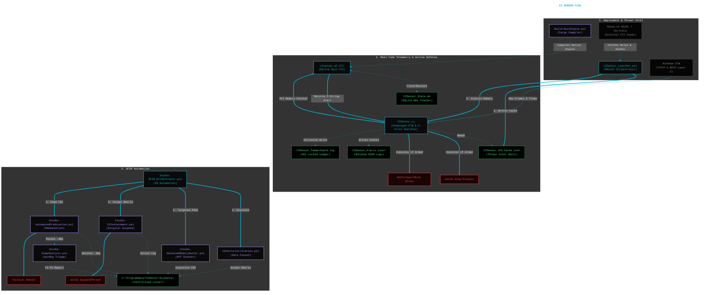
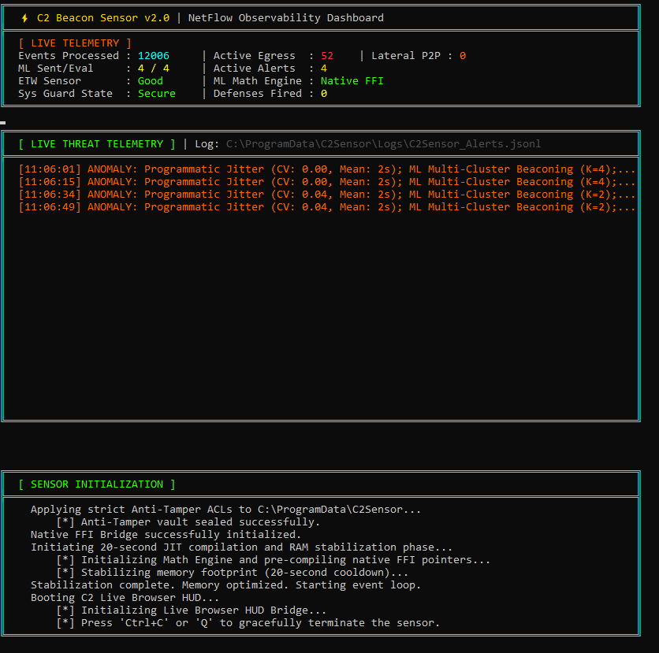
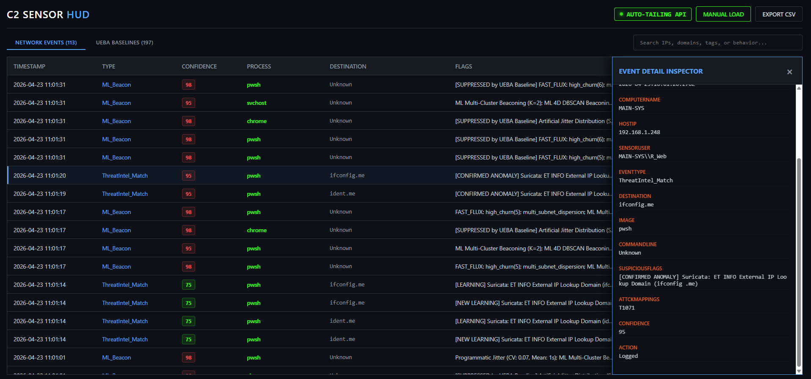

# Windows Kernel C2 Beacon Sensor

## Overview
A **kernel-native, high-performance** Command and Control (C2) detection and automated response engine for Windows. This project bridges the gap between raw Windows kernel telemetry (ETW), Cryptographic Deep Packet Inspection, wire-speed Threat Intelligence (Suricata/Abuse.ch), and native Machine Learning to catch modern, evasive C2 frameworks (Sliver, Cobalt Strike, Nighthawk).  A lightweight, drop-in sensor designed to detect stealthy C2 beacons through advanced mathematical ML analysis and UEBA-driven baselining of normal outbound traffic behavior.

By default, the suite operates in an **Audit Mode (Dry-Run)** to prevent accidental termination of legitimate business applications while mapping your environment's network profile.

---

## Architectural Highlights
* **Native Rust FFI Machine Learning:** Replaced the legacy Python daemon with `c2sensor_ml.dll`. The C# ETW listener pushes multi-dimensional telemetry matrices (Intervals, Packet Sizes, Subnet Diversity) directly into Rust's RAM for mathematically rigorous, lock-free DBSCAN and K-Means clustering.
* **O(1) Network Threat Intel:** Dynamically syncs and compiles EmergingThreats (Suricata) and Abuse.ch network rules into zero-allocation binary searches. Evaluates live DNS and TCP/IP flows against thousands of signatures simultaneously with zero CPU overhead.
* **Universal AppGuard:** Monitors `Kernel-Process` events to instantly intercept web shells and database RCEs (IIS, SQL, Tomcat, Node) attempting to spawn command interpreters in unauthorized directories.
* **Cryptographic DPI & JA3 Profiling:** Natively subscribes to the `NDIS-PacketCapture` provider to inspect raw Layer 2 Ethernet frames. Dynamically extracts TLS `Client Hello` signatures to generate JA3 hashes and block malicious L4 frameworks instantly.
* **Enterprise State Management:** Legacy JSON flat-files have been replaced by a high-speed SQLite Write-Ahead Logging (WAL) database (`C2Sensor_State.db`), securely anchoring temporal "low and slow" beacon tracking across system reboots.
* **Active Anti-Tamper & Self-Defense:** * Establishes a native Windows `icacls` locked vault for the `TamperGuard.log`.
  * Monitors `VirtualProtect` for RWX memory patching (`ntdll.dll` unhooking).
  * Intercepts rogue `logman` commands attempting to blind the ETW session.
* **1-Click DFIR Orchestration:** Automates the incident response pipeline (`Invoke-DFIR_Orchestrator.ps1`). Extracts BYOVD kernel persistence, pulls Sysinternals ProcDump, scans for APT-grade memory injections (Hell's Gate / Direct Syscalls), and stages automated WinDbg Tier 1-5 forensic reports into a centralized, timestamped evidence vault.

---

### System Diagram



---

## Prerequisites
* Windows 10 / Windows 11 / Windows Server 2019+
* PowerShell 5.1+ (Must be run as Administrator)
* **To Compile from Source:** Rust Toolchain (`cargo`) and MSVC C++ Desktop Build Tools (via `Build-RustEngine.ps1`).

---

## Quick Start Guide

### 1. Compile the Native Engine (First Run Only)
Before launching the sensor, compile the Rust machine learning engine into a native `.dll`.
```powershell
.\Build-RustEngine.ps1
```

### 2. Launch the Sensor (Audit Mode)
Run the orchestrator. It will bootstrap the environment, sync Suricata/Abuse.ch network rules, build the zero-allocation binary searches, map the Rust ML engine into memory, and begin monitoring in **Dry-Run Mode**.
```powershell
.\C2Sensor_Launcher.ps1
```
*In Audit mode, the Active Defender will only print out the processes and IPs it **would** have terminated or blocked. Leave this running to analyze your environment for false positives.*

### 3. Launch the Sensor (Armed Mode)
Once baselining is complete, pass the `-ArmedMode` switch. The daemon will utilize real-time ML clustering, Network Signatures, and Layer-2 cryptographic fingerprinting to execute process terminations and apply outbound Windows Firewall block rules autonomously.
```powershell
.\C2Sensor_Launcher.ps1 -ArmedMode
```

### 4. Trigger 1-Click DFIR Automation
When a critical ML or JA3 alert fires during an incident, open a new prompt and execute the master IR orchestrator to fully automate the investigation, memory acquisition, and eradication process.
```powershell
.\Invoke-DFIR_Orchestrator.ps1 -ArmedMode
```

---

## Core File Manifest
* **`C2Sensor_Launcher.ps1`**: The master orchestration, Threat Intel network compiler (Abuse.ch/Suricata), FFI memory mapper, and primary HUD daemon.
* **`C2Sensor.cs`**: The core unmanaged C# ETW listener, NDIS JA3 packet scanner, AppGuard interceptor, and `[DllImport]` boundary.
* **`lib.rs` / `c2sensor_ml.dll`**: The native Rust Machine Learning engine executing DBSCAN, K-Means clustering, SQLite WAL state management, and DGA heuristics natively in memory.
* **`Build-RustEngine.ps1` & `Build-AirGapPackage.ps1`**: Automated deployment pipelines for enterprise provisioning.
* **`Invoke-DFIR_Orchestrator.ps1`**: The 1-click incident response manager that chains all forensic phases into `C:\ProgramData\C2Sensor\Evidence\`.
* **`Invoke-AdvancedMemoryHunter.ps1`**: APT-grade memory forensics utilizing P/Invoke and Wildcard C# matching.
* **`C2VectorCorrelation.ps1`**: The DFIR fusion engine correlating math anomalies, network logs, and CTI data.
* **`Invoke-AutomatedEradication.ps1`**: Neutralizes BYOVD kernel persistence, pulls Sysinternals ProcDump to secure memory, and forces tactical reboots.

---

## Telemetry and Persistent Storage
The engine operates primarily in unmanaged memory, but rigorously logs alerts, states, and SIEM data to the secure `C:\ProgramData\C2Sensor\` enterprise directory:

| File/Directory | Description | Purpose |
| :--- | :--- | :--- |
| **`\Data\C2Sensor_State.db`** | High-speed SQLite database operating in WAL mode. | Persistence for "Low and Slow" beacon interval tracking. |
| **`\Data\C2Sensor_JA3_Cache.json`** | Dynamically updated cache of malicious TLS footprints. | Powers the real-time cryptographic L2 scanner. |
| **`\Data\C2Sensor_TamperGuard.log`** | `icacls` locked ledger tracking ETW bypasses. | Auditing sensor blinding and memory patching attempts. |
| **`\Logs\C2Sensor_Alerts.jsonl`** | Structured JSON alerts with MITRE ATT&CK mappings. | Primary SIEM ingestion file (Features 50MB Auto-Rotation). |
| **`\Logs\C2Sensor_UEBA.jsonl`** | High-volume RAW telemetry firehose. | Forwarded to Azure Sentinel / Splunk for historic querying. |
| **`\Evidence\DFIR_YYYYMMDD_HHmm\`** | Centralized IR Locker dynamically generated by the DFIR Orchestrator. | Incident response accountability and artifact storage. |
| **`advanced_memory_injections.csv`** | Generated CSV containing addresses of Direct Syscalls, RWX anomalies, and YARA hits. | Feeds the Eradication Engine. |
| **`*.dmp` & Forensic Reports** | Full process memory dumps and T1-T5 WinDbg analysis files. | Deep-dive reverse engineering handoff. |

---

### ML Engine Tuning Guidance

In `C2Sensor_Launcher.ps1`:
```pwsh
param (
    [int]$MinSamplesForML = 8,
)
```

The `MinSamplesForML` parameter is the mathematical trigger for the sensor. It dictates exactly how many network connections (pings, handshakes, or data transfers) to a single destination must be cached in memory before the C# orchestrator hands that array over the FFI boundary to the Rust ML engine.

Because the Rust engine evaluates behavioral timing—specifically Standard Deviation, Sparsity, Data Asymmetry, and K-Means clustering—the number of samples directly dictates both the CPU footprint and the mathematical accuracy of the detection.

Here is the breakdown of the sample ranges and the exact effect they have on the environment.

#### Range 1 to 3: The "Hair-Trigger" (Dev/Test Mode)
* **Mathematical Effect:** Statistical analysis breaks down. You cannot calculate a meaningful standard deviation or establish behavioral clusters on 2 or 3 data points.
* **Operational Impact:** CPU starvation and massive false positives. When a user opens a modern webpage, the browser instantly fires 3 to 6 concurrent sockets to the same CDN to pull images and scripts. At this threshold, the sensor sends every single legitimate web request to Rust for evaluation, flagging normal burst traffic as "beaconing."

#### Range 4 to 10: The Tactical Sweet Spot (Baseline: 8)
* **Mathematical Effect:** This provides the minimum viable density for statistical accuracy. At 8 data points, the engine can accurately plot inter-arrival times and calculate variance (jitter).
* **Operational Impact:** This is the optimal zone for an active defense posture. It successfully filters out the immediate, short-lived bursts of legitimate web browsing, preserving CPU cycles. More importantly, it maintains extremely low detection latency. If an adversary drops a payload with a 1-minute sleep cycle, a threshold of 8 catches them in exactly 8 minutes, allowing the sensor to sever the connection before deep lateral persistence is established. Maintaining this precise balance ensures continuous, stable improvement without introducing regression.

#### Range 11 to 25: The "Stealth Hunter"
* **Mathematical Effect:** Exceptional accuracy. With 20+ data points, the K-Means clustering algorithm is highly confident, dropping false positive rates to near zero.
* **Operational Impact:** CPU utilization drops to its absolute lowest, but **detection latency skyrockets**. If an advanced threat is using a 15-minute sleep cycle, a threshold of 25 means the sensor will silently watch the traffic for over 6 hours before it even attempts to run the math. While highly accurate, it grants the adversary a massive window of dwell time.

#### Range 26+: The Historical Analyst
* **Mathematical Effect:** Perfect statistical modeling.
* **Operational Impact:** The sensor ceases to be a "Real-Time" Active Defense engine. At 50 or 100 samples, the script acts more like a traditional SIEM, executing historical forensics rather than instantly isolating active threats.

The baseline of **8** is the mathematically sound fulcrum. It forces the engine to wait just long enough to prove the connection isn't a random browser burst, but reacts fast enough to execute wire-speed threat mitigation before the adversary can pivot.

---

### Console Dashboard & Sensor HUD

<p align="center">
  
</p>

<p align="center">
  
</p>