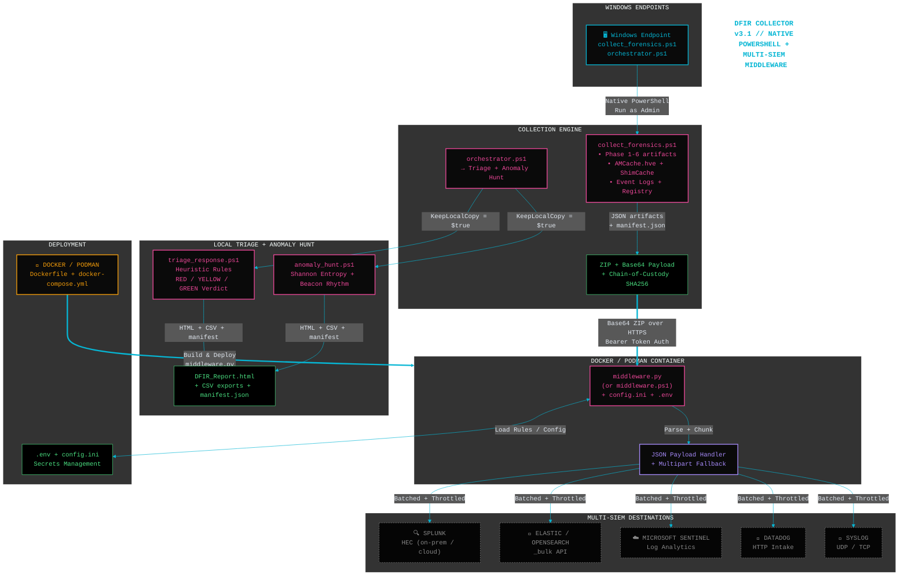

## DFIR Collector & Triage
- Author: Robert Weber

### Quick Deploy
---

1. `cd middleware`
2. `cp .env.example .env` and fill secrets
3. `docker compose up -d` (or `podman-compose up -d`)
4. On endpoints: `.\collector\orchestrator.ps1`

### arch
---
