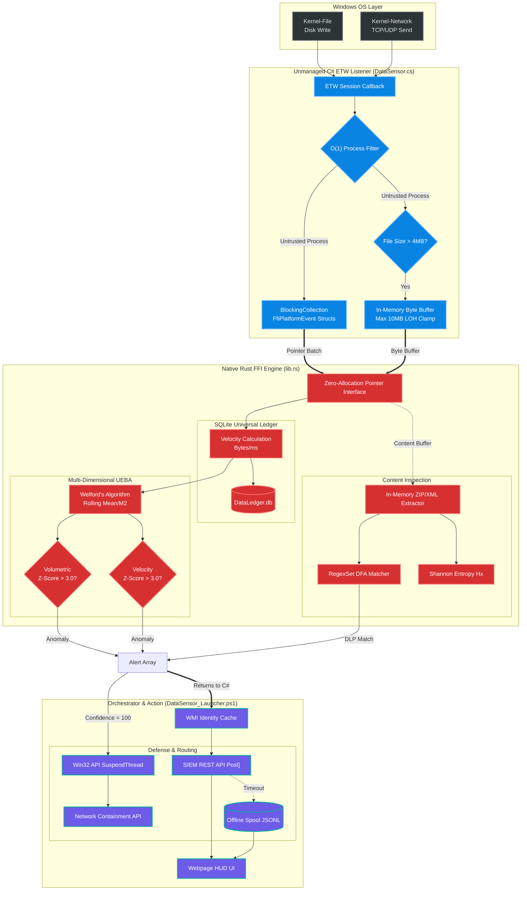

```mermaid
%%{init: {'theme': 'dark', 'themeVariables': { 'fontFamily': 'Fira Code, monospace', 'lineColor': '#06b6d4', 'mainBkg': '#0a0a0a', 'textColor': '#e2e8f0'}}}%%
graph LR
    %% Style Definitions (identical to original)
    classDef title fill:none,stroke:none,color:#06b6d4,font-size:18px,font-weight:bold;
    classDef external fill:#050505,stroke:#888,stroke-width:1px,color:#888,stroke-dasharray: 3 3;
    classDef core fill:#0a0a0a,stroke:#06b6d4,stroke-width:2px,color:#06b6d4;
    classDef logic fill:#0a0a0a,stroke:#ec4899,stroke-width:2px,color:#ec4899;
    classDef storage fill:#000,stroke:#4ade80,stroke-width:1px,color:#4ade80;
    classDef action fill:#0a0a0a,stroke:#ef4444,stroke-width:2px,color:#ef4444;
    classDef hook fill:#0a0a0a,stroke:#f59e0b,stroke-width:1px,color:#f59e0b;

    TITLE["DATA SENSOR"]:::title

    subgraph StagingSpace [COMPILATION & CONFIG]
        RUST_BUILD["Build-RustEngine.ps1<br/>(Ghost Lock Bypass)"]:::core
        CONFIG[("config.ini<br/>Regex & Thresholds")]:::storage
        SENTINEL[("Teardown.sig<br/>Lifecycle Poll")]:::hook
    end

    subgraph KernelSpace [KERNEL // INSTRUMENTATION]
        ETW_FILE["Kernel-File<br/>(Passive Disk)"]:::external
        ETW_NET["Kernel-Network<br/>(Passive Net + DNS)"]:::external
        ACT_DEFENSE["Win32 API<br/>(SuspendThread)"]:::action
    end

    subgraph HookSpace [USERLAND // INTERCEPTOR]
        HOOK_DLL["DataSensor_Hook.dll<br/>(In-Band SysHook)"]:::hook
        HW_GUARD{"GetFileType Guard<br/>(Disk Only)"}:::hook
        BYTE_SHIELD{"Byte Shield<br/>(Anti-Recursion)"}:::hook
        SENTINEL_POLL["Sentinel Poll<br/>(Teardown.sig)"]:::hook
    end

    subgraph EngineSpace [ENGINE // C# RUNSPACE]
        CSHARP["DataSensor.cs<br/>(ETW + Named Pipe)"]:::core
        O1_FILTER["O(1) HashSet<br/>(Trusted Processes)"]:::logic
        STRUCTS{"FfiPlatformEvent<br/>Blittable Structs"}:::logic
        PIPE_SERVER["IPC Named Pipe<br/>(DataSensorAlerts)"]:::core
        BATCH["BlockingCollection<br/>Micro-Batch"]:::logic
    end

    subgraph AnalysisSpace [ANALYSIS // NATIVE RUST DLL]
        ML["lib.rs<br/>(Zero-Allocation FFI)"]:::logic
        WELFORD["Welford's Algorithm<br/>(Rolling Mean/M2)"]:::logic
        GROOMER["DB Groomer<br/>(30d Retention)"]:::logic
        UEBA[("DataLedger.db<br/>SQLite WAL")]:::storage
        DFA["RegexSet + Entropy<br/>(+ Threat Intel)"]:::logic
    end

    subgraph OrchestrationSpace [ORCHESTRATION & SIEM]
        ORCH["DataSensor_Launcher.ps1<br/>(Watchdog + HUD)"]:::core
        SIEM_FWD["SIEM Aggregation<br/>(Async POST)"]:::action
        HUD["24-Bit Webpage HUD<br/>(REST + Evidence DL)"]:::logic
        JSONL[("Active.jsonl<br/>Audit Ledger")]:::storage
        EVIDENCE["\\Evidence\\<br/>(True Extensions)"]:::storage
    end

    %% Initialization Flow (updated)
    RUST_BUILD ==>|"Deploys"| ML
    SENTINEL -.->|"Signals Detach"| HOOK_DLL
    SENTINEL_POLL -.->|"Global Event"| HOOK_DLL

    %% Real-Time Telemetry Flow (new hook path)
    ETW_FILE ==> HOOK_DLL
    HOOK_DLL --> HW_GUARD
    HW_GUARD --> BYTE_SHIELD
    BYTE_SHIELD ==>|"Named Pipe IPC"| PIPE_SERVER
    PIPE_SERVER --> CSHARP

    ETW_NET -.->|"Stream"| CSHARP
    CSHARP <-->|"Drop Benign"| O1_FILTER
    CSHARP ===>|"Direct Memory Pointer"| STRUCTS
    STRUCTS ===>|"FFI Handoff"| ML
    BATCH ==>|"Micro-Batch"| ML

    %% ML & UEBA Loop (updated with Groomer)
    ML <--> WELFORD
    ML <--> GROOMER
    GROOMER <--> UEBA
    ML <--> DFA

    %% Bridge to Orchestration (updated)
    ML ===>|"Convictions"| ORCH
    ORCH -.->|"Structured Output"| JSONL
    ORCH -.->|"Evidence Staging"| EVIDENCE

    %% Defense & Routing (updated)
    ORCH ==>|"Mitigation"| ACT_DEFENSE
    ORCH ==>|"SIEM Relay"| SIEM_FWD
    ORCH -.->|"Live Alerting"| HUD
    ORCH ==>|"Firewall Contain"| ACT_DEFENSE

    %% Title alignment
    TITLE ~~~ StagingSpace
```

# Data Sensor (DLP & UEBA Engine)

## Overview
A **high-performance, wire-speed** Data Loss Prevention (DLP) and User & Entity Behavior Analytics (UEBA) sensor operating natively in-memory for Windows. This project integrates unmanaged C# Event Tracing for Windows (ETW) telemetry with a **Native Rust Machine Learning Engine (FFI)** and a **Ring-3 Rust Interceptor** to autonomously detect volumetric exfiltration, network anomalies, and sensitive data exposure.

The architecture combines passive kernel-level observation with active in-band interception. It utilizes mathematical baselines and hardware-level safeguards to ensure system stability while performing real-time buffer inspection and exfiltration mitigation.

---

## Architectural Highlights
* **High-Performance ETW Engine:** Subscribes to `Kernel-File` and `Kernel-Network` providers. Implements O(1) pre-filtering and lock-free micro-batching via `BlockingCollection` to process telemetry at wire speed.
* **Ring-3 API Interceptor:** Surgically hooks `WriteFile` syscalls across the OS. Performs in-band buffer inspection and computes SHA256 hashes for violating data before it is committed to disk.
* **System Integrity Guards:** Employs Win32 `GetFileType` hardware checks to bypass network sockets, pipes, and console buffers, preventing recursive detection loops and ensuring OS stability.
* **Zero-Allocation FFI Boundary:** Eliminates JSON overhead by using strict `[StructLayout]` (C#) to `#[repr(C)]` (Rust) memory mapping. Telemetry pointers are passed directly to the native engine for analysis.
* **Multi-Dimensional UEBA Engine:** Uses **Welford’s Online Algorithm** to maintain rolling mathematical baselines for volumetric flow and transfer velocity. Detects exfiltration (T1048) based on Z-Score deviations.
* **Universal Lifecycle Sentinel:** Implements a file-based teardown mechanism (`Teardown.sig`). All injected hooks poll this sentinel to ensure graceful detachment and cleanup upon Orchestrator termination.
* **Context-Aware Evidence Staging:** Dynamically extracts and preserves original filenames and extensions (e.g., `.docx`, `.zip`) during interception for forensic correlation in the Web HUD.

### System Diagram
---



---

## Quick Start Guide

### 1. Build and Stage
Compiles both the ML engine and the Ring-3 Interceptor.
```powershell
.\Build-RustEngine.ps1
```

### 2. Configure Policy
Edit `config.ini` to define Data Loss Prevention regex patterns, UEBA Z-Score thresholds, and hardware-level inspection constraints.

### 3. Launch Orchestrator
Bootstraps the unmanaged C# environment, initializes the ETW session, and spins up the asynchronous Web HUD.
```powershell
.\DataSensor_Launcher.ps1 -ConsoleUI
```

### Optional: Launch the Sensor with a Stealth Footprint
```powershell
$isAdmin = ([Security.Principal.WindowsPrincipal][Security.Principal.WindowsIdentity]::GetCurrent()).IsInRole([Security.Principal.WindowsBuiltInRole]::Administrator)
if (-not $isAdmin) {
    Write-Warning "Deployment halted. Administrator privileges are required to configure Session 0 and Symbolic Links."
    return
}

$UsePwshCore = $true  # Toggle to $false for Windows PowerShell 5.1
$TaskName    = "WinTelemetryCache"
$DataRoot    = "C:\ProgramData\DataSensor"
$BinDir      = "$DataRoot\Bin"
$SensorPath  = "C:\Path\to\DataSensor_Launcher.ps1" # correct the path
$StealthExe  = "$BinDir\vmmem_svc.exe" # rename here

if (!(Test-Path $BinDir)) { New-Item $BinDir -ItemType Directory -Force | Out-Null }

$rootItem = Get-Item $DataRoot
$rootItem.Attributes = $rootItem.Attributes -bor [System.IO.FileAttributes]::Hidden -bor [System.IO.FileAttributes]::System

if ($UsePwshCore) {
    $RealExe = (Get-Command pwsh.exe -ErrorAction SilentlyContinue).Source
    if (!$RealExe) { throw "PowerShell 7+ (pwsh.exe) not found on host." }
} else {
    $RealExe = "$env:Windir\System32\WindowsPowerShell\v1.0\powershell.exe"
}

if (Test-Path $StealthExe) { Remove-Item $StealthExe -Force }
New-Item -ItemType SymbolicLink -Path $StealthExe -Target $RealExe | Out-Null

$Action = New-ScheduledTaskAction -Execute $StealthExe `
    -Argument "-NoProfile -NonInteractive -ExecutionPolicy Bypass -File `"$SensorPath`" -ArmedMode" # configure runtime param switches

$Trigger = New-ScheduledTaskTrigger -AtStartup
$Principal = New-ScheduledTaskPrincipal -UserId "NT AUTHORITY\SYSTEM" -LogonType ServiceAccount -RunLevel Highest

$Settings = New-ScheduledTaskSettingsSet -AllowStartIfOnBatteries -DontStopIfGoingOnBatteries -StartWhenAvailable

Unregister-ScheduledTask -TaskName $TaskName -Confirm:$false -ErrorAction SilentlyContinue
Register-ScheduledTask -TaskName $TaskName -Action $Action -Trigger $Trigger -Principal $Principal -Settings $Settings

Write-Host "[+] Deployment Complete: Sensor active in Session 0 as '$TaskName'." -ForegroundColor Green
```

---

## Core File Manifest
* **`DataSensor_Launcher.ps1`**: Master orchestrator. Handles DLL ingestion, lock-bypassing, configuration parsing, SIEM routing, and hosts the Web HUD bridge.
* **`DataSensor.cs`**: Unmanaged C# core. Hosts the ETW listener, maintains the IPC Named Pipe for in-band alerts, and triggers Win32 `SuspendThread` mitigation.
* **`DataSensor_Hook.dll` (Rust)**: Ring-3 interceptor. Responsible for syscall hooking, buffer decoding, hardware-level I/O guarding, and evidence capture.
* **`DataSensor_ML.dll` (Rust)**: Native mathematical engine. Manages the SQLite WAL database and performs Z-Score anomaly detection using Welford's Algorithm.
* **`Teardown.sig`**: Lifecycle sentinel. Polled by injected hooks to guarantee 100% graceful detachment from system processes upon exit.

---

## Telemetry and Persistent Storage

| File/Directory | Description | Purpose |
| :--- | :--- | :--- |
| **`\Bin\`** | Secure Artifact Vault | Houses `DataSensor_ML.dll`, `DataSensor_Hook.dll`, and SHA256 manifests. |
| **`\Evidence\`** | Forensic Staging | Stores raw violating file captures, preserved with original extensions (e.g., `.txt`, `.zip`). |
| **`\Data\DataLedger.db`** | Universal Ledger | SQLite database (WAL mode) storing exfiltration history and mathematical baseline states. |
| **`\Logs\Active.jsonl`** | Structured Audit Trail | Primary JSONL ledger for local SIEM forwarders (Splunk/Filebeat). |


---

### How Events Are Evaluated (The Pipeline)

The Data Sensor utilizes a dual-path pipeline to process thousands of operations per second without I/O blocking:

1.  **In-Band Interception (Rust Hook):** Catches `WriteFile` calls. Validates the handle via `GetFileType`. It decodes UTF-8/16 buffers and matches against the DFA RegexSet. If matched, it captures the raw buffer into `\Evidence\` using its original extension.
2.  **Out-of-Band Observation (C# ETW):** Passive callbacks catch `TcpIp/Send` and `UdpIp/Send` operations. Telemetry is formatted into blittable `FfiPlatformEvent` structs.
3.  **Blittable Memory Transfer:** C# passes raw memory pointers directly to the Rust Engine, bypassing slow JSON serialization.
4.  **Mathematical Evaluation (Rust):** Rust updates rolling Mean and Variance (M2) using Welford's Algorithm. If the Z-Score breaches the configured threshold (e.g., 3.0), a `UEBA_ANOMALY` is generated.
5.  **Active Defense & Routing:** Convictions are returned to C#. If confidence is 100%, thread suspension is executed. The orchestrator routes the payload to the SIEM and the 24-bit Web HUD.

#### Pipeline Flow Diagram



---

### User Interface

Alerts are categorized dynamically:
* **`CONTENT_VIOLATION` (Red):** Emitted when deep memory inspection matches a defined DFA/Regex signature (e.g., SSN, AWS Keys) or intercepts a high-entropy byte buffer indicating encrypted staging.
* **`UEBA_ANOMALY` (Orange):** Emitted when Welford's algorithm calculates a Z-Score deviation above the configured threshold on either the Volume or Velocity axis.
* **`MITIGATION` (Green):** Emitted alongside thread suspension identifiers and Network Firewall containment verifications when the engine acts autonomously to halt exfiltration.
* **`SYSTEM FAULT` (Dark Red):** Raised dynamically by the ETW Watchdog if kernel buffers choke or FFI boundaries desync.

#### **Current State: Prototype (Standalone)**
The Data Sensor operates as a high-performance, isolated prototype. The Native FFI boundary is fully operational, facilitating zero-latency handoffs between the unmanaged ETW observer and the Rust ML engine. Current efforts prioritize the continuous refinement of the Welford baseline logic against live telemetry, the enforcement of anti-tamper ACLs on the Universal Ledger, and the optimization of the structured JSONL diagnostic engine for SIEM-ready audit trails.  The implementation prioritizes operating system non-interference through hardware-level guards and universal teardown polling. Current efforts focus on the refinement of mathematical baseline logic and the alignment of the Web HUD download API with the new context-aware evidence naming convention.

#### **The Intended End State (Readiness for Convergence)**
The successful completion of this phase yields a mathematically proven, resilient, and standalone Data Sensor. Once the UEBA logic, deep inspection routines, and active defense mechanisms demonstrate uncompromising reliability in isolation, the architecture is certified as production-ready. This validated, zero-allocation state serves as the definitive data pipeline for convergence into the larger .NET 10 Unified XDR orchestration agent and the Ring-0 kernel ecosystem.