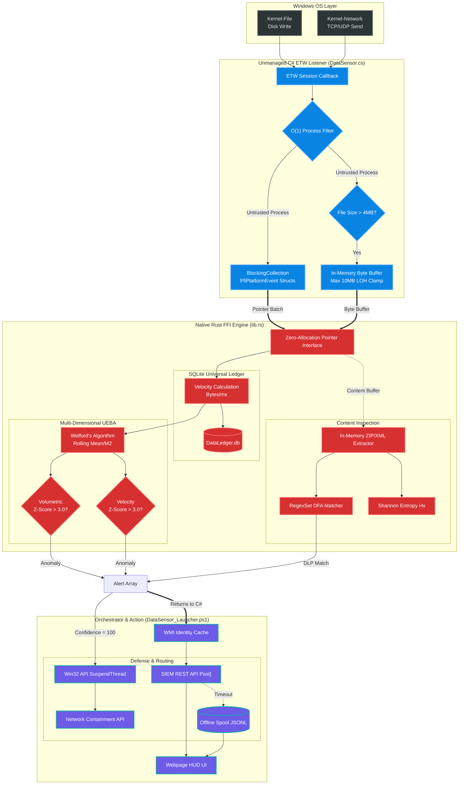

```mermaid
%%{init: {'theme': 'dark', 'themeVariables': { 'fontFamily': 'Fira Code, monospace', 'lineColor': '#06b6d4', 'mainBkg': '#0a0a0a', 'textColor': '#e2e8f0'}}}%%
graph LR
    %% Cyberpunk Style Definitions
    classDef title fill:none,stroke:none,color:#06b6d4,font-size:18px,font-weight:bold;
    classDef external fill:#050505,stroke:#888,stroke-width:1px,color:#888,stroke-dasharray: 3 3;
    classDef core fill:#0a0a0a,stroke:#06b6d4,stroke-width:2px,color:#06b6d4;
    classDef logic fill:#0a0a0a,stroke:#ec4899,stroke-width:2px,color:#ec4899;
    classDef storage fill:#000,stroke:#4ade80,stroke-width:1px,color:#4ade80;
    classDef action fill:#0a0a0a,stroke:#ef4444,stroke-width:2px,color:#ef4444;
    classDef alert fill:#0a0a0a,stroke:#f59e0b,stroke-width:1px,color:#f59e0b;

    TITLE["DATA SENSOR v1.0 (ALPHA)"]:::title

    subgraph StagingSpace [COMPILATION & CONFIG]
        RUST_BUILD["Build-RustEngine.ps1<br/>(MSVC/Cargo Compiler)"]:::core
        CONFIG[("config.ini<br/>Regex & Thresholds")]:::storage
        THREAT_INTEL[("Dynamic Threat Intel<br/>Tor/Webhooks")]:::storage
    end

    subgraph KernelSpace [KERNEL // ETW INSTRUMENTATION]
        ETW_FILE["Kernel-File<br/>(Disk I/O)"]:::external
        ETW_NET["Kernel-Network<br/>(TCP/UDP Sockets)"]:::external
        ACT_DEFENSE["Win32 API<br/>(SuspendThread)"]:::action
    end

    subgraph EngineSpace [ENGINE // C# RUNSPACE]
        CSHARP["DataSensor.cs<br/>(Unmanaged ETW Listener)"]:::core
        O1_FILTER["O(1) HashSet<br/>(Trusted Processes)"]:::logic
        STRUCTS{"FfiPlatformEvent<br/>Blittable Struct Array"}:::logic
    end

    subgraph AnalysisSpace [ANALYSIS // NATIVE RUST DLL]
        ML["lib.rs<br/>(Zero-Allocation Boundary)"]:::logic
        WELFORD["Welford's Algorithm<br/>(Volume & Velocity Z-Scores)"]:::logic
        INSPECTION["RegexSet & ZipArchive<br/>(In-Memory DFA Analysis)"]:::logic
        UEBA[("DataLedger.db<br/>SQLite WAL Map")]:::storage
    end

    subgraph OrchestrationSpace [ORCHESTRATION & SIEM]
        ORCH["DataSensor_Launcher.ps1<br/>(Watchdog & Routing)"]:::core
        SIEM_FWD["SIEM Aggregation<br/>(Async POST)"]:::action
        SPOOL[("OfflineSpool.jsonl<br/>Failover Store")]:::storage
        HUD["24-Bit Webpage HUD<br/>(Local HTTP Runspace)"]:::logic
        JSONL[("DataSensor_Active.jsonl<br/>Structured Ledger")]:::storage
    end

    %% Initialization Flow
    RUST_BUILD ==>|"Compiles"| ML
    CONFIG -.->|"Loads Rules"| ORCH
    THREAT_INTEL -.->|"Injects Indicators"| ORCH

    %% Real-Time Telemetry Flow
    ETW_FILE ==>|"Stream"| CSHARP
    ETW_NET ==>|"Stream"| CSHARP
    CSHARP <-->|"Drop Benign"| O1_FILTER
    CSHARP ===>|"Direct Memory Pointer"| STRUCTS
    STRUCTS ===>|"FFI Handoff"| ML

    %% ML & UEBA Loop
    ML <--> WELFORD
    ML <--> INSPECTION
    ML <--> UEBA

    %% Bridge to Orchestration
    ML ===>|"UEBA & DLP Convictions"| ORCH
    ORCH -.->|"Structured Output"| JSONL

    %% Defense & Routing
    ORCH ==>|"1. Enact Mitigation"| ACT_DEFENSE
    ORCH ==>|"2. Route Payload"| SIEM_FWD
    SIEM_FWD -.->|"On Network Failure"| SPOOL
    ORCH -.->|"Live Alerting"| HUD

    %% Title alignment
    TITLE ~~~ StagingSpace
```

# Data Sensor (DLP & UEBA Engine)

## Overview
A **high-performance, wire-speed** Data Loss Prevention (DLP) and User & Entity Behavior Analytics (UEBA) sensor operating natively in-memory for Windows. This project bridges unmanaged C# Event Tracing for Windows (ETW) telemetry with a **Native Rust Machine Learning Engine (DLL)** to autonomously detect volumetric exfiltration, network anomalies, and sensitive data exposure without I/O blocking.

Designed to operate seamlessly without third-party agents, the suite relies on rolling mathematical baselines, zero-allocation memory boundaries, and surgical thread-level containment to halt exfiltration in its tracks.

The sensor integrates an **In-Memory Content Inspection Engine** that performs deep archive extraction and Aho-Corasick/Regex evaluation with absolute memory safety, proving the host process will never crash during deep inspection of complex or malicious file structures.

By default, the suite operates in a **Standalone Alpha Phase** to stress-test UEBA logic against live telemetry, establish mathematical baselines, and rigorously validate the unmanaged C# listener's stability.

---

## Architectural Highlights
* **High-Performance ETW Engine:** Natively subscribes to `Microsoft-Windows-Kernel-File` and `Microsoft-Windows-Kernel-Network`. Implements O(1) pre-filtering for trusted processes and lock-free micro-batching via `BlockingCollection` to capture tens of thousands of events per second.
* **Zero-Allocation FFI Boundary:** Dismantles JSON serialization overhead by establishing a strict `[StructLayout]` (C#) to `#[repr(C)]` (Rust) memory contract (`FfiPlatformEvent`). Telemetry pointers are mapped directly into the Native Rust engine, bypassing IPC pipeline latency entirely.
* **Multi-Dimensional UEBA Engine (Rust):** A deeply integrated math engine (`lib.rs`) utilizes **Welford’s Online Algorithm** to maintain rolling mathematical baselines. It adapts to user behavior across dual axes (Volumetric Flow and Transfer Velocity), calculating variance and Z-Score deviations to identify burst exfiltration (T1048) and low-and-slow anomalies.
* **High-Speed Universal Ledger:** Integrates a memory-mapped SQLite database utilizing Write-Ahead Logging (WAL) and memory-mapped synchronization (`PRAGMA mmap_size`). It logs micro-batches of enterprise data movement transactionally without inducing disk contention.
* **Memory Inspection Resilience:** Safely extracts complex file types (Office Open XML, ZIP archives) completely in-memory. Enforces strict LOH clamps and extraction limits (e.g., 5MB) to protect against zip-bombs and Out-of-Memory (OOM) faults before matching against Deterministic Finite Automatons (DFAs).
* **Deterministic Active Defense:** Utilizes native Win32 P/Invoke (`OpenThread`, `SuspendThread`) to freeze the specific threads violating policy, halting data exfiltration while proving the primary application state remains uncorrupted.
* **ETW Watchdog & Auto-Recovery:** A built-in canary tracks kernel buffer health. If the Windows Kernel silently drops the trace session due to buffer starvation, the orchestrator executes a sub-second, non-destructive session recovery.
* **Offline Telemetry Spooling:** Built for network resilience, the orchestrator seamlessly routes JSONL payloads to an encrypted local Spool DB if the centralized SIEM/XDR is unreachable, guaranteeing zero telemetry loss.

### System Diagram
---



---

## Prerequisites
* Windows 10 / Windows 11 / Windows Server 2019+
* PowerShell 5.1+ (Must be run as Administrator)
* *Note: The `Build-RustEngine.ps1` script will automatically handle MSVC C++ Build Tools and NuGet TraceEvent dependencies if absent on the host.*

---

## Quick Start Guide

### 1. Compile the Native Engine
Compiles the Rust Machine Learning engine into a C-compatible DLL for zero-latency FFI injection, and validates the SHA256 integrity hash.
```powershell
.\Build-RustEngine.ps1
```

### 2. Configure Threat Matrices
Edit `config.ini` to define your specific Data Loss Prevention regex patterns, Z-Score thresholds, and trusted process exclusions.

### 3. Launch the Orchestrator
Bootstraps the environment, dynamically fetches Tor/Webhook threat intelligence, initiates the ETW listener, and spins up the asynchronous Web HUD.
```powershell
.\DataSensor_Launcher.ps1
```

---

## Core File Manifest
* **`DataSensor_Launcher.ps1`**: Master orchestrator. Handles configuration parsing, threat intel pulling, unmanaged dynamic C# compilation, ETW watchdog auto-recovery, SIEM routing, and hosts the Advanced 24-bit Webpage HUD.
* **`DataSensor.cs`**: The unmanaged C# ETW listener. Subscribes to Kernel File and Network telemetry, executes O(1) process filtering, packages FFI struct arrays, triggers Win32 `SuspendThread` mitigation, and enforces LOH safety clamps for file inspection.
* **`lib.rs`**: The Native Rust mathematical DLL. Operates the `DataLedger` SQLite WAL database, performs Welford's baseline mathematics for Z-Score anomaly detection, and runs deep content inspection using deterministic regex mapping on raw byte buffers.
* **`Build-RustEngine.ps1`**: Automated compiler pipeline that scaffolds the MSVC/Rust environment, downloads required NuGet packages (`TraceEvent.dll`), and builds the native `data_sensor_ml.dll`.
* **`config.ini`**: Centralized configuration matrix dictating inspection limits, Z-Score thresholds, archive extensions, and DLP regex rules (e.g., SSN, CreditCards, AWS Keys).

---

## Telemetry and Persistent Storage
The engine operates natively in-memory to bypass standard serialization lag, utilizing a secure, anti-tamper restricted directory (`C:\ProgramData\DataSensor`) for persistent ledgers.

| File/Directory | Description | Purpose |
| :--- | :--- | :--- |
| **`\Bin\`** | Staging ground for execution. | Houses `DataSensor_ML.dll`. ACL locked to `SYSTEM` and `Administrators`. |
| **`\Data\DataLedger.db`** | SQLite Universal Ledger (WAL mode). | Stores enterprise data movement history and mathematical UEBA baseline states. |
| **`\Data\OfflineSpool.jsonl`** | Network Resilience Storage. | Securely spools JSON telemetry alerts if the remote SIEM aggregator becomes unreachable. |
| **`\Logs\DataSensor_Active.jsonl`** | Structured Telemetry Audit Trail. | Primary JSONL ledger for local SIEM forwarders (Splunk/Filebeat). Capped at 50MB with a 3-day retention rotation. |
| **`\Intel\`** | Dynamic Threat Intelligence cache. | Stores dynamically fetched Tor Exit Nodes and high-risk Webhooks for real-time memory blocking. |

---

### How Events Are Evaluated (The Pipeline)

The Data Sensor processes thousands of operations per second by utilizing unmanaged pointer handoffs and asynchronous evaluation gates:

1.  **The Unmanaged Observer (C#):** ETW callbacks catch `Write`, `TcpIp/Send`, and `UdpIp/Send` operations. The engine validates the process against an O(1) hashset of trusted processes. Benign noise (like `svchost.exe`) is dropped instantly.
2.  **Blittable Memory Transfer:** Valid telemetry is formatted into an `FfiPlatformEvent` struct and pushed to a lock-free `BlockingCollection`. A background task pulls micro-batches of these structs and passes their raw memory pointers directly to the Rust Engine without slow JSON string concatenation.
3.  **Welford’s Mathematical Evaluation (Rust):** Rust inserts the raw event into the `DataLedger` and calculates the operation's velocity ($Bytes / Duration$). It updates the rolling Mean and Variance (M2) using Welford's Algorithm. If the resulting Z-Score breaches the configured threshold (e.g., 3.0), a `UEBA_ANOMALY` alert is queued.
4.  **In-Memory Deep Inspection:** If C# detects a large local disk write (e.g., >4MB to `\Device\HarddiskVolume`), it asynchronously pulls a 10MB chunk of the file into memory and calls `inspect_file_content`. Rust extracts ZIP/DOCX structures in-memory and runs Shannon Entropy and Regex DFA analysis.
5.  **Active Defense & Routing:** Rust returns convictions back to C#. If confidence is 100%, C# executes `SuspendThread`. The orchestrator (PowerShell) reads the JSON alert, attempts a 1-second timeout POST to the SIEM, spools to disk if it fails, and routes the data to the async Webpage HUD.

#### Pipeline Flow Diagram



---

### User Interface

Alerts are categorized dynamically:
* **`CONTENT_VIOLATION` (Red):** Emitted when deep memory inspection matches a defined DFA/Regex signature (e.g., SSN, AWS Keys) or intercepts a high-entropy byte buffer indicating encrypted staging.
* **`UEBA_ANOMALY` (Orange):** Emitted when Welford's algorithm calculates a Z-Score deviation above the configured threshold on either the Volume or Velocity axis.
* **`MITIGATION` (Green):** Emitted alongside thread suspension identifiers and Network Firewall containment verifications when the engine acts autonomously to halt exfiltration.
* **`SYSTEM FAULT` (Dark Red):** Raised dynamically by the ETW Watchdog if kernel buffers choke or FFI boundaries desync.

#### **Current State: Hardened Prototype (Standalone)**
The Data Sensor operates as a high-performance, isolated prototype. The Native FFI boundary is fully operational, facilitating zero-latency handoffs between the unmanaged ETW observer and the Rust ML engine. Current efforts prioritize the continuous refinement of the Welford baseline logic against live telemetry, the enforcement of anti-tamper ACLs on the Universal Ledger, and the optimization of the structured JSONL diagnostic engine for SIEM-ready audit trails.

#### **The Intended End State (Readiness for Convergence)**
The successful completion of this phase yields a mathematically proven, resilient, and standalone Data Sensor. Once the UEBA logic, deep inspection routines, and active defense mechanisms demonstrate uncompromising reliability in isolation, the architecture is certified as production-ready. This validated, zero-allocation state serves as the definitive data pipeline for convergence into the larger .NET 10 Unified XDR orchestration agent and the Ring-0 kernel ecosystem.