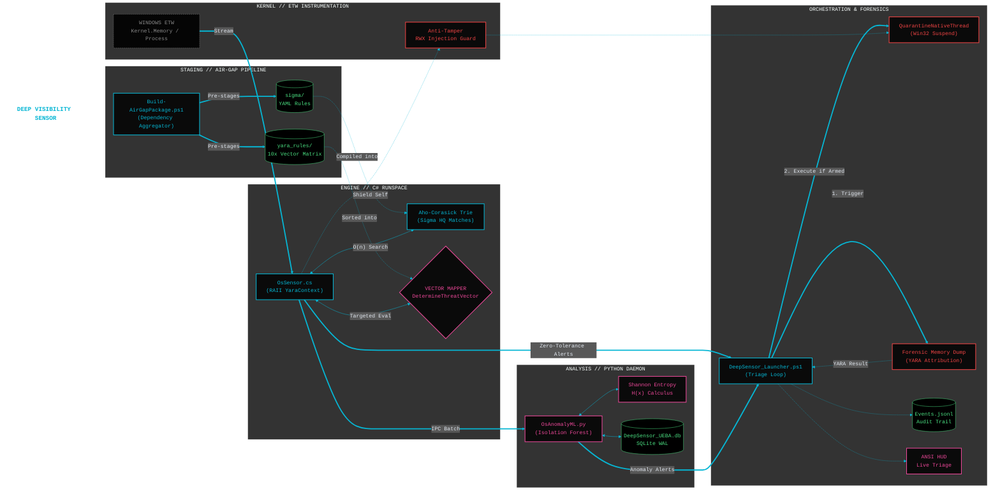

# Deep Visibility Sensor

## Overview
A **high-performance, real-time** Endpoint Detection and Response (EDR) sensor operating natively in-memory for Windows. This project bridges unmanaged C# Event Tracing for Windows (ETW) telemetry with a Python-based Machine Learning daemon to autonomously detect and neutralize evasive OS behaviors, zero-day persistence, and memory manipulation.

Designed to operate entirely without third-party agents or restricted Microsoft ELAM/PPL boundaries, the suite relies on mathematical outlier detection, dynamic Sigma threat intelligence, and surgical thread-level containment.

The sensor integrates a **Context-Aware YARA Engine** that provides high-fidelity forensic attribution and memory scanning without the overhead of traditional signature-based AV.

By default, the suite operates in a **Safe Baselining Mode (Dry-Run)** to evaluate telemetry and train the ML models on host-specific behavior without impacting legitimate processes.

Standard EDR handles the broad-spectrum behavioral blocking at the surface level; Deep Sensor can safely focus on:
1. Deep-dive UEBA baselining
2. Surgical forensic extraction & YARA attribution
3. Highly specialized Sigma telemetry

---

## Architectural Highlights
* **High-Performance ETW Engine:** Natively subscribes to `Kernel-Process`, `Kernel-Registry`, `Kernel-Memory`, and `Kernel-FileIO`. Zero-allocation string parsing and an $O(n)$ Aho-Corasick state machine evaluate 10,000+ Sigma rules in sub-millisecond time.
* **Context-Aware YARA Engine:** Implements a RAII-based `YaraContext` using **libyara.NET v3.5.2** to manage native handles for ten unique threat matrices. The engine dynamically maps targets to specific vectors (e.g., *BinaryProxy*, *SystemPersistence*, *LotL*) based on process heuristics to maintain zero-latency performance.
* **Two-Tiered Behavioral & UEBA Engine:** A daemonized Python engine operates via lock-free STDIN/STDOUT pipes. It features an Isolation Forest to evaluate execution lineages dynamically, calculates Shannon Entropy (T1027), and tracks high-frequency I/O bursts. It integrates a deterministic User and Entity Behavior Analytics (UEBA) SQLite database that learns host-specific administrative noise and autonomously suppresses false positives over time.
* **Dynamic Threat Intel & BYOVD Eradication:** The orchestrator compiles local YAML Sigma rules and dynamically fetches live BYOVD (Bring Your Own Vulnerable Driver) hashes from LOLDrivers.io to instantly convict malicious .sys loads.
* **Surgical Active Defense:** Utilizes native Win32 P/Invoke to execute QuarantineNativeThread (SuspendThread). This freezes malicious threads for forensic analysis without impacting parent process stability.
* **Automated Forensic Attribution:** Upon interventional detection, the sensor executes `NeuterAndDumpPayload` to extract shellcode, neutralize the thread, and perform a YARA scan. The resulting attribution (e.g., "CobaltStrike_Beacon") is embedded directly into the SIEM audit trail.
* **Air-Gap & Offline Resilience:** Features a dedicated `Build-AirGapPackage.ps1` staging engine that aggregates all Python dependencies, NuGet libraries, Sigma rules, and YARA intelligence (Elastic & ReversingLabs) into a single, portable deployment unit.
* **Active Anti-Tamper & Self-Defense:**
  * The C# engine defends its own PID, immediately killing external threads attempting RWX injections into its memory space.
  * Implements `icacls` lockdown sequences and secures the Windows Service DACL via `sc.exe sdset`.
  * Intercepts rogue `logman` commands attempting to blind the ETW session.

### System Diagram
---



---

## Prerequisites
* Windows 10 / Windows 11 / Windows Server 2019+
* PowerShell 5.1+ (Must be run as Administrator)
* *Note: The orchestrator will automatically handle Python 3.11.8 and ML dependency installation if internet-facing.*

---

## Quick Start Guide

### 1. Launch the Orchestrator (Safe Baselining Mode)
Bootstraps the environment, fetches YARA/Sigma intelligence, and initializes the HUD in **Dry-Run Mode**.
```powershell
.\DeepSensor_Launcher.ps1
```

### 2. Launch the Orchestrator (Armed Mode)
Enables real-time ETW correlation and autonomous active defense with forensic YARA attribution.
```powershell
.\DeepSensor_Launcher.ps1 -ArmedMode
```

### 3. Build Air-Gap Package (Offline Deployment)
Pre-stages all dependencies, libraries, and intelligence for restricted network deployment.
```powershell
.\Build-AirGapPackage.ps1
```

---

## Core File Manifest
* **`DeepSensor_Launcher.ps1`**: Master orchestrator, HUD renderer, environment bootstrapper, high-performance YARA/Sigma RAII, and Active Defense gateway.
* **`OsSensor.cs`**: The unmanaged C# ETW listener. Houses the Aho-Corasick string matching algorithms, native Win32 API containment logic, and the self-defense thread hijacking watchdog.
* **`OsAnomalyML.py`**: The headless Python mathematical daemon. Provides Isolation Forest execution scoring, Shannon Entropy calculations, stateful Ransomware burst detection, and the autonomous UEBA noise suppression engine.
* **`Build-AirGapPackage.ps1`**: Pipeline for portable, offline sensor deployment.

---

## Telemetry and Persistent Storage
The engine operates natively in-memory to prevent disk I/O lag, but preserves critical forensic telemetry and state data for investigation and SIEM ingestion in a locked-down directory structure:

| File/Directory | Description | Purpose |
| :--- | :--- | :--- |
| **`sigma\`** | Directory containing local YAML Sigma rules. | Dynamically parsed to build the Threat Intel Engine. |
| **`yara_rules\`** | Contextual YARA subdirectories. | Segments rules (e.g., `BinaryProxy`, `LotL`) for targeted scanning. |
| **`C:\ProgramData\DeepSensor\Data\Quarantine`** | Forensic shellcode repository. | Securely stores memory dumps extracted during interventional events. |
| **`DeepSensor_Events.jsonl`** | Structured JSON alerts with MITRE ATT&CK mappings. | Primary SIEM ingestion file stored in `C:\ProgramData` (Features 50MB Auto-Rotation). |
| **`DeepSensor_UEBA.db`** | SQLite DB stored in `C:\ProgramData` (WAL mode). | Maintains the learned UEBA baseline for deterministic alert suppression within the secure zone. |
| **`DeepSensor_UEBA_Diagnostic.log`**| Plaintext audit ledger in `C:\ProgramData`. | Traces the exact lifecycle of alerts transitioning from 'Learning' to 'Suppressed'. |
| **`DeepSensor_Diagnostic.log`** | Diagnostic log generated if `-EnableDiagnostics` is passed. | Troubleshooting environment boots and IPC timeouts (Stored in `C:\ProgramData`). |
| **`deepsensor_canary.tmp`** | Synthetic 60-second file drop. | Evaluates ETW health and detects sensor blinding attempts. |
| **`C2Hunter_TamperGuard.log`** | `icacls` locked ledger. | Audits DACL lockdowns and sensor security posture. |