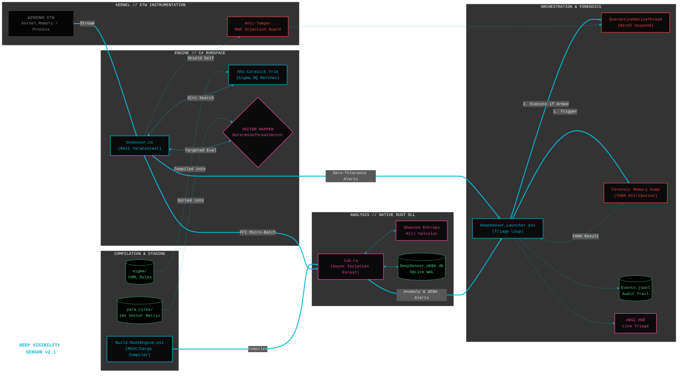
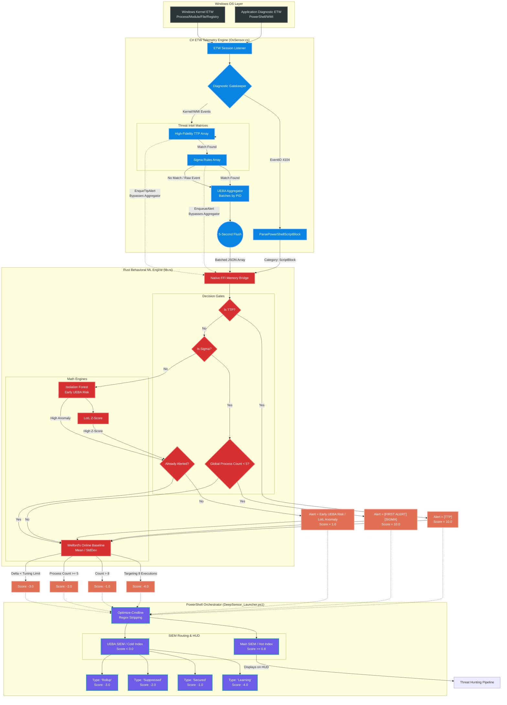
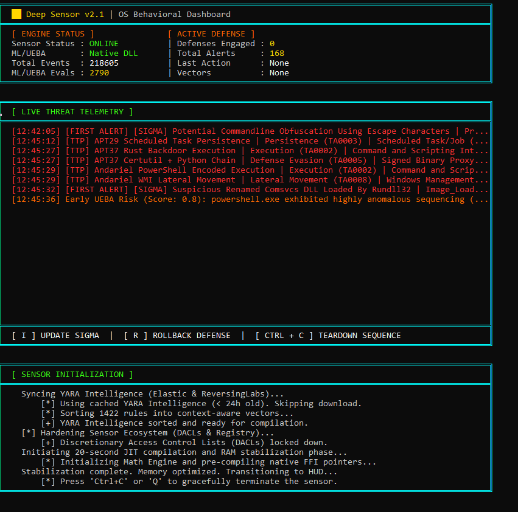
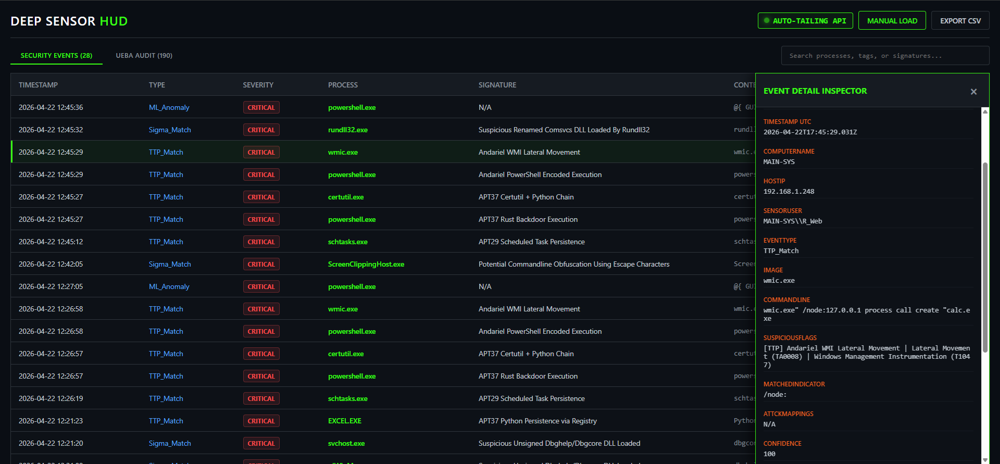

# Deep Visibility Sensor v2.1

**Developer Note (@RW):**
Transitioning the ML and UEBA engine from Python to Rust was the definitive architectural move because it completely eliminated the inter-process communication (IPC) overhead that fundamentally bottlenecked the telemetry pipeline. In the Python implementation, every kernel event had to be serialized into a JSON string and piped across process boundaries, incurring a massive CPU tax and unpredictable garbage collection pauses. By compiling the Isolation Forest and temporal baselining logic into a native Rust DLL, we collapsed the architecture into a single, shared memory space accessed directly via C# FFI. This allowed the sensor to ingest micro-batches of events at wire-speed and leverage Rust's thread-safe concurrency to train the mathematical models asynchronously in the background, achieving a deterministic, zero-latency evaluation loop that Python's interpreted execution and Global Interpreter Lock (GIL) simply could not mathematically match under extreme load.

**DISCLAIMER:** v3 will be a private project.

This is a side project (minimal effort) primarily driven by curiosity for utilizing sigma/yara for detection with c# traces, and dabbling with basic ml/ueba integration.  This is not a complete EDR at the moment and serves as a companion sensor with defense in depth in mind.  Happy Hunting!

## Overview
A **high-performance, real-time** Endpoint Detection and Response (EDR) sensor operating natively in-memory for Windows. This project bridges unmanaged C# Event Tracing for Windows (ETW) telemetry with a **Native Rust Machine Learning Engine (DLL)** to autonomously detect and neutralize evasive OS behaviors, zero-day persistence, and memory manipulation.

Designed to operate entirely without third-party agents or restricted Microsoft ELAM/PPL boundaries, the suite relies on mathematical outlier detection, dynamic Sigma threat intelligence, and surgical thread-level containment.

The sensor integrates a **Context-Aware YARA Engine** that provides high-fidelity forensic attribution and memory scanning without the overhead of traditional signature-based AV.

By default, the suite operates in a **Safe Baselining Mode (Dry-Run)** to evaluate telemetry and train the ML models on host-specific behavior without impacting legitimate processes.

Standard EDR handles the broad-spectrum behavioral blocking at the surface level; Deep Sensor can safely focus on:
1. Deep-dive UEBA baselining
2. Surgical forensic extraction & YARA attribution
3. Highly specialized Sigma telemetry

---

## Architectural Highlights
* **High-Performance ETW Engine:** Natively subscribes to `Kernel-Process`, `Kernel-Registry`, `Kernel-Memory`, and `Kernel-FileIO`. Zero-allocation string parsing and an $O(n)$ Aho-Corasick state machine evaluate 10,000+ Sigma rules in sub-millisecond time.
* **Context-Aware YARA Engine:** Implements a RAII-based `YaraContext` using **libyara.NET v3.5.2** to manage native handles for ten unique threat matrices. The engine dynamically maps targets to specific vectors (e.g., *BinaryProxy*, *SystemPersistence*, *LotL*) based on process heuristics to maintain zero-latency performance.
* **Native Rust Behavioral & UEBA Engine:** A deeply integrated math engine (`lib.rs`) operates via a zero-latency Foreign Function Interface (FFI) boundary. Event micro-batching eliminates P/Invoke overhead. It features an **asynchronously trained Isolation Forest** to evaluate execution lineages without blocking the ETW thread, calculates Shannon Entropy (T1027), and tracks high-frequency I/O bursts.
* **High-Speed Relational Baselines:** Integrates a deterministic User and Entity Behavior Analytics (UEBA) SQLite database utilizing Write-Ahead Logging (WAL) and memory-mapped synchronization. It learns host-specific administrative noise and autonomously suppresses false positives over time.
* **Dynamic Threat Intel & BYOVD Eradication:** The orchestrator compiles local YAML Sigma rules and dynamically fetches live BYOVD (Bring Your Own Vulnerable Driver) hashes from LOLDrivers.io to instantly convict malicious .sys loads.
* **Surgical Active Defense:** Utilizes native Win32 P/Invoke to execute QuarantineNativeThread (SuspendThread). This freezes malicious threads for forensic analysis without impacting parent process stability.
* **Automated Forensic Attribution:** Upon interventional detection, the sensor executes `NeuterAndDumpPayload` to extract shellcode, neutralize the thread, and perform a YARA scan. The resulting attribution (e.g., "CobaltStrike_Beacon") is embedded directly into the SIEM audit trail.
* **Active Anti-Tamper & Self-Defense:**
  * The C# engine defends its own PID, immediately killing external threads attempting RWX injections into its memory space.
  * Implements `icacls` lockdown sequences and secures the Windows Service DACL via `sc.exe sdset`.
  * Intercepts rogue `logman` commands attempting to blind the ETW session.

### System Diagram
---



---

## Prerequisites
* Windows 10 / Windows 11 / Windows Server 2019+
* PowerShell 5.1+ (Must be run as Administrator)
* *Note: The `Build-RustEngine.ps1` script will automatically handle MSVC C++ Build Tools and Rust Toolchain (Cargo) deployment if absent on the host.*

---

## Quick Start Guide

### 1. Compile the Native Engine
Compiles the Rust Machine Learning engine into a C-compatible DLL for zero-latency FFI injection.
```powershell
.\Build-RustEngine.ps1
```

### 2. Launch the Orchestrator (Safe Baselining Mode)
Bootstraps the environment, fetches YARA/Sigma intelligence, and initializes the HUD in **Dry-Run Mode**.
```powershell
.\DeepSensor_Launcher.ps1
```

### 3. Launch the Orchestrator (Armed Mode)
Enables real-time ETW correlation and autonomous active defense with forensic YARA attribution.
```powershell
.\DeepSensor_Launcher.ps1 -ArmedMode
```

### Optional: Launch the Sensor with a Stealth Footprint
```powershell
$isAdmin = ([Security.Principal.WindowsPrincipal][Security.Principal.WindowsIdentity]::GetCurrent()).IsInRole([Security.Principal.WindowsBuiltInRole]::Administrator)
if (-not $isAdmin) {
    Write-Warning "Deployment halted. Administrator privileges are required to configure Session 0 and Symbolic Links."
    return
}

$UsePwshCore = $true  # Toggle to $false for Windows PowerShell 5.1
$TaskName    = "WinTelemetryCache"
$DeepRoot    = "C:\ProgramData\DeepSensor"
$BinDir      = "$DeepRoot\Bin"
$SensorPath  = "C:\Path\to\DeepSensor_Launcher.ps1" # correct the path
$StealthExe  = "$BinDir\vmmem_svc.exe" # rename here

if (!(Test-Path $BinDir)) { New-Item $BinDir -ItemType Directory -Force | Out-Null }

$rootItem = Get-Item $DeepRoot
$rootItem.Attributes = $rootItem.Attributes -bor [System.IO.FileAttributes]::Hidden -bor [System.IO.FileAttributes]::System

if ($UsePwshCore) {
    $RealExe = (Get-Command pwsh.exe -ErrorAction SilentlyContinue).Source
    if (!$RealExe) { throw "PowerShell 7+ (pwsh.exe) not found on host." }
} else {
    $RealExe = "$env:Windir\System32\WindowsPowerShell\v1.0\powershell.exe"
}

if (Test-Path $StealthExe) { Remove-Item $StealthExe -Force }
New-Item -ItemType SymbolicLink -Path $StealthExe -Target $RealExe | Out-Null

$Action = New-ScheduledTaskAction -Execute $StealthExe `
    -Argument "-NoProfile -NonInteractive -ExecutionPolicy Bypass -File `"$SensorPath`" -Background -ArmedMode" # configure runtime param switches

$Trigger = New-ScheduledTaskTrigger -AtStartup
$Principal = New-ScheduledTaskPrincipal -UserId "NT AUTHORITY\SYSTEM" -LogonType ServiceAccount -RunLevel Highest

$Settings = New-ScheduledTaskSettingsSet -AllowStartIfOnBatteries -DontStopIfGoingOnBatteries -StartWhenAvailable

Unregister-ScheduledTask -TaskName $TaskName -Confirm:$false -ErrorAction SilentlyContinue
Register-ScheduledTask -TaskName $TaskName -Action $Action -Trigger $Trigger -Principal $Principal -Settings $Settings

Write-Host "[+] Deployment Complete: Sensor active in Session 0 as '$TaskName'." -ForegroundColor Green
```

---

## Core File Manifest
* **`DeepSensor_Launcher.ps1`**: Master orchestrator, HUD renderer, environment bootstrapper, high-performance YARA/Sigma RAII, and Active Defense gateway.
* **`OsSensor.cs`**: The unmanaged C# ETW listener. Houses the Aho-Corasick string matching algorithms, native Win32 API containment logic, the micro-batching FFI bridge, and the self-defense thread hijacking watchdog.
* **`lib.rs`**: The native Rust mathematical DLL. Provides asynchronous Isolation Forest execution scoring, Shannon Entropy calculations, stateful Ransomware burst detection, and the autonomous UEBA noise suppression engine.
* **`Build-RustEngine.ps1`**: Automated compiler pipeline that scaffolds the MSVC/Rust environment and builds the native `DeepSensor_ML_v2.1.dll`.

---

## Telemetry and Persistent Storage
The engine operates natively in-memory to prevent disk I/O lag, but preserves critical forensic telemetry and state data for investigation and SIEM ingestion in a locked-down directory structure:

| File/Directory | Description | Purpose |
| :--- | :--- | :--- |
| **`sigma\`** | Directory containing local YAML Sigma rules. | Dynamically parsed to build the Threat Intel Engine. |
| **`yara_rules\`** | Contextual YARA subdirectories. | Segments rules (e.g., `BinaryProxy`, `LotL`) for targeted scanning. |
| **`C:\ProgramData\DeepSensor\Data\Quarantine`** | Forensic shellcode repository. | Securely stores memory dumps extracted during interventional events. |
| **`DeepSensor_Events.jsonl`** | Structured JSON alerts with MITRE ATT&CK mappings. | Primary SIEM ingestion file stored in `C:\ProgramData` (Features 50MB Auto-Rotation). |
| **`DeepSensor_UEBA.db`** | SQLite DB stored in `C:\ProgramData` (WAL mode). | Maintains the learned UEBA baseline for deterministic alert suppression within the secure zone. |
| **`DeepSensor_UEBA_Diagnostic.log`**| Plaintext audit ledger in `C:\ProgramData`. | Traces the exact lifecycle of alerts transitioning from 'Learning' to 'Suppressed'. |
| **`DeepSensor_Diagnostic.log`** | Diagnostic log routing FFI engine states. | Troubleshooting environment boots and unmanaged memory mapping (Stored in `C:\ProgramData`). |
| **`deepsensor_canary.tmp`** | Synthetic 60-second file drop. | Evaluates ETW health and detects sensor blinding attempts. |

---

### How Events Are Evaluated in Batches

The engine optimizes performance and context by analyzing telemetry in **micro-batches** rather than as singular events.

1.  **The C# Aggregator (The Collector):** As raw OS events (FileIO, Registry, ImageLoads) occur, they are caught by the C# ETW listeners (`ProcessEvent`, etc.). Instead of sending every single file read to Rust instantly, C# groups these high-volume, low-fidelity events by `ProcessID` into a temporary `UebaAggregator` bucket.
2.  **The 5-Second Flush:** A background watchdog task continuously monitors these buckets. Every 5 seconds, or if a bucket hits 100 events, the aggregator packages the raw events into a compressed JSON array.
3.  **The Rust Multi-Dimensional Vector:** This batched JSON payload is fired across the FFI bridge into Rust. The Rust engine (`BehavioralEngine`) doesn't evaluate individual file reads; it evaluates the *behavior of the batch*. It calculates multi-dimensional features across the batch: [X1: Shannon Entropy, X2: Tuple Rarity, X3: Path Depth, X4: Execution Velocity, X5: Max Velocity].
4.  **High-Fidelity Bypass:** Crucially, if C# detects a Critical `TTP_Match` or `Sigma_Match`, it completely bypasses the aggregator. These events are fired directly to the `_mlWorkQueue` for immediate evaluation.

#### The Detection to UEBA Lifecycle Diagram



---

### User Interface

Executing the launcher without the -Background switch initializes both a mathematically pinned, non-scrolling terminal HUD in the console and an auto-tailing browser dashboard, providing a unified interface for real-time sensor event tracking:

* **SIGMA (`Sigma_Match`):** Events triggered when system activity matches compiled Sigma rules, typically indicating known suspicious behavioral patterns such as command-line obfuscation or suspicious module loads.
* **TTP (`TTP_Match`):** High-fidelity alerts generated from custom Threat Intelligence signatures that are explicitly mapped to specific MITRE ATT&CK tactics, techniques, and threat actors (e.g., known APT PowerShell execution commands).
* **Advanced Detection (`Static_Detection`):** Native, hardcoded alerts generated directly by the C# ETW sensor to instantly flag critical threats like process hollowing, sensor tampering, or the loading of known vulnerable drivers (BYOVD).
* **ML Anomaly:** Behavioral outliers identified by the native Rust Machine Learning engine, which triggers an alert when a process's activity score meets or exceeds a high-threat threshold (>= 0.8) without needing a static signature.
* **UEBA (`UEBA_Audit`):** User and Entity Behavior Analytics logs that track the system's baseline states, categorized into phases such as `Learning` (observing initial process behavior), `Secured` (baseline established), and `Suppressed` (silencing known safe noise to prevent alert fatigue).


<p align="center">
  
</p>

<p align="center">
  
</p>