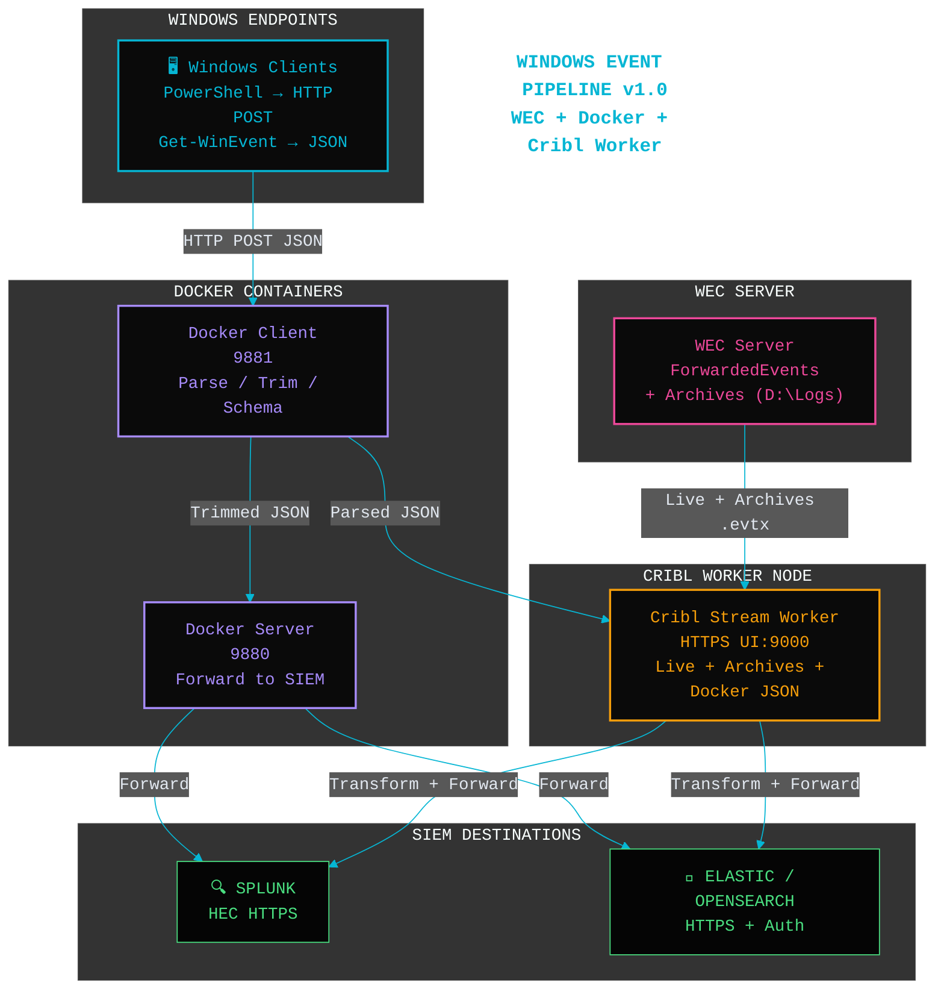

# Windows Event Forwarding + Cribl Worker Pipeline

**Modern, containerized Windows event collection and forwarding pipeline.**

- Windows clients forward events to WEC server
- Docker Client parses/trim events using schema
- Docker Server forwards to SIEM
- Cribl Stream Worker Node on WEC ingests live logs + archives + Docker JSON, transforms, and sends to Splunk (HEC) or Elastic (HTTPS)

### Quick Start

1. Place all files in one folder
2. Edit `docker-compose.*.yml` (SERVER_URL, Elastic/Splunk credentials)
3. Run:
   ```powershell
   .\Orchestrate-Deployment.ps1 -Deployment Both
   ```
4. Send events from Windows:
   ```powershell
   Get-WinEvent -LogName Security -MaxEvents 50 | ConvertTo-Json -Depth 5 -Compress | Invoke-WebRequest -Uri http://localhost:9881/ -Method Post -ContentType application/json
   ```

**Access:**
- Cribl UI: `https://localhost:9000` (admin/admin)
- Client listens on 9881, Server on 9880

**Supported Destinations:**
- Splunk HEC (HTTPS)
- Elastic / OpenSearch (HTTPS + Basic Auth / API Key)

**Files:**
- schema.json
- client_parser.py / server_parser.py
- Dockerfiles + docker-compose files
- Orchestrate-Deployment.ps1
- Install-CriblWorker.ps1


**Architecture Diagram**
---

