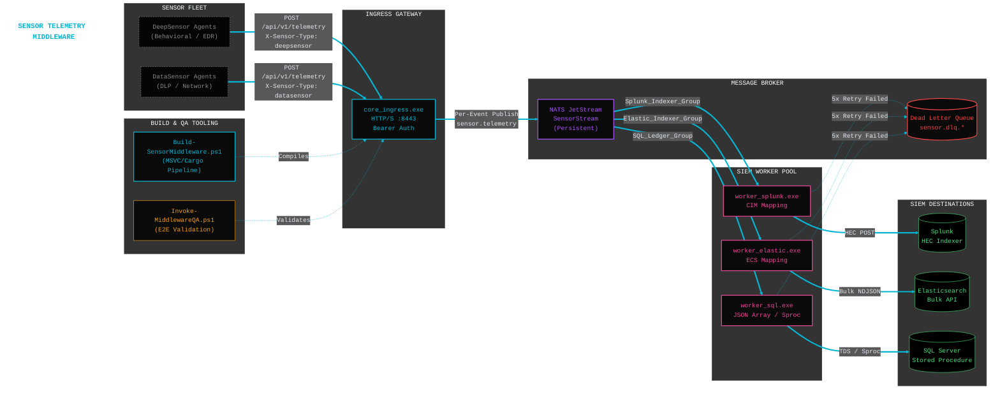
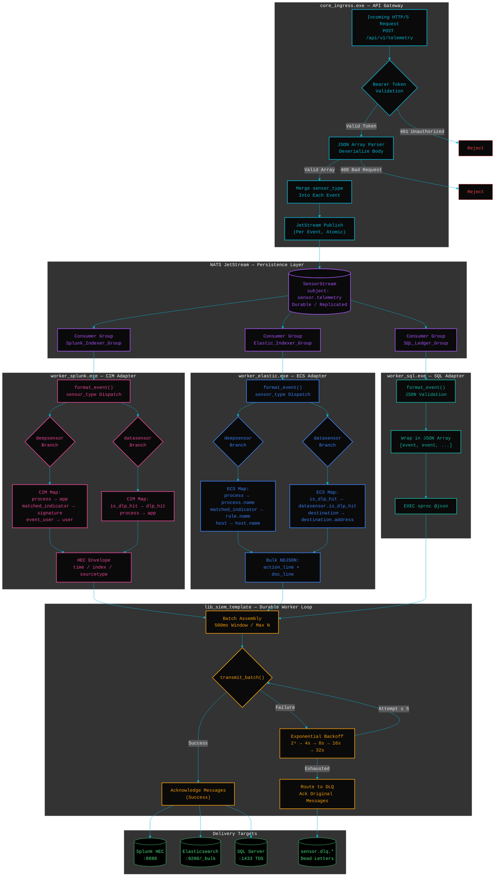

# Sensor Telemetry Middleware (Alpha Concept)

**Developer Note (@RW):**
The decision to build the middleware layer as a standalone Rust workspace rather than embedding routing logic inside each sensor was the critical architectural pivot. The previous approach required every sensor deployment to carry its own forwarding logic — hardcoded Splunk HEC calls baked into the agent binary, duplicated Elastic mapping code across firmware revisions, and a growing matrix of per-sensor configuration that made fleet-wide schema changes a multi-week deployment exercise. By decoupling telemetry ingestion from SIEM delivery entirely and placing a NATS JetStream broker between them, we achieved a write-once-route-everywhere architecture where sensors fire a single authenticated POST and the middleware handles all downstream formatting, retry, and delivery. The Rust workspace compiles into four statically-optimized binaries that share a common `SiemAdapter` trait, meaning adding a new SIEM target is a single crate implementing three functions — `format_event`, `transmit_batch`, and `batch_size` — without touching the ingress or any existing worker. NATS durable consumer groups give us horizontal scale for free: spin up five `worker_splunk.exe` instances and JetStream automatically load-balances events across all five. The result is a zero-coordination, fan-out telemetry pipeline that separates sensor development velocity from SIEM integration complexity permanently.

---

## Overview

A **high-throughput, durable** telemetry gateway that ingests structured JSON payloads from endpoint sensors and routes them to multiple SIEM platforms simultaneously. The middleware operates as four independent Rust binaries coordinated through NATS JetStream, providing **persistent message delivery**, **automatic retry with exponential backoff**, and **dead letter queue routing** for undeliverable events.

The system natively maps raw sensor telemetry into platform-specific schemas — **Splunk Common Information Model (CIM)**, **Elastic Common Schema (ECS)**, and raw **JSON array bulk insert for SQL Server** — without requiring any transformation logic on the sensor itself.

Designed to operate in enterprise environments where sensors generate high-volume behavioral telemetry (process execution chains, DLP exfiltration events, network anomalies) that must reach multiple analytics platforms with guaranteed delivery and correct field mappings.

Key design properties:
1. **Fan-out without duplication** — One POST from the sensor, three SIEM destinations served from a single JetStream stream
2. **Schema isolation** — Each worker owns its own CIM/ECS mapping; sensor payload format changes don't cascade
3. **Horizontal scale** — Spin up N instances of any worker; NATS consumer groups handle load distribution automatically
4. **Guaranteed delivery** — JetStream persistence + exponential backoff + DLQ ensures zero silent data loss

---

## Architectural Highlights

* **Authenticated Ingress Gateway:** An `axum`-based HTTP/S API that validates Bearer tokens per-request, parses incoming JSON arrays, and publishes each event as an independent JetStream message with `sensor_type` metadata merged in. Optional TLS termination via `rustls` is controlled by a single config flag — no code changes required to switch between HTTP (dev/test) and HTTPS (production).

* **NATS JetStream Persistence Layer:** All telemetry flows through a durable JetStream stream (`SensorStream`) that decouples sensor availability from SIEM availability. If a downstream target is unreachable, events remain persisted in the stream until workers recover. Consumer groups (`Splunk_Indexer_Group`, `Elastic_Indexer_Group`, `SQL_Ledger_Group`) enable independent processing rates per destination.

* **SiemAdapter Trait (Polymorphic Worker Framework):** A shared library crate (`lib_siem_template`) defines the `SiemAdapter` trait — `format_event()`, `transmit_batch()`, `batch_separator()`, and `batch_size()`. The `start_durable_worker()` function handles all JetStream consumer lifecycle, batch assembly, retry logic, and DLQ routing generically. Adding a new SIEM target requires implementing only the trait — zero modifications to the framework.

* **Splunk CIM Mapping Worker:** Consumes events from JetStream, maps `deepsensor` fields to CIM equivalents (`process` → `app`, `matched_indicator` → `signature`, `event_user` → `user`) and `datasensor` DLP fields (`is_dlp_hit` → `dlp_hit`), wraps them in Splunk HEC envelopes with `index` and `sourcetype`, and POSTs newline-delimited payloads to the HEC endpoint.

* **Elastic ECS Mapping Worker:** Transforms events into Elastic Common Schema with proper nesting (`process.name`, `rule.name`, `destination.address`, `event.dataset`). Emits Bulk API NDJSON (action line + document line per event). Handles field name normalization across sensor firmware variants (`Process` vs `process`, `MatchedIndicator` vs `matched_indicator`).

* **SQL Server Bulk Ingestion Worker:** Validates incoming JSON, assembles comma-separated events wrapped in a JSON array (`[event1, event2, ...]`), and executes a configurable stored procedure via TDS. Lazy connection with automatic reconnection on fault. Includes a `TestWebhookUrl` config key that redirects output to an HTTP mock during QA — enabling full E2E testing without a live SQL Server.

* **Exponential Backoff & Dead Letter Queue:** Every worker retries failed transmissions up to 5 times with exponential delay (2s → 4s → 8s → 16s → 32s). On final failure, the batch is routed to a DLQ subject (`sensor.dlq.<consumer_name>`) for manual replay or forensic analysis, and the original messages are acknowledged to prevent pipeline stalls.

* **Release-Optimized Compilation:** The workspace `Cargo.toml` enforces `opt-level = 3`, link-time optimization (`lto = true`), single codegen unit, and `panic = "abort"` — producing the smallest, fastest binaries possible with no unwinding overhead.

---

### System Diagram



---

### Logical Diagram — Internal Pipeline Flow



---

## Prerequisites

* Windows 10 / Windows 11 / Windows Server 2019+
* PowerShell 7.x (Must be run as Administrator for QA harness port binding)
* NATS Server (`nats-server.exe`) on PATH or in the project root (https://nats.io/about/)
* *Note: The `Build-SensorMiddleware.ps1` script will automatically handle MSVC C++ Build Tools and Rust Toolchain (Cargo) deployment if absent on the host.*

---

## Quick Start Guide

### 1. Compile the Middleware Workspace
Validates the MSVC/Rust toolchain, initializes the native vcvars64 compilation context, and builds all four release binaries with LTO optimization.
```powershell
.\Build-SensorMiddleware.ps1
```
Artifacts are staged into `dist\` with a `build_manifest.json` containing SHA-256 hashes for every binary.

### 2. Configure the Environment
Edit `config.ini` to set your NATS endpoint, SIEM credentials, and TLS paths. The config is divided into sections:
```ini
[GLOBAL]       # NATS endpoint, JetStream stream/subject names, DLQ prefix
[INGRESS]      # Bind port, Bearer auth token, TLS toggle + cert paths
[SPLUNK]       # HEC endpoint, token, batch size, target index/sourcetype
[ELASTIC]      # Bulk API endpoint, API key, batch size, target index
[SQL]          # Host, port, database, auth mode, stored procedure, batch size
```

### 3. Download & Start NATS Server
```powershell
.\Get-NATSServer.ps1

nats-server.exe               # Default: 127.0.0.1:4222
```

### 4. Launch the Middleware
Each binary reads `config.ini` from its working directory:
```powershell
.\core_ingress.exe             # API Gateway — binds HTTP/S
.\worker_splunk.exe            # Splunk CIM worker
.\worker_elastic.exe           # Elastic ECS worker
.\worker_sql.exe               # SQL Server worker
```

### 5. Run the E2E Validation Suite
Compiles the workspace, spins up mock SIEM listeners, injects synthetic telemetry, and validates schema mappings across all three targets with 30+ assertions:
```powershell
.\tests\Invoke-MiddlewareQA.ps1
```

### Optional: TLS Configuration
Generate a self-signed cert for development, then set the config flags:
```powershell
# Generate a self-signed PEM cert (dev only)
openssl req -x509 -newkey rsa:4096 -keyout certs/server-key.pem -out certs/server.pem -days 365 -nodes -subj "/CN=sensor-middleware"
```
```ini
[INGRESS]
TlsEnabled=True
TlsCertPath=certs/server.pem
TlsKeyPath=certs/server-key.pem
BindPort=8443
```

---

## Core File Manifest

* **`core_ingress/src/main.rs`**: The telemetry API gateway. Authenticates Bearer tokens, parses incoming JSON arrays, merges `sensor_type` metadata into each event, and publishes atomic messages to JetStream. Supports optional HTTPS via `axum-server` + `rustls` controlled by `config.ini`.
* **`lib_siem_template/src/lib.rs`**: The shared worker framework. Defines the `SiemAdapter` trait (polymorphic interface for all SIEM workers) and `start_durable_worker()` — the durable consumer loop that handles batch assembly, exponential backoff retry, and Dead Letter Queue routing generically.
* **`worker_splunk/src/main.rs`**: Splunk CIM adapter. Maps `deepsensor` behavioral events and `datasensor` DLP events to Splunk Common Information Model fields, wraps them in HEC envelopes with `index`/`sourcetype`, and POSTs newline-delimited batches to the HEC endpoint.
* **`worker_elastic/src/main.rs`**: Elastic ECS adapter. Transforms events into Elastic Common Schema with proper object nesting (`process.name`, `rule.name`, `event.dataset`). Emits Bulk API NDJSON format with action metadata lines. Handles field name normalization across sensor firmware variants.
* **`worker_sql/src/main.rs`**: SQL Server adapter. Validates JSON integrity, assembles comma-separated events into a JSON array, and executes a configurable stored procedure via TDS (Tabular Data Stream). Features a `TestWebhookUrl` config key that redirects output to an HTTP mock for E2E testing without a live database.
* **`Build-SensorMiddleware.ps1`**: Automated compiler pipeline. Validates/installs MSVC Build Tools and the Rust toolchain, initializes the vcvars64 native context, builds the workspace in release mode, validates binaries with SHA-256 hashes, and stages artifacts into `dist/`.
* **`Invoke-MiddlewareQA.ps1`**: End-to-end integration test harness. Generates an isolated test config, spins up mock SIEM HTTP listeners, orchestrates all daemons, executes negative/positive authentication vectors, injects polymorphic telemetry payloads, and asserts CIM/ECS field mappings across 30+ test cases.
* **`config.ini`**: Centralized configuration for all components — NATS endpoints, JetStream stream names, SIEM credentials, TLS paths, batch sizes, and SQL connection parameters.

---

## Configuration Reference

| Section | Key | Default | Description |
| :--- | :--- | :--- | :--- |
| **GLOBAL** | `NatsEndpoint` | `127.0.0.1:4222` | NATS server address |
| | `TelemetryStream` | `SensorStream` | JetStream stream name |
| | `TelemetrySubject` | `sensor.telemetry` | NATS subject for telemetry events |
| | `DlqSubjectPrefix` | `sensor.dlq` | Dead letter queue subject prefix |
| **INGRESS** | `BindPort` | `8443` | TCP port for the API gateway |
| | `AuthToken` | *(required)* | Expected Bearer token from sensors |
| | `TlsEnabled` | `True` | Enable HTTPS via rustls (`True`/`False`) |
| | `TlsCertPath` | `certs/server.pem` | PEM certificate chain (TLS only) |
| | `TlsKeyPath` | `certs/server-key.pem` | PEM private key (TLS only) |
| **SPLUNK** | `HecEndpoint` | *(required)* | Splunk HEC URL |
| | `HecToken` | *(required)* | HEC authentication token |
| | `MaxBatchSize` | `500` | Max events per HEC POST |
| | `TimeoutSeconds` | `15` | HTTP timeout |
| | `TargetIndex` | `sensor-alerts` | Splunk destination index |
| | `TargetSourceType` | `sensor:ueba` | Splunk sourcetype |
| **ELASTIC** | `Endpoint` | *(required)* | Elasticsearch Bulk API URL |
| | `ApiKey` | *(required)* | Elasticsearch API key |
| | `MaxBatchSize` | `1000` | Max events per bulk POST |
| | `TargetIndex` | `logs-sensor-alerts` | Elasticsearch destination index |
| **SQL** | `DbHost` | `127.0.0.1` | SQL Server hostname |
| | `DbPort` | `1433` | SQL Server port |
| | `DbName` | `DataSensor_Telemetry` | Database name |
| | `UseSspi` | `True` | Windows Integrated Auth (`True`/`False`) |
| | `DbUser` / `DbPass` | *(empty)* | SQL auth credentials (when SSPI=False) |
| | `Encryption` | `Required` | TDS encryption (`Required`/`Off`) |
| | `TrustServerCert` | `True` | Accept self-signed SQL certs |
| | `SprocName` | `EXEC dbo.sp_Ingest...` | Stored procedure call template |
| | `MaxBatchSize` | `2000` | Max events per stored procedure call |
| | `TestWebhookUrl` | *(empty)* | HTTP mock URL for QA (leave empty in prod) |

---

## How Events Are Processed

The middleware processes telemetry through a staged pipeline designed to maximize throughput while guaranteeing delivery:

1. **The Ingress Gateway (The Front Door):** Sensors POST a JSON array of events to `/api/v1/telemetry` with a Bearer token and an `X-Sensor-Type` header. The gateway validates authentication, deserializes the array, and for each event merges `sensor_type` as a top-level field. Each enriched event is published as an independent JetStream message — not the entire array as a single message. This atomic-per-event design ensures that a single malformed event in a batch of 100 doesn't block the other 99.

2. **The JetStream Broker (The Guarantor):** NATS JetStream provides at-least-once delivery semantics. Events are persisted to the `SensorStream` stream and distributed to three independent durable consumer groups. Each group tracks its own acknowledgment cursor — if the Splunk worker falls behind, it doesn't affect Elastic or SQL delivery. If a worker dies, events remain in the stream until it recovers.

3. **The Worker Batch Window (The Optimizer):** Each worker's `start_durable_worker()` loop opens a 500ms collection window, draining up to `MaxBatchSize` messages from its consumer. Events are passed through `format_event()` for schema mapping, then concatenated with the appropriate separator (newline for Splunk/Elastic NDJSON, comma for SQL JSON arrays). This batching amortizes network round-trips — instead of 500 individual HTTP POSTs, one bulk request delivers the entire batch.

4. **The Retry Engine (The Safety Net):** `transmit_batch()` sends the assembled payload to the downstream SIEM. On failure, the worker retries with exponential backoff: 2s, 4s, 8s, 16s, 32s. Five attempts cover approximately 62 seconds of transient outage. If all attempts fail, the batch is published to a Dead Letter Queue (`sensor.dlq.<consumer_name>`), original messages are acknowledged to unblock the pipeline, and the failed payload is preserved for manual replay or forensic review.

---

## Directory Structure

```
sensor_middleware/
├── Cargo.toml                        # Workspace root (4 members)
├── config.ini                        # Centralized runtime configuration
├── Build-SensorMiddleware.ps1        # MSVC/Rust compiler pipeline
│
├── core_ingress/
│   ├── Cargo.toml
│   └── src/main.rs                   # API gateway (axum + optional TLS)
│
├── lib_siem_template/
│   ├── Cargo.toml
│   └── src/lib.rs                    # SiemAdapter trait + durable worker loop
│
├── worker_splunk/
│   ├── Cargo.toml
│   └── src/main.rs                   # Splunk CIM mapper + HEC client
│
├── worker_elastic/
│   ├── Cargo.toml
│   └── src/main.rs                   # Elastic ECS mapper + Bulk API client
│
├── worker_sql/
│   ├── Cargo.toml
│   └── src/main.rs                   # SQL Server TDS client + test webhook
│
├── tests/
│   ├── Invoke-MiddlewareQA.ps1       # E2E integration test harness
│   ├── scratch/                      # Generated test config (gitignored)
│   └── logs/                         # Per-run QA logs + egress captures
│
├── dist/                             # Staged release binaries + manifest
│   ├── core_ingress.exe
│   ├── worker_splunk.exe
│   ├── worker_elastic.exe
│   ├── worker_sql.exe
│   ├── config.ini
│   └── build_manifest.json
│
└── certs/                            # TLS certificates (gitignored)
    ├── server.pem
    └── server-key.pem
```

---

## Schema Mapping Reference

### DeepSensor → Splunk CIM

| Sensor Field | Splunk CIM Field | Notes |
| :--- | :--- | :--- |
| `process` | `app` | Executable name |
| `event_user` | `user` | Authenticated user context |
| `matched_indicator` / `signature_name` | `signature` | Fallback chain: `signature_name` → `matched_indicator` → `reason` |
| `host` | `host` | Hostname |
| `ip` | `src_ip` | Source IP |
| `parent` | `parent_app` | Parent process |
| `cmd` | `command` | Full command line |
| `tactic` / `technique` | `tactic` / `technique` | MITRE ATT&CK mappings |
| `severity` / `score` | `severity` / `score` | Risk assessment |

### DeepSensor → Elastic ECS

| Sensor Field | ECS Field | Notes |
| :--- | :--- | :--- |
| `process` / `Process` / `Image` | `process.name` | Normalized across firmware versions |
| `matched_indicator` / `SignatureName` | `rule.name` | Full fallback chain |
| `host` | `host.name` | Hostname |
| `ip` | `source.ip` | Source IP |
| `score` / `severity` | `deepsensor.score` / `deepsensor.severity` | Custom namespace |
| `event.dataset` | `deepsensor.behavioral` | Fixed dataset identifier |

### DataSensor → Splunk CIM / Elastic ECS

| Sensor Field | Splunk CIM | Elastic ECS |
| :--- | :--- | :--- |
| `event_type` | `action` | `event.category` |
| `user` | `user` | `user.name` |
| `process` | `app` | `process.name` |
| `destination` | `dest` | `destination.address` |
| `bytes` | `bytes` | `network.bytes` |
| `is_dlp_hit` | `dlp_hit` | `datasensor.is_dlp_hit` |
| `event.dataset` | — | `datasensor.dlp` |